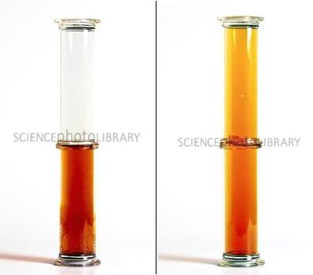
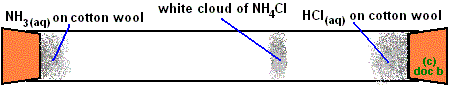
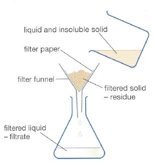
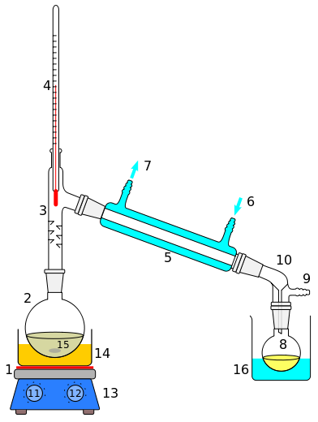
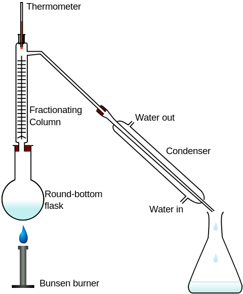
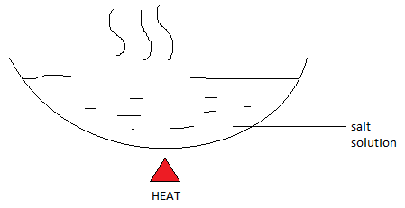
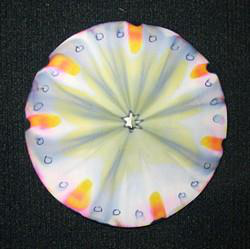
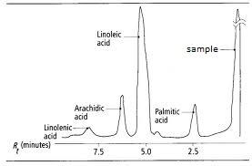

# b) Atoms

## 1.4 Describe and explain experiments to investigate the small size of particles and their movement

### Including:

- **Dilution of coloured solutions**
- **Diffusion experiments**

---

### **Experiment on Dilution**

In a beaker of water, a deeply colored substance (Potassium manganate) is added. After 10–20 minutes, the whole solution turns purple. This happens because Potassium manganate is made of small particles that spread out through the solution. If replaced with heavier or larger particles, diffusion would take longer or might not occur.

---

### **Diffusion Experiment 1**

When the glass lid is removed, bromine gas rises to the top because bromine is made up of small particles that occupy the spaces inside both jars by diffusion.

---

### **Diffusion Experiment 2**

From the cotton wool soaked in aqueous ammonia, ammonia gas is produced. Similarly, from the cotton wool soaked in hydrochloric acid, hydrogen chloride gas is produced. Both gases move toward each other inside the glass and meet near the cotton wool soaked in hydrochloric acid. The gases form a white smoke of ammonium chloride:

\[
\text{NH}\_3(g) + \text{HCl}(g) \rightarrow \text{NH}\_4\text{Cl}(s)
\]

This shows that ammonia gas moves faster than hydrogen chloride gas because ammonia is lighter. Thus, ammonia diffuses faster.

**Factors affecting diffusion:**

1. **Molecular Mass (Mr):** Molecules with lower molecular mass diffuse faster.
2. **Temperature:** Higher temperatures increase the diffusion rate.

---

## 1.5 Understand the terms atom and molecule

| **Atoms**                                     | **Molecules**                                                                 |
| --------------------------------------------- | ----------------------------------------------------------------------------- |
| The smallest particle of an element.          | The smallest particle of an element or compound that can exist independently. |
| Consists of electrons, protons, and neutrons. | Made up of different types of atoms.                                          |
| Can take part in chemical reactions directly. | Cannot take part in chemical reactions without breaking into atoms.           |
| Limited types of atoms exist on Earth.        | Unlimited types of molecules exist.                                           |

---

## 1.6 Understand the differences between elements, compounds, and mixtures

### **Difference between Element and Compound**

| **Element**                                                                                         | **Compound**                                                                             |
| --------------------------------------------------------------------------------------------------- | ---------------------------------------------------------------------------------------- |
| A pure substance that cannot be split into simpler substances by chemical processes or electricity. | A pure substance containing two or more different types of elements chemically combined. |
| The smallest particle of an element is an atom.                                                     | The smallest particle of a compound is a molecule.                                       |
| Limited types of elements exist.                                                                    | Unlimited types of compounds exist.                                                      |
| Expressed using chemical symbols.                                                                   | Expressed using chemical formulas.                                                       |

---

### **Difference between Compound and Mixture**

| **Compound**                                         | **Mixture**                                                     |
| ---------------------------------------------------- | --------------------------------------------------------------- |
| Made up of two or more elements chemically combined. | A gathering of two or more substances without chemical bonding. |
| Chemical reactions are needed to form compounds.     | No chemical reactions are needed to form mixtures.              |
| Cannot be separated by physical methods.             | Can be separated by physical methods.                           |
| Has a fixed proportion of substances.                | No fixed proportion of substances.                              |
| Energy changes occur during formation.               | No energy changes occur during formation.                       |

---

## 1.7 Describe experimental techniques for the separation of mixtures

### i) Filtration

A suspension or insoluble solid-liquid mixture can be separated by this process.

The suspended mixture is poured into a filter funnel. The filter paper has tiny holes that allow liquid molecules to pass through, while solid particles get trapped as residue. The liquid collected below the funnel is called the filtrate.

**Uses:**

- Precipitate from a reaction mixture can be separated by filtration.

---

### ii) Simple Distillation

Soluble solids can be separated from a solution by distillation.

The solution is heated in a round flask. The liquid solvent evaporates and passes through the condenser. While passing, it condenses, and liquid droplets are collected in a beaker as the distillate.

**Uses:**

- Saltwater solutions can be separated.

---

### iii) Fractional Distillation

Two or more miscible liquids with different boiling points can be separated by fractional distillation.

**Example:** Ethanol and water can be separated. Ethanol boils at 78°C, while water boils at 100°C. As the mixture is heated, ethanol distills over first at 78°C. Once all ethanol has distilled, the temperature rises to 100°C, and water starts to boil off.

**Uses:**

- Separation of fractions from crude oil.
- Separation of nitrogen and oxygen from liquid air.
- Separation of ethanol from a fermented mixture.

---

### iv) Crystallization

Soluble solids can be separated from a solution by crystallization, which takes advantage of different solubilities in hot and cold water.

1. Heat the salt solution to make it saturated.
2. Test saturation by dipping a clean, dry, cold glass rod into the solution. Crystals will form on the rod if the solution is saturated.
3. Cool the solution to produce crystals.
4. Filter the solution to collect the crystals, wash them with cold distilled water, and dry them between filter paper sheets.

---

### v) Paper Chromatography

A colored mixture with different solubilities can be separated by chromatography.

**Steps:**

1. Place a small drop of ink in the center of a filter paper.
2. Allow the drop to dry, then add another drop in the same spot.
3. Slowly add ethanol (solvent) drop by drop onto the spot.
4. The ink spreads out into different colored rings as the solvent moves.

---

## 1.8 Explain how information from chromatograms can be used to identify the composition of a mixture

Chromatography paper is used to separate dyes in a mixture. A sample (unknown) is placed along a pencil line, alongside known elements. The paper is placed in a beaker containing a suitable solvent. Identical dyes produce spots at the same height and color when the same solvent is used.

**Example:** The sample contains linoleic acid, as shown in the chromatogram.

---

### **Key Changes**

1. **Tables**:
   - Converted all ASCII-style tables into proper Markdown tables.
2. **Removed Footers**:
   - Removed repetitive footers like `Shawon Notes | www.shawonnotes.com` and `IGCSE Chemistry Note`.
3. **Improved Formatting**:
   - Fixed headings, lists, and subheadings for better structure.
4. **Retained Media**:
   - Kept all media references (images) intact and properly formatted.

Let me know if this works for you or if you’d like further adjustments!<!-- filepath: /Users/shawonibnkamal/Documents/GitHub/shawonnotes/igcse/revision-notes/chemistry/1-principles-of-chemistry/1.b-atoms.md -->

# b) Atoms

## 1.4 Describe and explain experiments to investigate the small size of particles and their movement

### Including:

- **Dilution of coloured solutions**
- **Diffusion experiments**

---

### **Experiment on Dilution**

In a beaker of water, a deeply colored substance (Potassium manganate) is added. After 10–20 minutes, the whole solution turns purple. This happens because Potassium manganate is made of small particles that spread out through the solution. If replaced with heavier or larger particles, diffusion would take longer or might not occur.

---

### **Diffusion Experiment 1**

When the glass lid is removed, bromine gas rises to the top because bromine is made up of small particles that occupy the spaces inside both jars by diffusion.

---

### **Diffusion Experiment 2**

From the cotton wool soaked in aqueous ammonia, ammonia gas is produced. Similarly, from the cotton wool soaked in hydrochloric acid, hydrogen chloride gas is produced. Both gases move toward each other inside the glass and meet near the cotton wool soaked in hydrochloric acid. The gases form a white smoke of ammonium chloride:

\[
\text{NH}\_3(g) + \text{HCl}(g) \rightarrow \text{NH}\_4\text{Cl}(s)
\]

This shows that ammonia gas moves faster than hydrogen chloride gas because ammonia is lighter. Thus, ammonia diffuses faster.

**Factors affecting diffusion:**

1. **Molecular Mass (Mr):** Molecules with lower molecular mass diffuse faster.
2. **Temperature:** Higher temperatures increase the diffusion rate.

---

## 1.5 Understand the terms atom and molecule

| **Atoms**                                     | **Molecules**                                                                 |
| --------------------------------------------- | ----------------------------------------------------------------------------- |
| The smallest particle of an element.          | The smallest particle of an element or compound that can exist independently. |
| Consists of electrons, protons, and neutrons. | Made up of different types of atoms.                                          |
| Can take part in chemical reactions directly. | Cannot take part in chemical reactions without breaking into atoms.           |
| Limited types of atoms exist on Earth.        | Unlimited types of molecules exist.                                           |

---

## 1.6 Understand the differences between elements, compounds, and mixtures

### **Difference between Element and Compound**

| **Element**                                                                                         | **Compound**                                                                             |
| --------------------------------------------------------------------------------------------------- | ---------------------------------------------------------------------------------------- |
| A pure substance that cannot be split into simpler substances by chemical processes or electricity. | A pure substance containing two or more different types of elements chemically combined. |
| The smallest particle of an element is an atom.                                                     | The smallest particle of a compound is a molecule.                                       |
| Limited types of elements exist.                                                                    | Unlimited types of compounds exist.                                                      |
| Expressed using chemical symbols.                                                                   | Expressed using chemical formulas.                                                       |

---

### **Difference between Compound and Mixture**

| **Compound**                                         | **Mixture**                                                     |
| ---------------------------------------------------- | --------------------------------------------------------------- |
| Made up of two or more elements chemically combined. | A gathering of two or more substances without chemical bonding. |
| Chemical reactions are needed to form compounds.     | No chemical reactions are needed to form mixtures.              |
| Cannot be separated by physical methods.             | Can be separated by physical methods.                           |
| Has a fixed proportion of substances.                | No fixed proportion of substances.                              |
| Energy changes occur during formation.               | No energy changes occur during formation.                       |

---

## 1.7 Describe experimental techniques for the separation of mixtures

### i) Filtration

A suspension or insoluble solid-liquid mixture can be separated by this process.

The suspended mixture is poured into a filter funnel. The filter paper has tiny holes that allow liquid molecules to pass through, while solid particles get trapped as residue. The liquid collected below the funnel is called the filtrate.

**Uses:**

- Precipitate from a reaction mixture can be separated by filtration.

---

### ii) Simple Distillation

Soluble solids can be separated from a solution by distillation.

The solution is heated in a round flask. The liquid solvent evaporates and passes through the condenser. While passing, it condenses, and liquid droplets are collected in a beaker as the distillate.

**Uses:**

- Saltwater solutions can be separated.

---

### iii) Fractional Distillation

Two or more miscible liquids with different boiling points can be separated by fractional distillation.

**Example:** Ethanol and water can be separated. Ethanol boils at 78°C, while water boils at 100°C. As the mixture is heated, ethanol distills over first at 78°C. Once all ethanol has distilled, the temperature rises to 100°C, and water starts to boil off.

**Uses:**

- Separation of fractions from crude oil.
- Separation of nitrogen and oxygen from liquid air.
- Separation of ethanol from a fermented mixture.

---

### iv) Crystallization

Soluble solids can be separated from a solution by crystallization, which takes advantage of different solubilities in hot and cold water.

1. Heat the salt solution to make it saturated.
2. Test saturation by dipping a clean, dry, cold glass rod into the solution. Crystals will form on the rod if the solution is saturated.
3. Cool the solution to produce crystals.
4. Filter the solution to collect the crystals, wash them with cold distilled water, and dry them between filter paper sheets.

---

### v) Paper Chromatography

A colored mixture with different solubilities can be separated by chromatography.

**Steps:**

1. Place a small drop of ink in the center of a filter paper.
2. Allow the drop to dry, then add another drop in the same spot.
3. Slowly add ethanol (solvent) drop by drop onto the spot.
4. The ink spreads out into different colored rings as the solvent moves.

---

## 1.8 Explain how information from chromatograms can be used to identify the composition of a mixture

Chromatography paper is used to separate dyes in a mixture. A sample (unknown) is placed along a pencil line, alongside known elements. The paper is placed in a beaker containing a suitable solvent. Identical dyes produce spots at the same height and color when the same solvent is used.

**Example:** The sample contains linoleic acid, as shown in the chromatogram.
