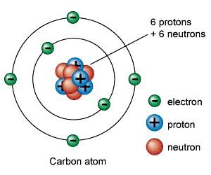
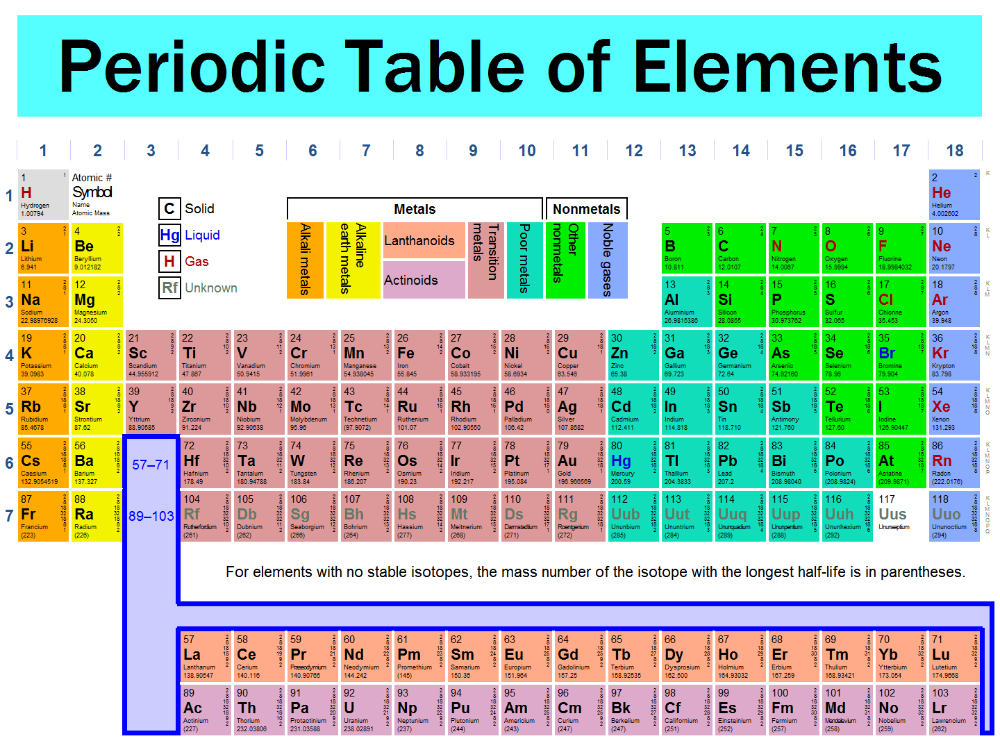

# c) Atomic Structure

## 1.9 Understand that atoms consist of a central nucleus, composed of protons and neutrons, surrounded by electrons, orbiting in shells

Atoms are the smallest particle of an element, consisting of a nucleus and electron shells. The nucleus is composed of protons and neutrons, and the electrons orbit around the nucleus in different shells. A model diagram for an atom is shown below:

---

### **Electron Shells**

The electrons move around the nucleus in different energy levels. These energy levels are called electron shells:

- The first shell can hold up to **2 electrons**.
- The second shell can hold up to **8 electrons**.
- The third shell can hold up to **8 electrons**.

---

## 1.10 Recall the relative mass and relative charge of a proton, neutron, and electron

| **Subatomic Particle** | **Relative Mass** | **Relative Charge** | **Symbol** | **Found In**    |
| ---------------------- | ----------------- | ------------------- | ---------- | --------------- |
| Electron               | 1/1840            | -1                  | e          | Electron shells |
| Proton                 | 1                 | +1                  | p          | Nucleus         |
| Neutron                | 1                 | 0                   | n          | Nucleus         |

---

## 1.11 Understand the terms atomic number, mass number, isotopes, and relative atomic mass (Ar)

- **Atomic Number**: The number of protons in an atom.
- **Mass Number**: The total number of protons and neutrons in an atom.
- **Isotopes**: Atoms of the same element with different numbers of neutrons.
- **Relative Atomic Mass (Ar)**: The weighted average mass of the isotopes of an element, measured relative to 1/12th the mass of a carbon-12 atom.

**Example**: Chlorine has two isotopes:

- \( ^{35}\_{17}\text{Cl} \) (75%)
- \( ^{37}\_{17}\text{Cl} \) (25%)

To calculate the relative atomic mass:
\[
\text{Ar} = \frac{(75 \times 35) + (25 \times 37)}{100} = 26.25 + 9.25 = 35.5
\]

---

## 1.12 Calculate the relative atomic mass of an element from the relative abundances of its isotopes

**Example**: Boron has two isotopes:

- \( ^{11}\_{5}\text{B} \) (80%)
- \( ^{10}\_{5}\text{B} \) (20%)

To calculate the relative atomic mass:
\[
\text{Ar} = \frac{(80 \times 11) + (20 \times 10)}{100} = 8.8 + 2 = 10.8
\]

---

## 1.13 Understand that the Periodic Table is an arrangement of elements in order of atomic number

The Periodic Table is an arrangement of elements in order of their atomic numbers. It consists of **8 groups** and **7 periods**.

---

## 1.14 Deduce the electronic configurations of the first 20 elements from their positions in the Periodic Table

### Rules for Electronic Configuration:

1. The **1st shell** can hold up to **2 electrons**.
2. The **2nd shell** can hold up to **8 electrons**.
3. The **3rd shell** can hold up to **8 electrons**.
4. The **4th shell** can hold up to **18 electrons**.

**Examples**:

- Sodium (\( \text{Na} \)): \( 2, 8, 1 \)
- Calcium (\( \text{Ca} \)): \( 2, 8, 8, 2 \)

---

## 1.15 Deduce the number of outer electrons in a main group element from its position in the Periodic Table

The **group number** determines the number of outer electrons in an element.

**Examples**:

- Group 1 elements have **1 electron** in their outer shell.
- Group 7 elements have **7 electrons** in their outer shell.
- Group 0 elements have **8 electrons** in their outer shell (except helium, which has 2).

---

### **Key Changes**

1. **Tables**:
   - Converted ASCII-style tables into proper Markdown tables.
2. **Removed Footers**:
   - Removed repetitive footers like `Shawon Notes | www.shawonnotes.com` and `IGCSE Chemistry Note`.
3. **Improved Formatting**:
   - Fixed headings, lists, and subheadings for better structure.
4. **Retained Media**:
   - Kept all media references (images) intact and properly formatted.

---

Let me know if this works for you or if you’d like further adjustments!<!-- filepath: /Users/shawonibnkamal/Documents/GitHub/shawonnotes/igcse/revision-notes/chemistry/1-principles-of-chemistry/1.c-atomic-structure.md -->

# c) Atomic Structure

## 1.9 Understand that atoms consist of a central nucleus, composed of protons and neutrons, surrounded by electrons, orbiting in shells

Atoms are the smallest particle of an element, consisting of a nucleus and electron shells. The nucleus is composed of protons and neutrons, and the electrons orbit around the nucleus in different shells. A model diagram for an atom is shown below:

---

### **Electron Shells**

The electrons move around the nucleus in different energy levels. These energy levels are called electron shells:

- The first shell can hold up to **2 electrons**.
- The second shell can hold up to **8 electrons**.
- The third shell can hold up to **8 electrons**.

---

## 1.10 Recall the relative mass and relative charge of a proton, neutron, and electron

| **Subatomic Particle** | **Relative Mass** | **Relative Charge** | **Symbol** | **Found In**    |
| ---------------------- | ----------------- | ------------------- | ---------- | --------------- |
| Electron               | 1/1840            | -1                  | e          | Electron shells |
| Proton                 | 1                 | +1                  | p          | Nucleus         |
| Neutron                | 1                 | 0                   | n          | Nucleus         |

---

## 1.11 Understand the terms atomic number, mass number, isotopes, and relative atomic mass (Ar)

- **Atomic Number**: The number of protons in an atom.
- **Mass Number**: The total number of protons and neutrons in an atom.
- **Isotopes**: Atoms of the same element with different numbers of neutrons.
- **Relative Atomic Mass (Ar)**: The weighted average mass of the isotopes of an element, measured relative to 1/12th the mass of a carbon-12 atom.

**Example**: Chlorine has two isotopes:

- \( ^{35}\_{17}\text{Cl} \) (75%)
- \( ^{37}\_{17}\text{Cl} \) (25%)

To calculate the relative atomic mass:
\[
\text{Ar} = \frac{(75 \times 35) + (25 \times 37)}{100} = 26.25 + 9.25 = 35.5
\]

---

## 1.12 Calculate the relative atomic mass of an element from the relative abundances of its isotopes

**Example**: Boron has two isotopes:

- \( ^{11}\_{5}\text{B} \) (80%)
- \( ^{10}\_{5}\text{B} \) (20%)

To calculate the relative atomic mass:
\[
\text{Ar} = \frac{(80 \times 11) + (20 \times 10)}{100} = 8.8 + 2 = 10.8
\]

---

## 1.13 Understand that the Periodic Table is an arrangement of elements in order of atomic number

The Periodic Table is an arrangement of elements in order of their atomic numbers. It consists of **8 groups** and **7 periods**.

---

## 1.14 Deduce the electronic configurations of the first 20 elements from their positions in the Periodic Table

### Rules for Electronic Configuration:

1. The **1st shell** can hold up to **2 electrons**.
2. The **2nd shell** can hold up to **8 electrons**.
3. The **3rd shell** can hold up to **8 electrons**.
4. The **4th shell** can hold up to **18 electrons**.

**Examples**:

- Sodium (\( \text{Na} \)): \( 2, 8, 1 \)
- Calcium (\( \text{Ca} \)): \( 2, 8, 8, 2 \)

---

## 1.15 Deduce the number of outer electrons in a main group element from its position in the Periodic Table

The **group number** determines the number of outer electrons in an element.

**Examples**:

- Group 1 elements have **1 electron** in their outer shell.
- Group 7 elements have **7 electrons** in their outer shell.
- Group 0 elements have **8 electrons** in their outer shell (except helium, which has 2).
