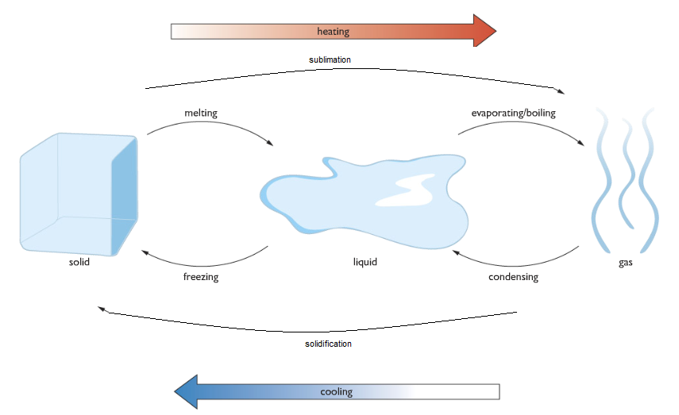

# a) States of Matter

## 1.1 Understand the arrangement, movement, and energy of the particles in each of the three states of matter: solid, liquid, and gas

| Features                   | Solid                     | Liquid                           | Gas                       |
| -------------------------- | ------------------------- | -------------------------------- | ------------------------- |
| Arrangement                | Regular                   | Irregular                        | Random                    |
| Movement                   | Cannot move, vibrate only | Particles can move slightly      | Particles can move freely |
| Energy of Particles        | Least kinetic energy      | More kinetic energy than solid   | Most kinetic energy       |
| Distance Between Particles | Closely packed            | Not closely packed               | Far apart                 |
| Shape                      | Fixed 3D structure        | Takes the shape of the container | No fixed shape            |

## 1.2 Understand how the interconversions of solids, liquids, and gases are achieved and recall the names used for these interconversions

### Interconversions of States of Matter

| Process        | Description                                                                       |
| -------------- | --------------------------------------------------------------------------------- |
| Melting        | The process of converting from solid to liquid due to an increase in temperature. |
| Melting Point  | The temperature at which a solid starts to melt. Example: Ice melts at 0°C.       |
| Boiling        | The process of converting from liquid to gas due to an increase in temperature.   |
| Boiling Point  | The temperature at which a liquid starts to boil. Example: Water boils at 100°C.  |
| Condensation   | The process by which a gas turns into a liquid.                                   |
| Sublimation    | The process by which a solid directly turns into a gas without melting.           |
| Solidification | The process at which a gas directly turns into a solid.                           |
| Vaporization   | The process by which a liquid turns into a gas at its boiling point.              |
| Evaporation    | The process by which a liquid turns into a gas below its boiling point.           |
| Volatile       | Liquids that evaporate at room temperature are called volatile liquids.           |

## 1.3 Explain the changes in arrangement, movement, and energy of particles during these interconversions

- **Solid to Liquid**:  
  When a solid is heated, the particles absorb energy and start to vibrate faster about their fixed positions. When the temperature is high enough, the vibrations overcome the attraction between particles, allowing them to move past each other. The solid becomes a liquid.

- **Liquid to Solid**:  
  When a liquid is cooled, the particles lose energy and move more slowly. At a low enough temperature, the particles settle into fixed positions, forming a solid.

- **Liquid to Gas**:  
  When a liquid is heated, the particles gain enough energy to break all forces of attraction. Bubbles of gaseous particles form throughout the liquid, and it becomes a gas.

- **Gas to Liquid**:  
  When a gas is cooled, the particles lose energy and move slowly enough for the attraction between them to hold them together as a liquid. This process is called condensation.
