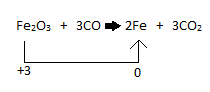
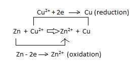
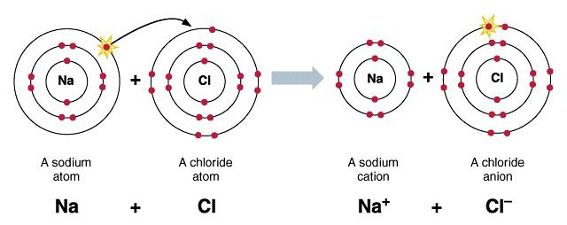
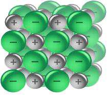
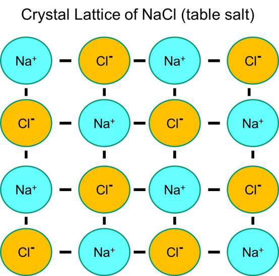

# f) Ionic Compounds

## 1.28 Describe the Formation of Ions by the Gain or Loss of Electrons

Ions are charged particles. Atoms become charged by losing or gaining electrons. Atoms that lose electrons become positively charged and atoms that gain electrons become negatively charged.

## 1.29 Understand Oxidation as the Loss of Electrons and Reduction as the Gain of Electrons

### Oxidation

Oxidation takes place when electrons are lost. Oxygen is added or oxidation number is increased.

Examples:

- $Na - e \rightarrow Na^+$
- $2 Cl - 2e \rightarrow Cl_2$
- $Fe^{2+} - e \rightarrow Fe^{3+}$
- $2CO + O_2 \rightarrow 2CO_2$

### Oxidation State/Number

The valence condition of an element in a compound is called oxidation state. In other words, the applied valency of an element inside a compound is called oxidation state.

Examples:

In $CO$, valency of $C$ is 2\
In $CO_2$, valency of $C$ is 4

$KMnO_4 = 0$\
$1 + Mn + 4(-2) = 0$\
$Mn - 7 = 0$\
$Mn = +7$

### Reduction

Reduction takes place when electrons are gained, oxygen is lost. Oxidation number is decreased or hydrogen is added.

### Oxidising Agent

The substance that oxidises others is called oxidising agent or oxidant. It is reduced after the reaction. The oxidising agents are: $H_2SO_4$ , $HNO_3$ , $O_3$ , $Cl_2$ , $KMnO_4$ , $K_2Cr_2O_7$

### Reducing Agent

A substance that reduces others is called reducing agent. Examples: $C$, $H_2$ , $CO$ , metals , $H_2S$ etc.

When in a chemical reaction both oxidation and reduction takes place, then the reaction is called redox.

## 1.30 Recall the Charges of Common Ions in this Specification

- Group I elements have charge of 1+.
- Group II elements have charge of 2+.
- Group III elements have charge of 3+.
- Group V elements have charge of 3-.

## 1.31 Deduce the Charge of an Ion from the Electronic Configuration of the Atom from Which the Ion is Formed

Here are the steps:

1. Find the number of electrons in the outer electron shell.
2. Find out if it is easy for the atom to gain electron or to donate electron. (In most cases atoms that have below four electrons, donate electrons and atoms that have above 4 electrons, receive electrons)
3. Atoms that gain electron become negative ion and atoms that donate electron forms positive ion.

## 1.32 Explain, Using Dot and Cross Diagrams, the Formation of Ionic Compounds by Electron Transfer, Limited to Combinations of Elements from Groups 1, 2, 3 and 5, 6, 7

## 1.33 Understand Ionic Bonding as a Strong Electrostatic Attraction Between Oppositely Charged Ions

When a metal/metals donates electron, a non-metal/non-metals receives it. The metal becomes positively charged and non-metal becomes negatively charged. As positive and negative charge attract each other, they form an electrostatic force between them. That's how they form ionic compound.

## 1.34 Understand that Ionic Compounds Have High Melting and Boiling Points Because of Strong Electrostatic Forces Between Oppositely Charged Ions

Melting and boiling point depends on the force that holds the particles. In ionic compounds, the ions are packed tightly for the electrostatic attraction between oppositely charged ions and form a giant structure. So to separate the ions, from the lattice it needs high amount of heat energy to break the millions of bonds, which results in high melting and boiling point.

## 1.35 Understand the Relationship Between Ionic Charge and the Melting Point and Boiling Point of an Ionic Compound

Ionic charge is directly proportional to the melting and boiling point in an ionic compound.

Example: Magnesium oxide has higher melting point than NaCl. This is because in $MgO$, $2+$ ions are attracting $2-$ ions and in sodium chloride, the attraction is weaker because there are only $+1$ and $-1$ ions between them.

## 1.36 Describe an Ionic Crystal as a Giant Three-Dimensional Lattice Structure Held Together by the Attraction Between Oppositely Charged Ions

In ionic compounds the lattice is composed of positive and negative ions in a regular shape. A lattice is a regular array of particles. The lattice is held together by the strong attraction between the positively and negatively charged ions.

## 1.37 Draw a Diagram to Represent the Positions of the Ions in a Crystal of Sodium Chloride

