# Covalent substances

## 1.38 Describe the formation of a covalent bond by the sharing of a pair of electrons between two atoms

When two or more non-metal share electrons to fulfill their outer electron shell, they form a bond called covalent bond.

## 1.39 Understand covalent bonding as a strong attraction between the bonding pair of electrons and the nuclei of the atoms involved in the bond

When non-metals share electrons, they are attracted by the nucleus. Since nucleus is positively charged it attracts negatively charged electrons.

## 1.40 Explain, using dot and cross diagrams, the formation of covalent compounds by electron sharing for the following substances:

| **Hydrogen**                   | **Chlorine**                   |
| ------------------------------ | ------------------------------ |
| 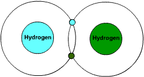 | 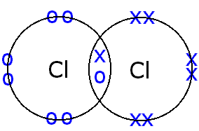 |

| **Hydrogen chloride**          | **Water**                      |
| ------------------------------ | ------------------------------ |
| 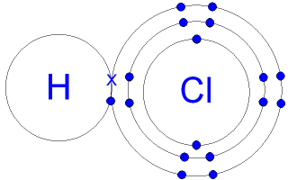 | 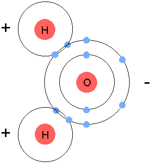 |

| **Methane**                    | **Ammonia**                    |
| ------------------------------ | ------------------------------ |
| 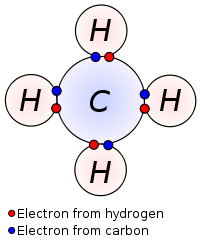 | 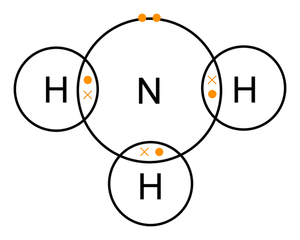 |

| **Oxygen**                     | **Nitrogen**                   |
| ------------------------------ | ------------------------------ |
| 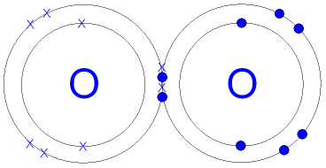 | 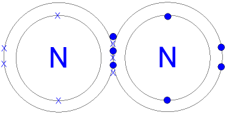 |

| **Carbon dioxide**             | **Ethane**                     |
| ------------------------------ | ------------------------------ |
| 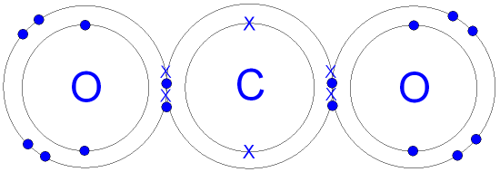 | 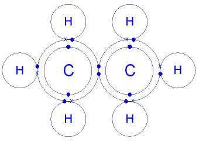 |

| **Ethene**                     |
| ------------------------------ |
| 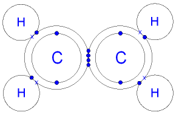 |

## 1.41 Understand that substances with simple molecular structures are gases or liquids, or solids with low melting points

Gases, liquids and gases that have simple molecular structure have low melting points. Reason stated in 1.42

## 1.42 Explain why substances with simple molecular structures have low melting and boiling points in terms of the relatively weak forces between the molecules

The intermolecular attraction between molecules in simple molecular structures is very weak. So less energy is required to break down the forces and hence they have low melting and boiling points.

## 1.43 Explain the high melting and boiling points of substances with giant covalent structures in terms of the breaking of many strong covalent bonds

In giant covalent structures such as diamond, the molecules are held together by billions of strong covalent bond. So a lot of energy is required to break down these bonds and hence they have high melting and boiling point.

## 1.44 Draw diagrams representing the positions of the atoms in diamond and graphite

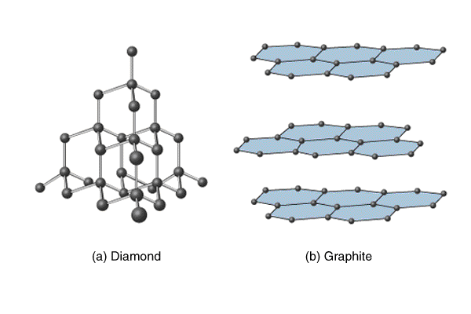

(a)Diamond: Diamond is one of the allotropes of carbon. Here each carbon atom is joined to four other carbon atoms by strong covalent bonds. It has a giant molecular structure.

(b) Graphite: Graphite is another allotropes of carbon. Within each layer, each carbon atom forms strong covalent bonds with three other carbon atoms. This forms of six carbon atoms that are joined to form two-dimensional flat layers. Therefore, each layer is a giant molecule. The layers of carbon atoms, which are held by weak van der Waal's forces, lie on top of each other.

## 1.45 Explain how the uses of diamond and graphite depend on their structures, limited to graphite as a lubricant and diamond in cutting.

|            | Diamond                                                                            | Graphite                                                                       |
| ---------- | ---------------------------------------------------------------------------------- | ------------------------------------------------------------------------------ |
| Properties | • Hard • Very high melting and boiling points • Non-conductor of electricity | • Soft • Very high melting and boiling points • Conductor of electricity |
| Uses       | • As gemstones • As tips of cutting, grinding and polishing tools               | • In pencils • As a dry lubricant • As inert electrodes                  |

Q: Why diamond is hard?/Why it can be used as cutting tools?

Diamonds are used in cutting tools because each carbon is bonded to four other strong covalent bonds and form a giant structure. So to separate, we need to break billions of bond which makes the diamond very hard.

Q: Why diamond do not conduct electricity?

Diamonds do no conduct electricity because each carbon atom has four electrons. In diamonds, these four electrons are engaged in bond formation to other four electrons. So there are no free electrons.

Q: Why graphite can be used as lubricant?

Graphite can be used as lubricants because there are layers in them and the attraction between the layers is weak. So when a force is applied, the layers can slide over each other easily, resulting soft and slippery.

Q: Why graphite is a good conductor of electricity?

In a graphite each carbon atoms are bonded to three other and the fourth electron is free to move through lattice carrying the charge which enables graphite to conduct electricity.
