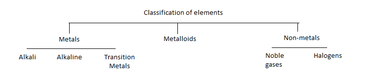
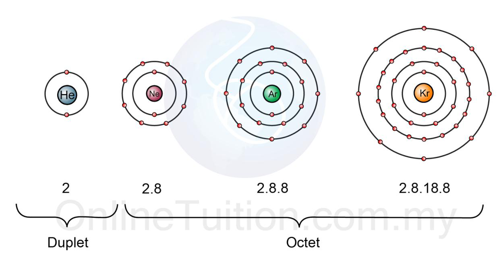

# a) The Periodic Table

## 2.1 Understand the terms group and period

Groups are the vertical columns in the periodic table.

Periods are the horizontal rows in the periodic table.

## 2.2 Recall the positions of metals and non-metals in the Periodic Table

Metals are on the left side of the zig-zag line in the periodic table. Non-metal is on the right.

## 2.3 Explain the classification of elements as metals or non-metals on the basis of their electrical conductivity and the acid-base character of their oxides

Metalloids are the elements of both properties of metals and non-metals, Gallium, Germanium. They exist in the periodic table neat the zig-zag line.

## Difference between metals and non-metals

Metals:

- Tend to be solids with high melting and boiling points, and with relatively high densities(but as with several of the properties in this list, there are exceptions- like mercury is a liquid.
- Are shiny when they are polished and tend to be easily workable.
- Are good conductors of electricity and heat
- Form positive ions in their compounds
- Have oxides which tend to be basic. This is because when the metallic oxides are dissolved in water, they produce alkalis. Some metallic oxides can show both acidic and alkali property. eg: PbO, Al203
- Metal reacts with acids to give a salt and water.

Non-metals:

| Properties                 | Description                                                                                                       |
| -------------------------- | ----------------------------------------------------------------------------------------------------------------- |
| Melting and Boiling Points | Tend to have low melting and boiling points(with the exceptional of carbon and silicon)                           |
| Appearance                 | Tend to be brittle as solids and, even if they are crystalline, they don't have the same sort of shine as metals. |
| Conductivity               | Don't usually conduct electricity(with the exceptional of carbon and graphite)                                    |
| Heat Conduction            | Are poor conductors of heat                                                                                       |
| Ions and Compounds         | Tend to form negative ions and covalent compounds                                                                 |
| Oxides                     | Non-metallic oxides are acidic.                                                                                   |
| Reaction with Acid         | Non-metal doesn't react with acid.                                                                                |

## 2.4 Understand why elements in the same group of the Periodic Table have similar chemical properties

Elements in the same group have similar properties because they have the same number of electrons in their outer electron shell. So when they react, they lose one electron to form single positively charged ions. That's why they have similar chemical properties though the vigorousness can vary upward and downward position of the group.

## 2.5 Understand that the noble gases (Group 0) are a family of inert gases and explain their lack of reactivity in terms of their electronic configurations.

The noble gases are neon, argon, krypton, xenon and radon. Helium have two electrons in their outer shell which is full and is called duplet electron configuration.

Other noble gases have eight electrons in their outer shell.

The duplet and octet electronic configuration make noble gases inert or unreactive. Because they don't want to lose or gain electron to become stable, they are already stable. That's why they are a family of inert gases.

### Physical properties of noble gases:

- Colorless gases
- Monatomic: ie. They consist of only one atom
- Densities and boiling points are in a trend. They increases if you go down.

### Chemical properties of noble gases:

- They do not react to form ions and so don't produce ionic compounds. Because they already have their outer shell full and is stable.
- They are unlikely to form covalent compounds. Because it costs too much energy to rearrange the full energy levels to produce the single electron that an atom needs.
