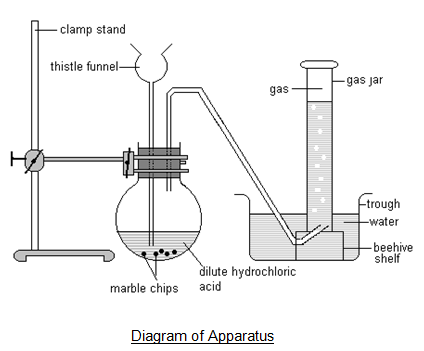

# d) Oxygen and oxides

## 2.16 Recall the gases present in air and their approximate percentage by volume

| Gas            | Amount in air (%) | Amount in air (fraction) |
| -------------- | ----------------- | ------------------------ |
| Nitrogen       | 78.1              | About 4/5                |
| Oxygen         | 21.0              | About 1/5                |
| Argon          | 0.9               |                          |
| Carbon dioxide | 0.004             |                          |

## 2.17 Explain how experiments involving the reactions of elements such as copper, iron and phosphorus with air can be used to investigate the percentage by volume of oxygen in air

### Using copper:

The apparatus originally contains 100cm3 of air. This is pushed forward and backward over the heated copper, which turns black as copper(II) oxide is formed. The volume of gas reduce as the oxygen is used up.

$$2Cu(s) + O2(g) \rightarrow 2CuO(s)$$

As the copper reacts, the Bunsen is moved along the tube so that it is always heating fresh copper. Eventually all the oxygen in the air is used up. The volume stops reducing. Now there's only 79% of air remaining which proves that air has the percentage composition of 21% in air.

### Using rusting or iron:

A test tube is taken and damp iron wool is placed. This is inverted and placed in a beaker containing water. The tube is now left for weeks. Iron uses oxygen and water to form rust. As long as the wool is damp, the rusting will continue.

The water level rises as oxygen is used. This is marked with a rubber band. At the end of the experiment, we will see all the oxygen is used up. The original water level was 15cm3 and now it is 12cm3. That means 3cm3 is used up.

$$\frac{3}{15} \times 100 = 20\%$$

## 2.18 Describe the laboratory preparation of oxygen from hydrogen peroxide, using manganese(IV) oxide as a catalyst

Oxygen is made in the lab from hydrogen peroxide solution using manganese(IV) oxide as a catalyst. The reaction is known as catalytic decomposition of hydrogen peroxide.

$$2H2O2(aq) \rightarrow 2H2O(l) + O2(g)$$

Testing oxygen: Oxygen relights a glowing splint.

## 2.19 Describe the reactions of magnesium, carbon and sulfur with oxygen in air, and the acid-base character of the oxides produced

### Burning magnesium

Magnesium burns in air with a bright white flame to give a white, powdery ash of magnesium oxide. The flame is extremely bright in pure oxygen.

$$2Mg(s) + O2(g) \rightarrow 2MgO(s)$$

### Burning carbon

Carbon burns if it is heated very strongly in air or oxygen to give colourless carbon dioxide gas. The carbon may produce a small yellow-orange flame and perhaps some sparks. It depends on the purity of the carbon.

$$C(s) +O2(g) \rightarrow CO2(g)$$

### Burning sulfur

Sulfur burns in air with a tiny, almost invisible blue flame. In oxygen it burns much more strongly giving a bright blue flame. Poisonous, colourless sulfur dioxide gas is produced.

$$S(s) + O2(g) \rightarrow SO2(g)$$

### Acid base character of oxides:

Few metal oxides react or dissolve in water -- to form alkaline solutions. Most metal oxides do not. Shaking a solid magnesium oxide with water doesn't seem to dissolve. However, checking the pH of mixture it proves it is mildly an alkaline.

$$MgO(s) + H2O(l) \rightarrow Mg(OH)2(s \text{ and } aq)$$

Many non-metals react with water to give acidic solutions except water and carbon dioxide. For example sulfur dioxide reacts with water to give sulfurous acid. Sulfurous acid is fairly acidic.

$$H2O(l) + SO2(g) \rightarrow H2SO3(aq)$$

## 2.20 Describe the laboratory preparation of carbon dioxide from calcium carbonate and dilute hydrochloric acid

Carbon dioxide is most easily made by the reaction between dilute hydrochloric acid and calcium carbonate in the form of marble chips. Carbon dioxide is collected in an inverted jar.

$$CaCO3(s) + 2HCl(aq) \rightarrow CaCl2(aq) + CO2(g) + H2O(l)$$

### Testing carbon dioxide:

Carbon dioxide turns lime water(calcium hydroxide solution) milky. It reacts to give a white precipitate of calcium carbonate.

$$Ca(OH)2(aq) + CO2(g) \rightarrow CaCO3(s) + H2O(l)$$

With an excess of carbon dioxide, the precipitate dissolves again to give a colorless solution of calcium hydrogen carbonate.

$$CaCO3(s) + CO2(g) + H2O(l) \rightarrow Ca(HCO3)2 (aq)$$

## 2.21 Describe the formation of carbon dioxide from the thermal decomposition of metal carbonates such as copper(II) carbonate

The formation of carbon dioxide by the thermal decomposition of metal carbonate.

For example:

_Copper carbonate_ -> _Copper oxide + Carbon dioxide_

$$CuCO3(green) \rightarrow CuO(black) + CO2$$

## 2.22 Describe the properties of carbon dioxide, limited to its solubility and density

Properties of Carbon dioxide:

- Denser than air
- Colourless
- Odourless
- Does not supper combustion.
- Produces acidic gas reacting with water
- Sparingly soluble in water.

## 2.23 Explain the use of carbon dioxide in carbonating drinks and in fire extinguishers, in terms of its solubility and density

It is used in carbonated drinks because it dissolves in water under pressure. When you open bottle, the pressure falls and the gas bubbles out of solution.

It is also used in fire extinguishers to put out electrical fires, or those caused by burning liquids, where using water could cause problems. The dense gas sinks onto the flames and prevents any more oxygen from reaching them.

## 2.24 Understand that carbon dioxide is a greenhouse gas and may contribute to climate change

Carbon dioxide is a green house gas. Carbon dioxide absorbs IR radiation and heats up. As carbon dioxide is present in the air, the air gets warm by absorption of radiation from sunlight. This acts as a greenhouse.

In greenhouse, the heat energy gets trapped inside the house and cannot get out from it. So inside the house, the air is warmer than the outside. Carbon dioxide act as this greenhouse, that's why this gas is called green house gas.

Contribution to climate change:

- Global warming.
- Ice cap melting of N and S pole.
- Flooding in low lying countries.
