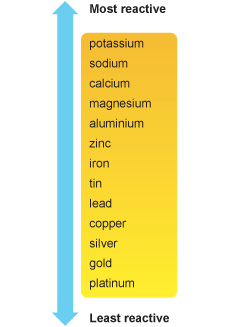
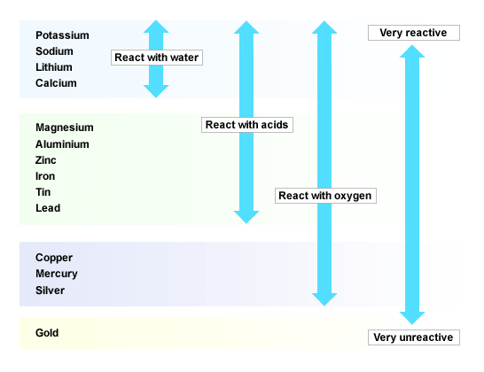
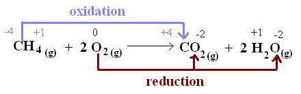

# f) Reactivity series

## 2.29 Understand that metals can be arranged in a reactivity series

Based on the reactions of the metals and their compounds: potassium, sodium, lithium, calcium, magnesium, aluminium, zinc, iron, copper, silver and gold.

## 2.30 Describe how reactions with water and dilute acids can be used to deduce the following order of reactivity

Potassium, sodium, lithium, calcium, magnesium, zinc, iron and copper.

Potassium, sodium, lithium, calcium react with water and acids. Magnesium, aluminium, zinc, iron, tin, lead can react with acids too but more slowly. They can't react with water. Copper can't react with any of them. The more the vigorous the element is in the reaction, the more reactive the element is and the more things they can react with.

## 2.31 Deduce the position of a metal within the reactivity series

Using displacement reactions between metals and their oxides, and between metals and their salts in aqueous solutions. If metal is reactive than the metal in metal oxide, the metal will be displaced and reaction will occur in water. If metal is less reactive than the metal in metal oxide, no reaction will occur. In this way we can work out their position in reactivity series.

## 2.32 Understand oxidation and reduction as the addition and removal of oxygen respectively

**Oxidation:** Oxidation takes place during:

i. Addition of oxygen\
e.g: $Cu + O2 \rightarrow CuO$

ii. Loss of electron.\
e.g: $Ca \rightarrow Ca^{2+} + 2e^-$

**Oxidation state:** The applied valency of an element in a compound is called an oxidation state. e.g: Oxidation state of carbon (C) in carbon monoxide (CO) is +2. Oxidation of carbon (C) in carbon dioxide (CO2) is +4.

P.S: The total oxidation of a compound is 0\
$CO = 0$\
$C + (-2) = 0$\
$C -2 = 0$\
$C = +2$

**Reduction:** Reduction takes place during:\
i. Removal of oxygen\
ii. Addition of electron\
iii. Decrease in oxidation state

## 2.33 Understand the terms redox, oxidising agent, reducing agent

**Redox reaction**: If in a reaction, both oxidation and reduction take place, it is called redox reaction.

**Oxidising agent/ oxidant**: Oxidising agent is a substance that oxidizes others but reduce itself from the reaction. **Reducing agent**: Reducing agent is a substance that reduces others but oxides itself from the reaction.

| **Oxidising agents**        | **Reducing agents** |
| --------------------------- | ------------------- |
| Bromine                     | Carbon              |
| Chlorine                    | Carbon monoxide     |
| Concentrated sulphuric acid | Hydrogen            |
| Nitric acid                 | Hydrogen sulphide   |
| Oxygen                      | Metals              |
| Potassium manganate(VII)    | Potassium iodide    |
| Potassium dichromate        | Sulphur dioxide     |
| Hydrogen peroxide           | Ammonia             |

## 2.34 Describe the conditions under which iron rusts

**_What is rusting?_**

When an object made of iron is exposed to moist air for some time, a reddish-brown substance slowly forms on the surface of the metal. The substance is called rust and have the chemical name hydrated iron (II) oxide.

The process is known as rusting or corrosion of iron.\
$4Fe(s) + 3O2(g) + 2xH2O(l) \rightarrow 2Fe2O3xH2O(s)$

**Conditions under which iron rusts:**\
• Both air and water are needed for rusting to occur\
• The presence of sodium chloride increases the speed of rusting.

## 2.35 Describe how the rusting of iron may be prevented by grease, oil, paint, plastic and galvanising

Grease, oil, paint and plastic prevent air and/or water from coming into contact with iron. This means the reaction that rusts iron can't occur.

Galvanizing is coating in zinc. This Zinc react in the air to form ZnCO3 which prevents air and/or water from coming into contact with the iron.

## 2.36 Understand the sacrificial protection of iron in terms of the reactivity series.

Magnesium or zinc is used as sacrificial protection of iron. If you keep them beside or attach them to iron, magnesium or zinc will corrode instead of iron. Because they are more reactive than iron. As long as magnesium or zinc is present, iron will not rust.

Various methods of rust prevention:

| **Method**                       | **Where it is used**                                    | **Comment**                                                                                                                                     |
| -------------------------------- | ------------------------------------------------------- | ----------------------------------------------------------------------------------------------------------------------------------------------- |
| Painting                         | Large objects like cars, ships and bridges              | If the paint on the metal surface is scratched, rusting will take place under the painted surface.                                              |
| Oiling or greasing               | Tools and machine parts                                 | The protective film of oil or grease gathers dust and must be renewed.                                                                          |
| Plastic coating                  | Kitchenware such as draining racks                      | If the plastic layer is torn, the iron starts to rust.                                                                                          |
| Galvanizing (zinc - plating)     | Water buckets, dustbins, 'zinc' roofs, kitchen sinks    | The metal does not rust even if the zinc layer is damaged. (This is because zinc is more reactive than iron. So zinc corrodes instead of iron). |
| Tin-plating                      | Food cans                                               | If the tin layer is scratched, the iron beneath it rusts.                                                                                       |
| Chrome-plating                   | Taps, kettles, bicycle handle bars                      | This gives a bright shiny finish as well as rust protection.                                                                                    |
| Metal block of zinc or magnesium | Underground pipes, ships, legs of steel piers           | Magnesium and zinc corrode in place of iron because they are more reactive metals.                                                              |
| Stainless steel                  | Cutlery, surgical instruments, pipes in chemical plants | Stainless steel contains chromium and nickel, which do not rust.                                                                                |
