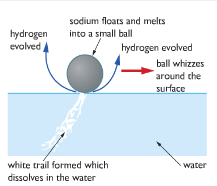
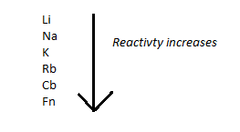

# b) Group 1 elements --- lithium, sodium and potassium

## 2.6 describe the reactions of these elements with water and understand that the reactions provide a basis for their recognition as a family of elements

All the group 1 elements react with water to produce a metal hydroxide and hydrogen. The difference is how fast they happen.

### Sodium:

$$2Na(s) + 2H2O(l) \rightarrow 2NaOH(aq) + H2(g)$$

The sodium floats on water because it is less dense. It melts because its melting point is low and a lot of heat is produced in this reaction. It forms a ball. Because the hydrogen isn't given off symmetrically around the ball, the sodium is pushed around the surface of the water.

A white trail is formed inside the water which is sodium hydroxide, which dissolves to make a strongly alkaline solution. All these metals react with water to produce alkaline metal hydroxides. That's why the Group is called 'alkali metals'.

### Lithium:

$$2Li (s) + 2H2O(l) \rightarrow 2LiOH(aq) + H2(g)$$

The reaction is very similar to sodium's reaction, except that it is slower. Lithium's melting point is higher and the heat isn't produced so quickly, so the lithium doesn't melt.

### Potassium:

$$2K(s) +2H2O(l) \rightarrow 2KOH(aq) + H2 (g)$$

Potassium's reaction is faster than sodium's. Enough heat is produced to ignite the hydrogen, which burns with a lilac flame. The reaction often ends with the potassium spitting around.

### Rubidium and caesium:

These react even more violently than potassium, and the reaction can be explosive. Rubidium hydroxide and caesium hydroxide are formed.

## 2.7 describe the relative reactivities of the elements in Group 1

The reactivity of group one elements increases down the group.

## 2.8 explain the relative reactivities of the elements in Group 1 in terms of distance between the outer electrons and the nucleus.

Group 1 elements lose electrons to non-metals to react. As you go down the group, the reactivity of the elements increases. Because the number of electrons increase if we go down. Higher electrons can form more shells. Higher electron shell reduces the attraction between proton and electron. So elements can easily lose electrons.