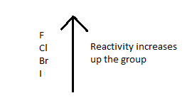
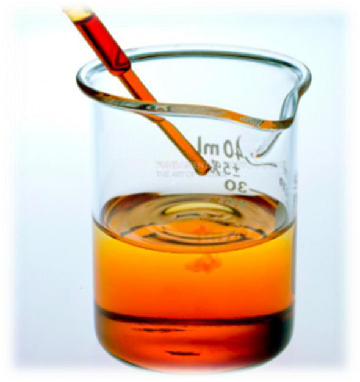

# c) Group 7 elements --- chlorine, bromine and iodine
## 2.9 recall the colours and physical states of the elements at room temperature

| Element | State in room temperature | Colour At RTP | Colour At Vapour | Colour in Solution |
|---------|--------------------------|---------------|------------------|--------------------|
| F2      | Gas                      | Yellow        | Green            | Green              |
| Cl2     | Gas                      | Green         | Yellow           | Red                |
| Br2     | Liquid                   | Red           | Brown            | Orange             |
| I2      | Solid                    | Black         | Purple           | Dark brown         |

## 2.10 make predictions about the properties of other halogens in this group

- Halogens are oxidising agent.
- They are poisonous.
- They are diatomic.
- They combine with metals to form ionic compounds.
- They get higher melting and boiling points down the group.
- They get darker colour down the group.

## 2.11 understand the difference between hydrogen chloride gas and hydrochloric acid

| Hydrogen chloride gas | Hydrochloric acid |
|-----------------------|-------------------|
| It is a gaseous compound of Hydrogen and chlorine gas. | It is an aqueous solution of hydrogen and chlorine. |
| Have symbol: HCl (g) | Have symbol: HCl(aq) |
| It exist as a molecule | Here, hydrogen and chloride ions are present. |
| Hydrogen chloride gas doesn't change the colour of litmus paper when it is dry. | It changes the colour of dry litmus paper. |
| Hydrogen chloride is acidic in water as it produce hydroxonium ions and chloride ions: $H2O(l) + HCl(g) \rightarrow H3O+(aq) +Cl-(aq)$ | |

## 2.12 explain, in terms of dissociation, why hydrogen chloride is acidic in water but not in methylbenzene

In water, hydrogen chloride dissociates to form hydrogen ion. That's why it shows acidic property. This solution can react with metals to give H2 gas.

This solution changes the colour of blue litmus paper to red. That means hydrogen chloride is an acid.

Hydrogen chloride in methyl benzene, does not dissociates. It exists as molecule. So it cannot show acid behavior in methyl benzene. That's why this solution does not react with metal carbonates, metal sulphides, and cannot change the colour of litmus.

## 2.13 describe the relative reactivities of the elements in Group 7

The reactivity falls quickly as you go down the group.

During the reactions, halogens gain one electron to form negatively charged ions. This is because the nucleus attracts the outer shell electron towards it to achieve to fill up its octet. If we go down the group, the distance between the nucleus and the outer shell electron increases. So the attraction for the extra electron decreases. So larger halogens feel less attraction for an extra electron.

## 2.14 describe experiments to demonstrate that a more reactive halogen will displace a less reactive halogen from a solution of one of its salts

### Reacting chlorine with potassium bromide
If you add chlorine solution to colourless potassium solution, the solution becomes orange as bromine is formed.

$$2KBr (aq) + Cl2 (aq) \rightarrow 2KCl (aq) + Br2(aq)$$

This is because chlorine is more reactive than bromine. This is because chlorine displaces bromine.

### Reacting chlorine with potassium iodide
Adding chlorine solution to potassium iodide solution gives a dark reddish-brown solution of iodine.

$$2KI (aq) + Cl2(aq) \rightarrow 2KCl(aq) + I2(aq or s)$$

## 2.15 understand these displacement reactions as redox reactions.

In the reaction between chlorine and potassium bromide, bromine loosed electrons. That means it is oxidized. Chlorine gained electron which means it is reduced. When both oxidation and reduction takes place in the same reaction, it is said to be redox reaction.