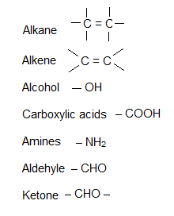
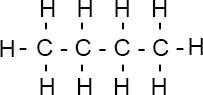

# a) Introduction

## 3.1 Explain the terms homologous series, hydrocarbon, saturated, unsaturated, general formula, and isomerism.

### Organic Compound

The compounds of carbon are called organic compounds. However, for conventional reasons, metal carbonates, carbon dioxide, and carbon monoxide are not included in organic compounds.

**Examples:** Methane ($\text{CH}_4$), Ethanol ($\text{C}_2\text{H}_5\text{OH}$), Carbon Tetrachloride ($\text{CCl}_4$), Benzene ($\text{C}_6\text{H}_6$), etc.

The main branches of organic compounds are:

1. Aliphatic hydrocarbons
2. Aromatic hydrocarbons

### Homologous Series

A homologous series is a family of compounds with the same functional group and general formula, exhibiting similar physical and chemical properties.

#### Characteristics of Homologous Series

- They have a general formula.
- They differ in molecular formula.
- A homologous series has similar chemical properties.
- Their physical properties follow a trend.
- Each homologous series has a functional group.
- Each member in a homologous series differs in molecular formula from the next by $\text{CH}_2$.

### Hydrocarbon

Compounds that are made of only hydrogen and carbon. Hydrocarbons are of two types: Saturated and Unsaturated.

| Saturated                                                       | Unsaturated                                                    |
| --------------------------------------------------------------- | -------------------------------------------------------------- |
| Contain C-C single bond (e.g., Alkanes)                         | Contain C=C double bond (e.g., Alkenes)                        |
| Give substitution reactions                                     | Give addition reactions                                        |
| A part of saturated compounds is comparatively less reactive    | A part of unsaturated is more reactive than saturated          |
| Alkanes do not polymerize                                       | Alkenes can be polymerized                                     |
| Saturated hydrocarbons cannot change the color of bromine water | Unsaturated hydrocarbons can change the color of bromine water |

### General Formula

The general formula confirms which compound belongs to which homologous series.

- Alkanes: $C_nH_{2n + 2}$
- Alkenes: $C_nH_{2n}$
- Alcohols: $C_nH_{2n + 1}OH$
- Carboxylic acids: $C_nH_{2n + 1}COOH$
- Amines: $C_nH_{2n + 1}NH_2$

### Functional Group

A functional group is an atom or group of atoms that controls the properties of a homologous series.

### Isomerism

Molecules with identical molecular formulae but different structural formulae are called isomers.

**Example: Isomers of Butane**

### Types of Formula

| Name   | Molecular Formula | Structural Formula                             | Displayed Formula          |
| ------ | ----------------- | ---------------------------------------------- | -------------------------- |
| Butane | $C_nH_{2n+2}$     | $\text{CH}_3\text{CH}_2\text{CH}_2\text{CH}_3$ |  |
