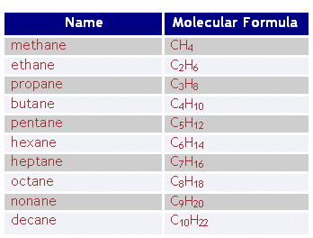
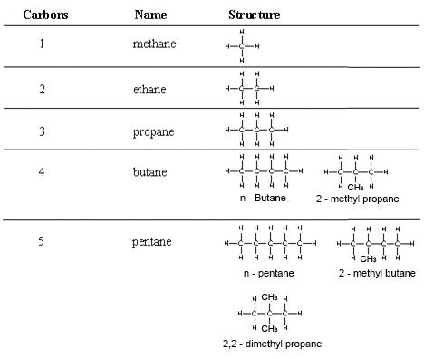

# b) Alkanes

## 3.2 General Formula

Alkanes have the general formula $C_nH_{2n+2}$, where \( n \) is the number of carbon atoms.

{width="3.625in" height="2.75in"}

## 3.3 Displayed Formulae

Draw displayed formulae for alkanes with up to five carbon atoms in a molecule, and name the straight-chain isomers.

## 3.4 Combustion of Alkanes

### Complete Combustion

If air is present in sufficient quantity, alkanes burn completely to produce carbon dioxide and water:

$$
\text{CH}_4 + \text{O}_2 \rightarrow \text{CO}_2 + \text{H}_2\text{O}
$$

### Incomplete Combustion

If air is insufficient, alkanes burn incompletely, producing carbon monoxide or soot (carbon) and water:

$$
\text{CH}_4 + \text{O}_2 \rightarrow \text{CO} + \text{H}_2\text{O}
$$

or

$$
\text{CH}_4 + \text{O}_2 \rightarrow \text{C (s)} + \text{H}_2\text{O}
$$

Complete combustion is more efficient than incomplete combustion, producing more heat energy.

## 3.5 Substitution Reaction of Methane

Describe the substitution reaction of methane with bromine to form bromomethane in the presence of UV light.

If hydrogen atoms of alkanes are replaced by halogen atoms, this type of reaction is called a **substitution reaction**.

- If chlorine is replaced, it is called **chlorination**.
- If bromine is replaced, it is called **bromination**.
- If any halogen is replaced, it is called **halogenation**.

Alkanes undergo substitution reactions by reacting with bromine in the presence of ultraviolet light. A hydrogen atom in the alkane is replaced by a bromine atom.

A mixture of methane and bromine gas appears brown due to the presence of bromine. When exposed to sunlight, it loses its color, resulting in a mixture of bromomethane and hydrogen bromide gases.

### Reaction Examples

1. Methane + Chlorine → Monochloromethane + Hydrogen Chloride

   $$
   \text{CH}_4 (g) + \text{Cl}_2 (g) \rightarrow \text{CH}_3\text{Cl} (g) + \text{HCl} (g)
   $$

2. Monochloromethane + Chlorine → Dichloromethane + Hydrogen Chloride

   $$
   \text{CH}_3\text{Cl} (g) + \text{Cl}_2 (g) \rightarrow \text{CH}_2\text{Cl}_2 (g) + \text{HCl} (g)
   $$

3. Dichloromethane + Chlorine → Trichloromethane + Hydrogen Chloride

   $$
   \text{CH}_2\text{Cl}_2 (g) + \text{Cl}_2 (g) \rightarrow \text{CHCl}_3 (l) + \text{HCl} (g)
   $$

4. Trichloromethane + Chlorine → Tetrachloromethane + Hydrogen Chloride
   $$
   \text{CHCl}_3 (l) + \text{Cl}_2 (g) \rightarrow \text{CCl}_4 (l) + \text{HCl} (g)
   $$

### Overall Reaction

$$
\text{CH}_4 (g) + \text{Cl}_2 (g) \rightarrow \text{CCl}_4 (l) + \text{HCl} (g)
$$
