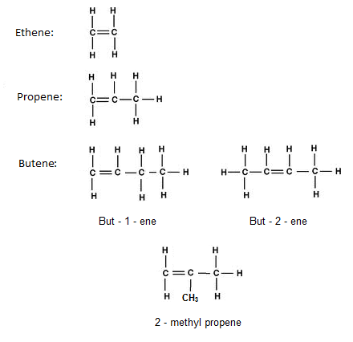
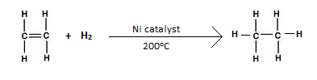
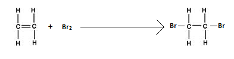

# c) Alkenes

## 3.6 Recall that Alkenes Have the General Formula CnH2n

Alkenes have the general formula $C_nH_{2n}$.

## 3.7 Draw Displayed Formulae for Alkenes with Up to Four Carbon Atoms in a Molecule, and Name the Straight-Chain Isomers

## 3.8 Describe the Addition Reaction of Alkenes with Bromine, Including the Decolourising of Bromine Water as a Test for Alkenes

**Addition Reaction:**

1. **With Hydrogen**  
   In the presence of a nickel catalyst, alkenes react with hydrogen to produce alkanes. This process adds hydrogen, therefore it is called hydrogenation.

   

2. **With Halogen**  
   An alkene will convert its double bond into a single bond to bond with two bromine atoms. This process is called halogenation because halogen is added. When alkenes are placed in bromine water, it turns from brown to colourless.

   This reaction can be used to check saturation because only alkenes can add bromine, but not alkanes.

## Test

Shake the compound with bromine water solution.

### Result

If the compound is unsaturated, then the colour will change from orange to colourless.

For example:

$$ C_2H_4(g) + Br_2(aq) \rightarrow C_2H_4Br_2(aq) $$

