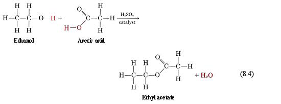

# d) Ethanol

## d) Ethanol

Ethanol is the second member of a homologous series, alcohol. All alcohols have a functional group -OH. The general formula of alcohol is $C_nH_{2n+1}OH$.

## 3.9 Manufacture of Ethanol by Catalytic Addition

Ethanol is manufactured by the catalytic addition of steam to ethene. The mixture of ethene and steam is passed through phosphoric (V) acid at 300°C and 60 atm. Phosphoric (V) acid ($H_3PO_4$) acts as a catalyst in this reaction.

| Reactants                | Products     |
| ------------------------ | ------------ |
| Ethene + Steam           | Ethanol      |
| $CH_2=CH_2(g) + H_2O(g)$ | $CH_3CH_2OH$ |

## 3.10 Manufacture of Ethanol by Fermentation

Fermentation is a chemical process in which microorganisms such as yeast act on carbohydrates to produce ethanol and carbon dioxide. Sugars and starch are examples of carbohydrates.

Yeast contains zymase enzymes (biological catalysts) which cause starch or sugar to break down to glucose. The glucose is then broken down to ethanol and carbon dioxide.

A glucose solution is mixed with yeast, and the mixture is produced after a few days. The enzymes in yeast work best at around 37°C. If the temperature is raised beyond 37°C, the enzymes will die, and fermentation stops.

The fermentation of sugars produces only a dilute solution of ethanol, which is about 12%. This is because when the alcohol content exceeds this value, the yeast dies, and fermentation stops. The fermented mixture is filtered to remove solid impurities, and the filtrate is fractionally distilled for further purification.

The reaction can be summarized as:

$$
C_6H_{12}O_6 (aq) + \text{yeast} \rightarrow 2C_2H_5OH (aq) + 2CO_2 (g)
$$

## Purification of Fermented Mixture

_Follow: 1.7(iii)_

## 3.11 Evaluation of Factors in Ethanol Manufacture

### Comparison of Methods

| Factors             | Fermentation                                                                                                                                                                        | Hydration of Ethene                                                                                                                   |
| ------------------- | ----------------------------------------------------------------------------------------------------------------------------------------------------------------------------------- | ------------------------------------------------------------------------------------------------------------------------------------- |
| Uses of Resources   | Uses renewable resources - sugar beet or sugar cane, corn, and other starchy materials.                                                                                             | Uses finite resources - once all the oil has been used up, there won't be any more.                                                   |
| Type of Process     | A batch process - everything is mixed together in a reaction vessel and then left for several days. That batch is then removed, and a new reaction is set up - this is inefficient. | A continuous flow process - a stream of reactant is constantly passed over the catalyst. This is more efficient than a batch process. |
| Rate of Reaction    | Slow, taking several days for each batch.                                                                                                                                           | Rapid.                                                                                                                                |
| Quality of Product  | Produces very impure ethanol that needs further processing.                                                                                                                         | Produces much purer ethanol.                                                                                                          |
| Reaction Conditions | Uses gentle temperature and ordinary pressure.                                                                                                                                      | Uses high temperature and pressures, needing a high input of energy.                                                                  |

## 3.12 Dehydration of Ethanol to Ethene

Dehydration refers to the removal of water from a compound. The dehydration of ethanol produces ethene. Ethanol vapor is passed over hot aluminium oxide, acting as a catalyst.

$$
C_2H_5OH(g) \rightarrow C_2H_4(g) + H_2O(l)
$$

If propanol is used instead of ethanol, then by the loss of water molecules, propene will be produced.

## Other Reactions of Alcohol

### (i) With Sodium

Ethanol reacts with sodium to produce sodium ethoxide and hydrogen. This time, sodium sinks in ethanol (whereas sodium floats in water).

$$
C_2H_5OH + Na \rightarrow C_2H_5ONa + H_2
$$

### (ii) With Phosphorus Pentachloride

Ethanol reacts with phosphorus (V) chloride to produce chloroethane, phosphorus oxychloride, and steamy fumes of hydrogen chloride gas.

$$
C_2H_5OH + PCl_5 \rightarrow C_2H_5Cl + POCl_3 + HCl
$$

### (iii) With Acidified Potassium Dichromate (Oxidation Reaction)

If ethanol is warmed with acidified potassium dichromate (VI), then ethanol oxidizes to ethanoic acid.

$$
CH_3CH_2OH + [O] \rightarrow CH_3COOH + H_2O
$$

Here, the color changes from orange to green in the reaction mixture.

### (iv) Esterification

$$
\text{Alcohol} + \text{Carboxylic Acid} \rightarrow \text{Ester} + \text{Water}
$$

If ethanol is heated with ethanoic acid in the presence of concentrated acid & catalyst, then an ester is formed.

$$
CH_3CH_2OH + CH_3COOH \rightarrow CH_3COOCH_2CH_3
$$

_Ethanol + Ethanoic Acid → Ethyl Ethanoate_

