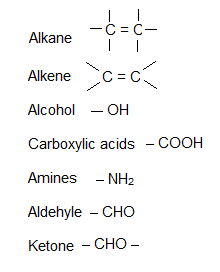
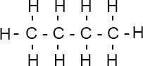

> **a) Introduction**\
> **3.1 explain the terms homologous series, hydrocarbon, saturated,
> unsaturated, general formula and isomerism.**
>
> **_Organic compound:_**\
> The compounds of carbon are called organic compounds. But for
> conventional reason, the metal carbonate, carbon dioxide and carbon
> monoxide are not included in organic compounds.
>
> e.g: methane (CH4), ethanol (C2H5OH), carbon tetrachloride (CCl4),
> benzene (C2H6) etc.
>
> The main branches of organic compounds are:-
>
> i\. Aliphatic hydrocarbon\
> ii. Aromatic hydrocarbon\
> **_Homologous series:_**\
> It is a family of compounds with same functional group and general
> formula with similar physical and chemical properties.
>
> **_Characteristics of homologous series:_**

+-----------------------------------+-----------------------------------+
| > •\ | > They have a general formula. |
| > •\ | > |
| > •\ | > They differ in molecular |
| > •\ | > formula. |
| > •\ | > |
| > • | > A homologous series have |
| | > similar chemical properties. |
| | > |
| | > Their physical properties are |
| | > in a trend. |
| | > |
| | > Each homologous series have a |
| | > functional of group. |
| | > |
| | > Each member in a homologous |
| | > series differs in molecular |
| | > formula from next by CH2. |
+===================================+===================================+
+-----------------------------------+-----------------------------------+

> **_Hydrocarbon:_**\
> Compounds that are made of only hydrogen and carbon. Hydrocarbons are
> of two types: Saturated and Unsaturated

+-----------------------------------+-----------------------------------+
| Saturated | Unsaturated |
+===================================+===================================+
| > Contain C-C single bond(eg: | > Contain C=C double bond. (eg: |
| > Alkanes) | > alkenes) |
+-----------------------------------+-----------------------------------+
| > Give substitution reaction | > Give addition reaction |
+-----------------------------------+-----------------------------------+
| > A part of saturated compound | > A part of unsaturated is more |
| > comparatively is less reactive | > reactive than saturated |
+-----------------------------------+-----------------------------------+
| > Alkanes do not polimarise | > Alkene can be polimarised |
+-----------------------------------+-----------------------------------+
| > Saturated hydrocarbons cannot | > Unsaturated hydrocarbons can |
| > change the colour of bromine | > change the colour of bromine |
| > water | > water |
+-----------------------------------+-----------------------------------+

+-----------------------------------+-----------------------------------+
| {width="0.4263888888888889in" | |
| height="0.42777668416447945in"} | |
+===================================+===================================+
+-----------------------------------+-----------------------------------+

+-----------------------------------+-----------------------------------+
| 51 | > IGCSE Chemistry Note |
+===================================+===================================+
+-----------------------------------+-----------------------------------+

> **_General formula:_**\
> General formula confirms which compound is in which homologous series.
>
> •Alkanes  CnH2n + 2\
> •Alkenes  CnH2n\
> •Alcohols  CnH2n + 1+ OH\
> • Carboxylic acid  CnH2n + 1 COOH\
> • Amines  CnH2n + 1 NH2\
> **_Functional Group_**\
> Functional group is an atom or group of atom which controls the
> property of homologus series.
>
> {width="2.134721128608924in"
> height="2.638888888888889in"}
>
> **_Isomerism:_**\
> Molecules with identical molecular formulae but with different
> structural formulae are called isomer.
>
> Example:
>
> Isomers of Butane:
>
> {width="3.625in"
> height="1.5944444444444446in"}

+-----------------------------------+-----------------------------------+
| {width="0.4263888888888889in" | |
| height="0.42777668416447945in"} | |
+===================================+===================================+
+-----------------------------------+-----------------------------------+

+-----------------------------------+-----------------------------------+
| IGCSE Chemistry Note | > 52 |
+===================================+===================================+
+-----------------------------------+-----------------------------------+

> **_Types of formula_**

---

Name Molecular Formula Structural Displayed Formula
Formula

---

Butane C4H10 CH3CH2 CH2 CH3 {width="1.9041655730533684in"
height="0.8916666666666667in"}

---
