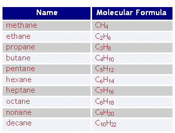
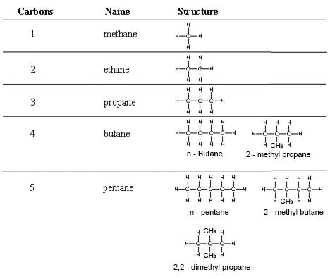

> **b) Alkanes**\
> **3.2 recall that alkanes have the general formula CnH2n+2**
>
> Alkanes have the general formula CnH2n+2.n is the number of carbons.
>
> {width="3.625in"
> height="2.75in"}

+-----------------------------------+-----------------------------------+
| {width="0.4263888888888889in" | |
| height="0.42777668416447945in"} | |
+===================================+===================================+
+-----------------------------------+-----------------------------------+

+-----------------------------------+-----------------------------------+
| 53 | > IGCSE Chemistry Note |
+===================================+===================================+
+-----------------------------------+-----------------------------------+

> **3.3 draw displayed formulae for alkanes with up to five carbon atoms
> in a molecule, and name the straight-chain isomers**
>
> {width="4.690277777777778in"
> height="3.9680555555555554in"}
>
> **3.4 recall the products of the complete and incomplete combustion of
> alkanes** If air is present enough, then alkanes burn completely to
> produce carbon dioxide and water.
>
> eg:

*CH4 + O2* _CO2 + H2O_

> If the air is not enough then alkanes burn incompletely and produce
> carbon monoxide or soot (carbon) and water.
>
> *CH4 + O2* _CO + H2O_\
> or\
> *CH4 +O2* _C (s) + H2O_
>
> Complete combustion is more efficient than incomplete combustion and
> during complete combustion more heat energy is produced.
>
> **3.5 describe the substitution reaction of methane with bromine to
> form bromomethane in the presence of UV light.**
>
> If hydrogen atoms of alkanes are replaced by halogen atoms then this
> type of reaction is called **substitution** reaction.
>
> If chlorine is replaced, it is **chlorination.** If bromine is
> replaced, it is **bromination.** If halogen is replaced, it is
> **halogenations**.

Alkanes give substitution reaction by reacting with bromine in the
presence of ultra-violet light. A hydrogen atom in the

+-----------------------------------+-----------------------------------+
| {width="0.4263888888888889in" | |
| height="0.42777668416447945in"} | |
+===================================+===================================+
+-----------------------------------+-----------------------------------+

+-----------------------------------+-----------------------------------+
| IGCSE Chemistry Note | > 54 |
+===================================+===================================+
+-----------------------------------+-----------------------------------+

> alkane is replaced by a bromine atom.

A mixture of methane and bromine gas is brown because of the presence of
bromine. If it is exposed to sunlight, it loses

> its colour, and a mixture of bromomethane and hydrogen bromide gases
> is formed.
>
> Methane + chlorine monochloromethane + hydrogen chloride\
> CH4 (g) + Cl2 (g)  CH3Cl (g) + HCl (g)
>
> Monochloromethane + chlorine  dichloromethane + hydrogen chloride
> CH3Cl (g) + Cl2 (g)  CH2Cl2 (g) + HCl (g)
>
> Dichloromethane + chlorine trichloromethane + hydrogen chloride
> CH2Cl2 (g) + Cl2 (g)  CHCl3 (l) + HCl (g)
>
> Trichloromethane + chlorine tetrachlomethane + hydrogen chloride
> CHCl3 (l) + Cl2 (g)  CCl4 (l) + HCl (g)
>
> Overall reaction:

CH4 (g) + Cl2 (g)  CCl4 (l) + HCl (g)

+-----------------------------------+-----------------------------------+
| {width="0.4263888888888889in" | |
| height="0.42777668416447945in"} | |
+===================================+===================================+
+-----------------------------------+-----------------------------------+

+-----------------------------------+-----------------------------------+
| 55 | > IGCSE Chemistry Note |
+===================================+===================================+
+-----------------------------------+-----------------------------------+
