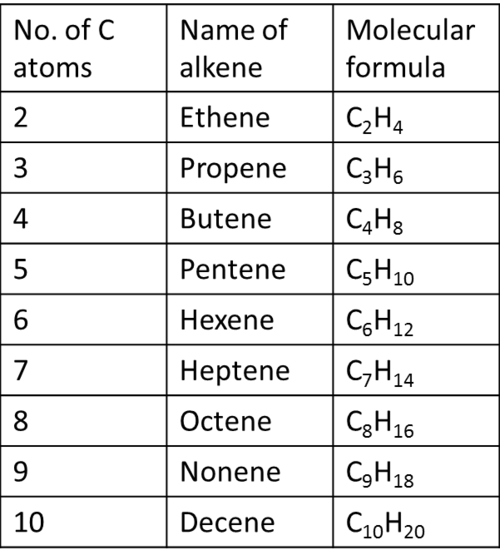
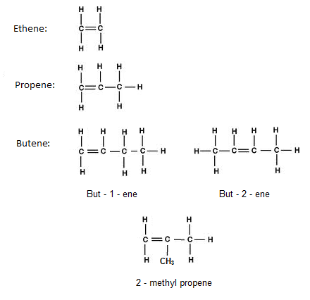
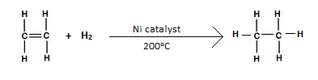
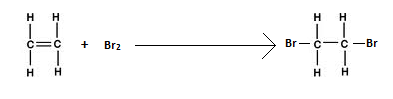

> **c) Alkenes**\
> **3.6 recall that alkenes have the general formula CnH2n**\
> Alkenes have the general formula CnH2n
>
> {width="3.1347222222222224in"
> height="3.511111111111111in"}

+-----------------------------------+-----------------------------------+
| {width="0.4263888888888889in" | |
| height="0.42777668416447945in"} | |
+===================================+===================================+
+-----------------------------------+-----------------------------------+

+-----------------------------------+-----------------------------------+
| IGCSE Chemistry Note | > 56 |
+===================================+===================================+
+-----------------------------------+-----------------------------------+

> **3.7 draw displayed formulae for alkenes with up to four carbon atoms
> in a molecule, and name the straight-chain isomers (knowledge of cis-
> and trans- isomers is not required)**
>
> {width="4.583333333333333in"
> height="4.4375in"}
>
> **3.8 describe the addition reaction of alkenes with bromine,
> including the decolourising of bromine water as a test for alkenes.**
>
> **Addition reaction:**\
> (i) With hydrogen\
> In the presence of nickel catalyst, alkenes react with hydrogen to
> produce alkanes. This process is adds hydrogen, therefore it is called
> hydrogenation.

{width="4.094444444444444in"
height="1.0305555555555554in"}

> \(ii\) With halogen\
> An alkene will make its double bond into a single bond, to bond to two
> bromines. Bromine is added to the molecule. This is called
> halogenations because halogen is added. When alkenes are put in
> bromine water it turns from brown to colourless.
>
> This reaction can be used to check saturation because only alkenes can
> add bromine but not alkane.

+-----------------------------------+-----------------------------------+
| {width="0.4263888888888889in" | |
| height="0.42777668416447945in"} | |
+===================================+===================================+
+-----------------------------------+-----------------------------------+

+-----------------------------------+-----------------------------------+
| 57 | > IGCSE Chemistry Note |
+===================================+===================================+
+-----------------------------------+-----------------------------------+

> **Test:** Shake the compound with bromine water solution.
>
> **Result:** If the compound is unsaturated, then the colour will
> change from orange to colourless.
>
> For example:

_C2H4(g) + Br2 (aq) → C2H4Br2 (aq)_

{width="4.094444444444444in"
height="1.0319444444444446in"}
