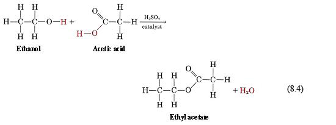

> **d) Ethanol**\
> Ethanol is the second member of a homologus series, alcohol. All
> alcohol has a functional group --OH. The general formula of alcohol is
> CnH2n + 1 OH.
>
> **3.9 describe the manufacture of ethanol by passing ethene and steam
> over a phosphoric acid catalyst at a temperature of about 300°C and a
> pressure of about 60--70 atm**\
> Ethanol is manufactured by the catalytic addition of steam to ethane.
> The mixture of ethane and steam is passed through phosphoric (V) acid
> at 3000C and 60 atm. Phosphoric(V) acid (H3PO4) acts as a catalyst in
> this reaction.

+-----------------------------------+-----------------------------------+
| > Ethane + | |
| > | |
| steam{width="1.0833333333333333in" | |
| > | |
| height="9.722222222222222e-2in"} | |
| > ethanol | |
+===================================+===================================+
| > CH2 = CH2(g) + H2O(g) | > {width="1.0972222222222223in" |
| | > height= |
| | "8.333333333333333e-2in"}CH3CH2OH |
+-----------------------------------+-----------------------------------+

> **3.10 describe the manufacture of ethanol by the fermentation of
> sugars, for example glucose, at a temperature of about 30°C**\
> Fermentation is a chemical process in which microorganisms such as
> yeast act on carbohydrates to produce ethanol and carbon dioxide.
> Sugars and starch are examples of carbohydrates.
>
> Yeast contains zymase enzymes (biological catalysts) which cause
> starch or sugar to break down to glucose. The glucose is then broken
> down to ethanol and carbon dioxide.
>
> A glucose solution is mixed with yeast and the mixture is produced
> after a few days.
>
> The enzymes in yeast work best at around 37oC. If the temperature is
> raised beyond 37o, the enzymes will die and the fermentation stops.
>
> The fermentation of sugars produces only a dilute solution of ethanol
> which is about 12%.This is because when the alcohol content exceeds
> this value, the yeast dies and fermentation stops. Then the fermented
> mixture is filtered to remove the solid impurities and the filtrate is
> fractionally distilled for further purification.
>
> Glucose solution yeast ethanol + carbon dioxide\
> C6H12O6 (aq) yeast 2C2H5OH (aq) + 2 CO2 (g)

+-----------------------------------+-----------------------------------+
| {width="0.4263888888888889in" | |
| height="0.42777668416447945in"} | |
+===================================+===================================+
+-----------------------------------+-----------------------------------+

+-----------------------------------+-----------------------------------+
| IGCSE Chemistry Note | > 58 |
+===================================+===================================+
+-----------------------------------+-----------------------------------+

> **Purification of fermented mixture:**
>
> _Follow: 1.7(iii)_
>
> **3.11 evaluate the factors relevant to the choice of method used in
> the manufacture of ethanol, for example**
>
> **the relative availability of sugar cane and crude oil**

+-----------------------+-----------------------+-----------------------+
| | > Fermentation | > Hydration of ethane |
+=======================+=======================+=======================+
| > Uses of\ | > Uses renewable | > Uses finite |
| > resources | > resources- sugar | > resources -- once |
| | > beet or sugar cane, | > all the oil has |
| | > corn and other | > been used up there |
| | > starchy materials. | > won't be any more |
+-----------------------+-----------------------+-----------------------+
| > Type of process | > A batch process -- | > A continuous flow |
| | > everything is mixed | > process -- a stream |
| | > together in a | > of reactant is |
| | > reaction vessel and | > constantly passed |
| | > then left for | > over the catalyst. |
| | > several days. That | > This is more |
| | > batch is then | > efficient than a |
| | > removed and a new | > batch process |
| | > reaction is set up | |
| | > -- this is | |
| | > inefficient | |
+-----------------------+-----------------------+-----------------------+
| > Rate of\ | > Slow, taking | > Rapid |
| > reaction | > several days for | |
| | > each batch | |
+-----------------------+-----------------------+-----------------------+
| > Quality of product | > Produces very | > Produce much purer |
| | > impure ethanol that | > ethanol |
| | > needs further | |
| | > processing | |
+-----------------------+-----------------------+-----------------------+
| > Reaction\ | > Uses gentle | > Uses high |
| > conditions | > temperature and | > temperature and |
| | > ordinary pressure | > pressures, needing |
| | | > a high input of |
| | | > energy |
+-----------------------+-----------------------+-----------------------+

> **3.12 describe the dehydration of ethanol to ethene, using aluminium
> oxide.**
>
> Dehydration refers to the removal of water from a compound. The
> dehydration of ethanol produces ethane. Ethanol
>
> vapour is passed over hot aluminium oxide, acting as a catalyst.

_C2H5OH(g)_  _C2H4(g) + H2O(l)_

> If propanol is used instead of ethanol, then by the loss of water
> molecules, propene will be produced.

+-----------------------------------+-----------------------------------+
| {width="0.4263888888888889in" | |
| height="0.42777668416447945in"} | |
+===================================+===================================+
+-----------------------------------+-----------------------------------+

+-----------------------------------+-----------------------------------+
| 59 | > IGCSE Chemistry Note |
+===================================+===================================+
+-----------------------------------+-----------------------------------+

> **Other reactions of alcohol:**\
> **(i) With sodium**\
> Ethanol reacts with sodium to produce sodium ethoxide and hydrogen.
> This time, sodium sinks in ethanol, (whereas sodium floats in water).
>
> _C2H5OH + Na_  _C2H5ONa + H2_\
> **(ii) With phosphorus pentachloride**\
> Ethanol reacts with phosphorus (V) chloride to produce chloroethane,
> phosphorus oxychloride and steamy fumes of hydrogen chloride gas.
>
> *C2H5OH + PCl5* _C2H5Cl + POCl2 + HCl_ **(iii) With acidified
> potassium dichloride VI (oxidation reaction).**
>
> If ethanol is warmed with acidify potassium dichloro VI, then, ethanol
> oxidises to ethanoic acid.
>
> _CH3CH2OH + \|O\|_  _CH3COOH + H2O_ Here, the colour changes from
> orange to green of the reaction mixture.
>
> **(iv) Esterification**\
> _Alcohol + carboxylic acid_  _ester + water_\
> If ethanol is heated with ethanoic acid in the presence of
> concentrated acid & catalyst then a ester is formed.
>
> _CH3CH2OH + CH3COOH_  _CH3COOCH2CH3_\
> _Ethanol + ethanoic acid_ *ethylethanoite*

{width="5.729166666666667in"
height="2.1347222222222224in"}

+-----------------------------------+-----------------------------------+
| {width="0.4263888888888889in" | |
| height="0.42777668416447945in"} | |
+===================================+===================================+
+-----------------------------------+-----------------------------------+

+-----------------------------------+-----------------------------------+
| IGCSE Chemistry Note | > 60 |
+===================================+===================================+
+-----------------------------------+-----------------------------------+
