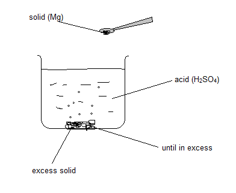

# a) Acids, Alkalis, and Salts

## 4.1 Describe the Use of Indicators

Indicators are mixtures of dyes that change color to show whether a solution is acidic or alkaline. Some indicators and their colors in different solutions are given below.

| Indicator                  | Color in Acid | Color in Alkali | Color in Neutral |
| -------------------------- | ------------- | --------------- | ---------------- |
| 1. **Litmus**              | **Red**       | **Blue**        | **Purple**       |
| 2. **Methyl Orange**       | **Red**       | **Yellow**      | **Orange**       |
| 3. **Phenolphthalein**     | **Colorless** | **Pink**        | **Colorless**    |
| 4. **Universal Indicator** | **Red**       | **Violet**      | **Green**        |

## 4.2 Understanding the pH Scale

Some acids are weaker than others, and the same applies to alkalis. The strength of an acid or alkali is shown using the pH scale, which ranges from 0 to 14.

On this scale:

1. An acidic solution has a pH number less than 7.
2. An alkaline solution has a pH number greater than 7.
3. A neutral solution has a pH number of exactly 7.

- Strongly acidic solution: pH 0 -- 3
- Weakly acidic solution: pH 3 -- 7
- Neutral solution: pH 7
- Weakly alkaline solution: pH 7 - 11
- Strongly alkaline solution: pH 11 - 14

## 4.3 Universal Indicator and pH Measurement

Universal indicator is a mixture of several different indicators. Unlike litmus, universal indicator can show how strongly acidic or alkaline a solution is by the gradual color change over a range of pH. This is measured using the pH scale.

- pH 1 -- 3: red color; strong acid
- pH 3 -- 7: orange; weak acid
- pH 7: green; neutral
- pH 7 -- 11: blue-green; weak alkali
- pH 11 -- 14: violet; strong alkali

## 4.4 Definition of Acids and Alkalis

**Acids:** Acids are substances that provide $ \text{H}^+ $ ions when dissolved in water. For example:

$$
\text{HCl (aq)} \rightarrow \text{H}^+ \text{(aq)} + \text{Cl}^- \text{(aq)}
$$

$$
\text{HNO}_3 \text{(aq)} \rightarrow \text{H}^+ \text{(aq)} + \text{NO}_3^- \text{(aq)}
$$

$$
\text{H}_2\text{SO}_4 \text{(aq)} \rightarrow 2\text{H}^+ \text{(aq)} + \text{SO}_4^{2-}
$$

**Alkalis:** Alkalis are substances that provide hydroxide ions $ \text{OH}^- $ when dissolved in water. For example:

$$
\text{NaOH} \rightarrow \text{Na}^+ + \text{OH}^-
$$

$$
\text{KOH} \rightarrow \text{K}^+ + \text{OH}^-
$$

$$
\text{Ca(OH)}_2 \rightarrow \text{Ca}^{2+} + 2\text{OH}^-
$$

## 4.5 Predicting Products of Reactions

### Metals

Metals above hydrogen react with acids to produce metal salts and hydrogen.

- Hydrochloric acid + metal → metal chloride salt + hydrogen
- Sulfuric acid + metal → metal sulfate + hydrogen

**Note:** Only nitric acid can react with copper.

### Metal Oxides

- Hydrochloric acid + metal oxide → metal chloride salt + water
- Nitric acid + metal oxide → metal nitrate salt + water
- Sulfuric acid + metal oxide → metal sulfate + water

**Example:**

$$
\text{ZnO (s) + HCl (aq)} \rightarrow \text{ZnCl}_2 \text{(s) + H}_2\text{O (l)}
$$

### Metal Carbonates

Acids react with metal carbonates to produce metal salts, carbon dioxide, and water.

- Hydrochloric acid + metal carbonate → metal chloride salt + water + carbon dioxide
- Nitric acid + metal carbonate → metal nitrate salt + water + carbon dioxide
- Sulfuric acid + metal carbonate → metal sulfate + water + carbon dioxide

**Example:**

$$
\text{CaCO}_3 + \text{HCl} \rightarrow \text{CaCl}_2 + \text{H}_2\text{O} + \text{CO}_2
$$

## 4.6 General Rules for Predicting Solubility of Salts

- All common sodium, potassium, and ammonium salts are soluble.
- All nitrates are soluble.
- Common chlorides are soluble, except silver chloride and lead (II) chloride.
- Common sulfates are soluble, except those of barium, lead, and calcium.
- Common carbonates are insoluble, except those of sodium, potassium, and ammonium.

## 4.7 Preparing Soluble Salts from Acids

These methods involve reacting a solid with an acid:

- Acid + metal (only for moderately reactive metals from magnesium to iron)
- Acid + metal oxide or hydroxide
- Acid + carbonate

### Method 1: Making Soluble Crystals of Magnesium Sulfate

1. Add enough magnesium to dilute sulfuric acid until no acid is left and the solution stops bubbling:
   $$
   \text{Mg (s) + H}_2\text{SO}_4\text{(aq)} \rightarrow \text{MgSO}_4 + \text{H}_2\text{O}
   $$

2. Filter the unused magnesium.

3. Heat the solution to evaporate water and make the solution saturated.

4. Test the solution to see if it is saturated using a glass rod.

5. Leave the solution to cool and crystallize.

6. Filter the crystals and dry them by keeping them under sunlight.

### Method 2: Titration

$$
\text{Acid + Alkali} \rightarrow \text{Salt + Water}
$$

$$
\text{HCl + NaOH} \rightarrow \text{NaCl + H}_2\text{O}
$$

1. Take 25 cm³ of alkali in a conical flask and add a few drops of phenolphthalein.

2. Run acid through the burette until the color changes. Measure the amount of acid added by subtracting the final volume from the initial volume.

3. Repeat the experiment without using an indicator, with the same volume of acid and alkali. Heat the solution to evaporate water and make the solution saturated.

4. Test the solution to see if it is saturated using a glass rod.

5. Leave the solution to cool and crystallize.

6. Filter the crystals and dry them by keeping them under the sun.

## 4.8 Preparing Insoluble Salts Using Precipitation Reactions

The insoluble salts include:

- Barium sulfate
- Calcium sulfate
- Lead (II) sulfate
- Silver chloride
- Silver bromide
- Silver iodide
- Lead (II) iodide
- Lead (II) chloride
- Carbonates (except potassium, sodium, and ammonia)

### Preparation of an Insoluble Salt

1. Two soluble salt solutions are mixed. Take barium nitrate in a beaker and add sodium sulfate solution until no precipitate forms.

2. Filter to collect the residue.

3. Wash the residue with cold distilled water.

4. Leave the residue to dry on filter paper or dry in a warm oven.

### Example: Preparing Silver Chloride

$$
\text{NaCl (aq) + AgNO}_3 \text{(aq)} \rightarrow \text{AgCl (s) + NaNO}_3 \text{(aq)}
$$

When you mix the two solutions, the silver ions meet chloride ions, and the attractions are strong enough to form a solid.

$$
\text{Ag}^+ \text{(aq) + Cl}^- \text{(aq)} \rightarrow \text{AgCl (s)}
$$

### Example: Making Pure Barium Sulfate

$$
\text{Ba}^{2+} \text{(aq) + SO}_4^{2-} \text{(aq)} \rightarrow \text{BaSO}_4 \text{(s)}
$$

Barium chloride and dilute sulfuric acid are mixed together. The mixture is filtered to get the precipitate, which is then washed with pure water and left to dry.

## 4.9 Acid-Alkali Titrations

Titration is a quantitative experimental technique used in neutralization reactions between acids and alkalis. It involves adding an acid from a burette into a conical flask containing the alkali. A pipette is used to measure out the exact volume of alkali, and an indicator is added so the endpoint of the titration can be seen.

### Procedure

1. Fill the acid up to the mark in the burette.
2. Pipette 25.0 cm³ sodium hydroxide into a conical flask.
3. Add a few drops of methyl orange indicator.
4. Add acid from the burette dropwise while swirling the flask.
5. Stop when the color change is permanent (turns pink/red).
6. Note burette readings.
7. Repeat until concordant results are obtained (results within 0.1 of each other) and take the average of results.

### Uses

If asked how to prepare a soluble salt using an acid and an alkali, titration must be used. First, carry out a normal titration to find the exact amount of acid needed to neutralize the alkali. Then repeat it without an indicator to avoid contamination with color. Remove the salt from the neutralized solution by evaporation, then dry it.

### Calculations

Where,

- $ M $ = molarity or concentration in mol/dm³
- $ V $ = volume in cm³
- $ n $ = number of moles shown in the chemical equation
