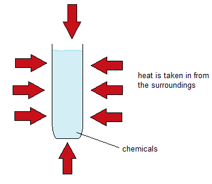
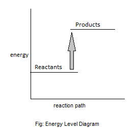
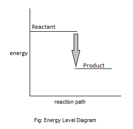

# b) Energetics

## 4.10 Understanding Exothermic and Endothermic Reactions

Chemical reactions in which heat energy is given out are described as exothermic, and those in which heat energy is taken in are endothermic.

### Exothermic Reactions

The chemical reactions that give out heat energy to the surroundings are called exothermic reactions.

### Examples of Exothermic Reactions

1. Combustion:
   $$
   \text{CH}_4 + \text{O}_2 \rightarrow \text{CO}_2 + \text{H}_2\text{O}
   $$
2. Neutralization Reaction:
   $$
   \text{HCl} + \text{NaOH} \rightarrow \text{NaCl} + \text{H}_2\text{O}
   $$
3. Respiration:
   $$
   C_6H\_{12}O_6 + 6\text{O}_2 \rightarrow 6\text{CO}_2 + 6\text{H}_2\text{O} + \text{energy}
   $$
4. Condensing:
   $$
   \text{H}_2\text{O} (g) \rightarrow \text{H}_2\text{O} (l)
   $$
5. Oxidation:
   $$
   \text{Mg} + \text{O}_2 \rightarrow \text{MgO}
   $$

### Endothermic Reactions

The chemical reaction in which heat is taken in from the surroundings is called an endothermic reaction.

### Examples of Endothermic Reactions

1. Thermal Decomposition:
   $$
   \text{CaCO}_3 \rightarrow \text{CaO} + \text{CO}_2
   $$
2. Photosynthesis:
   $$
   6\text{CO}_2 + 6\text{H}_2\text{O} \rightarrow \text{C}_6\text{H}\_{12}\text{O}_6 + 6\text{O}_2
   $$
3. Vaporization:
   $$
   \text{H}_2\text{O} (l) \rightarrow \text{H}_2\text{O} (g)
   $$
4. Dissolving Ammonium Nitrate:
   $$
   \text{NH}_4\text{NO}_3 (s) + \text{aq} \rightarrow \text{NH}_4\text{NO}_3 (aq)
   $$

## 4.11 Simple Calorimetry Experiments

### Measuring Energy Changes Involving Solution (Dissolving, Displacement & Neutralization)

When magnesium reacts with dilute sulfuric acid, the mixture gets very warm. The reaction is:

$$
\text{Mg}(s) + \text{H}_2\text{SO}_4(aq) \rightarrow \text{MgSO}_4(aq) + \text{H}_2(g)
$$

50 cm³ of dilute sulfuric acid is run into a polystyrene cup, and the temperature of the acid is measured. A small amount of magnesium powder is placed in a weighing bottle, and the mass of the bottle plus magnesium is recorded.

The magnesium is then tipped into the acid, and the maximum temperature reached is measured on the thermometer.

### Experiment Data

| Measurement                            | Experiment 1 | Experiment 2 |
| -------------------------------------- | ------------ | ------------ |
| Mass of weighing bottle + Mg (g)       | 10.810       | 10.800       |
| Mass of weighing bottle afterwards (g) | 10.687       | 10.685       |
| Mass of Mg used (g)                    | 0.123        | 0.115        |
| Initial temperature (°C)               | 17.4         | 17.3         |
| Maximum temperature (°C)               | 27.5         | 26.7         |
| Temperature rise (°C)                  | 10.1         | 9.4          |

If you do a reaction using a known mass of solution and measure the temperature rise, the amount of heat given out during the reaction is given by:

$$
\text{Heat given out} = \text{mass} \times \text{specific heat} \times \text{temperature rise}
$$

The specific heat is the amount of heat needed to raise the temperature of 1 gram of a substance by 1°C. For water, the value is 4.18 J g\(^{-1}\)°C\(^{-1}\).

### Calculation

1. Heat evolved when 0.123 g Mg reacts:

   $$
   \text{Heat} = 50 \times 4.18 \times 10.1 \, \text{J} = 2111 \, \text{J} = 2.111 \, \text{kJ}
   $$

2. Now we need to calculate how much heat is evolved when 24.3 g of Mg react (Molar enthalpy change).

If 0.123 g Mg produces 2.111 kJ, then 24.3 g Mg produces:

$$
\text{The amount of heat given out by the reaction is therefore:}
$$

$$
\text{Mg}(s) + \text{H}_2\text{SO}_4(aq) \rightarrow \text{MgSO}_4(aq) + \text{H}_2(g) \quad \Delta H = -417 \, \text{kJ mol}^{-1}
$$

## 4.12 Calculate Molar Enthalpy Change from Heat Energy Change

## 4.13 Understanding the Use of ΔH to Represent Enthalpy Change

ΔH is the symbol that represents the amount of energy lost or gained in a reaction.

- $+\Delta H$ is endothermic (because it gains heat)
- $-\Delta H$ is exothermic (because it loses heat)

The unit of ΔH is kJ/mol.

## 4.14 Represent Exothermic and Endothermic Reactions on a Simple Energy Level Diagram

### Endothermic Reaction

### Exothermic Reaction

## 4.15 Understanding Bond Energies

During chemical reactions, bonds in the reactants have to be broken, and new ones formed to make the products. Breaking bonds needs energy, and energy is released when new bonds are made.

- Endothermic reaction: Bond breaking energy $>$ Bond making energy
- Exothermic reaction: Bond making energy $>$ Bond breaking energy

$$
\Delta H = E_{\text{in}} - E_{\text{out}}
$$

## 4.16 Use Average Bond Energies to Calculate the Enthalpy Change During a Simple Chemical Reaction

### Bond Energies Table

| Bonds        | H – H | C – C | C – H | C – O | O = O | O – H | H – Cl | N Ξ N | N = H | Cl - Cl |
| ------------ | ----- | ----- | ----- | ----- | ----- | ----- | ------ | ----- | ----- | ------- |
| Energies/mol | 436   | 348   | 413   | 443   | 496   | 463   | 431    | 946   | 488   | 242     |

### Example Reaction

$$
\text{H}_2 + \text{O}_2 \rightarrow 2\text{H}_2\text{O}
$$

**Bond Breaking:**  
When the bonds in the hydrogen molecule and oxygen molecule are breaking, they have free hydrogen atoms. This requires energy to be absorbed, making the process endothermic.

- Energy required to break 1 mol of H-H bonds = $+436$ kJ
- Energy required to break 2 mol of H-H bonds = $2 \times 436$ kJ = $+872$ kJ
- Energy required to break 1 mol of O=O bonds = $+496$ kJ
- Total energy = $872 + 496 = +1368$ kJ

**Bond Making:**  
Energy released on forming 2 mol of O-H bonds = $-468$ kJ $\times 2 = -936$ kJ

Therefore, energy released on forming 2 mol of H2O molecules = $2 \times -926 = -1852$ kJ.

The overall enthalpy change for the reaction = $(+1368) + (-1852) = -484$ kJ.
