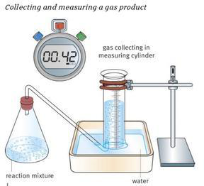
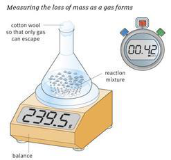
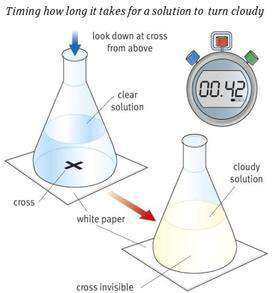
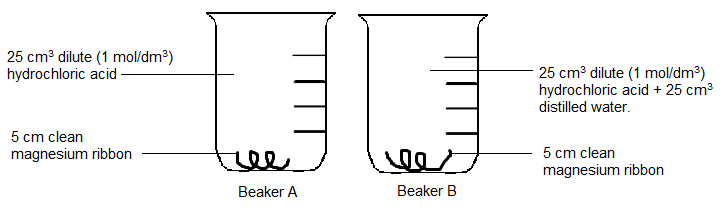
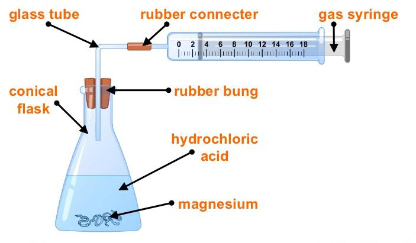
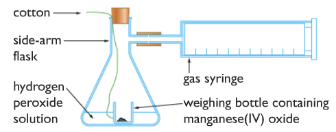
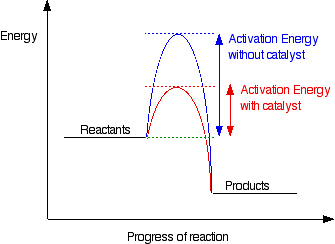

# c) Rates of Reaction

## 4.17 Describe experiments to investigate the effects of changes in surface area of a solid, concentration of solutions, temperature, and the use of a catalyst on the rate of a reaction

Rate of reaction means the amount of reactant used up or the amount of product obtained per unit time.

Reaction rate can be measured in four ways:

1. **Measuring a gas product**:

   

   Obviously, this method is only suitable when one of the products formed is a gas. Ideally, this gas needs to be insoluble; otherwise, some may dissolve in solution. In practice, this is not always easily achieved.

   The gas formed is collected at regular intervals, such as every 30 or 60 seconds. Commonly, the gas is collected in a measuring cylinder, but a gas syringe could also be used.

   The volume of gas collected is plotted against time taken; a line of best fit is then drawn, completing the graph. The rate of reaction is calculated by taking the initial rate from the graph.

2. **Measuring loss of mass**:

   

   Quite similar to measuring the volume of a gas product, this particular method relies on the accurate measurement of the mass of gas lost.

   Again, the mass lost is recorded at regular intervals, allowing a graph to be drawn with a curve of best fit. The initial rate of reaction can be calculated using this curve.

3. **Timing a reactant disappearing**:
   This method relies on human perception; by that, it is meant that it requires the chemist to judge when the reaction is complete. Hence, this method is open to human error.

   Mixing the solid and solution reactants together and timing until you can no longer see any solid allows the chemist to calculate the average rate of reaction.

4. **Timing a cloudy solution**:

   

   This is for reactions that produce an insoluble solid, such as sulphur.

   Initially, you are required to draw a cross on a piece of paper, which is then placed under your glassware. Mix the solutions in the flask and start timing; you stop once you can no longer see the cross on the paper through the solution.

   Again, this method relies on the individual. Each person may perceive the reaction completed at different timings.

## Experiment: How temperature affects the speed of Reaction

Sodium thiosulphate reacts with hydrochloric acid to form a yellow deposit of sulfur.

$$
Na_2S_2O_3(aq) + 2HCl(aq) \rightarrow 2NaCl(aq) + SO_2(g) + H_2O(l) + S(s)
$$

1. Measure out 10 cm³ of the sodium thiosulphate solution (40 g dm⁻³) into a conical flask and add 40 cm³ of water.
2. If necessary, very gently warm the solution to a temperature of approximately 30 °C.
3. Add 5 cm³ of 2 mol dm⁻³ hydrochloric acid and start the stop clock.
4. Swirl the mixture and place it over the cross marked on the white sheet of paper.
5. Look down vertically onto the cross, and time its 'disappearance'.
6. Repeat the experiment at about 40 °C, 50 °C, 60 °C, and 70 °C by heating the thiosulphate solution before you add the acid. It is advisable to heat the solution to a little above these temperatures to allow for the temperature to fall before you actually add the acid and start the clock.
7. Plot a graph of temperature against time taken for the cross to disappear at different temperatures.

### Observation:

1. The higher the temperature, the shorter the time taken for the cross to disappear from view. This means that the higher the temperature, the faster the rate of reaction.
2. Observe the gradient of the graph at various temperatures. The rate of reaction increases rapidly as the temperature increases.

## Experiment: To study the effect of concentration on the speed of the reaction between magnesium and hydrochloric acid

1. Two beakers are taken:

   - Beaker A: 50 cm³ dilute (1 mol/dm³) hydrochloric acid and 5 cm clean magnesium ribbon.
   - Beaker B: 25 cm³ dilute (1 mol/dm³) hydrochloric acid + 25 cm³ distilled water and 5 cm clean magnesium ribbon.

   

2. The time taken for each piece of magnesium ribbon to dissolve is recorded.

| Beaker                                   | A   | B   |
| ---------------------------------------- | --- | --- |
| Time taken for magnesium to dissolve (g) | 39  | 78  |

### Observation:

In the above experiment, the acid in beaker A is twice as concentrated as the acid in beaker B. The time taken for magnesium to react completely in beaker A is shorter. Thus, we can conclude that a reaction proceeds faster when the concentration of a reactant is increased.

## Experiment: To study the effect of particle size on the speed of reaction

1. A conical flask is set up and attached to a gas syringe (to measure the amount of CO₂ produced). Marble chips are placed in hydrochloric acid in the flask. The volume of gas produced is recorded at one-minute intervals for investigation I.
2. The experiment is repeated for investigation II, with marble chips that have been crushed into much smaller pieces.

### Observation:

## Experiment: Investigating the effect of catalyst in the decomposition of hydrogen peroxide

1. Hydrogen peroxide solution is placed in a beaker with a weighing bottle containing catalyst (manganese (IV) oxide).
2. The weighing bottle is dropped, and the reaction starts.
3. Measure the time needed to complete the reaction (usually when the volume of oxygen in the gas syringe doesn't increase anymore).
4. Repeat the above experiment with no catalyst, with different masses of catalyst, and different catalysts themselves.

### Observation:

1. Experiment using more mass of catalyst produces a steeper graph. This means adding more catalyst increases the rate of reaction.
2. With different catalysts, it is observed that only some catalysts produce a higher rate of reaction than others. In this experiment, manganese (IV) oxide is proved to be the best catalyst for this reaction.

## 4.18 Describe the effects of changes in surface area of a solid, concentration of solutions, pressure of gases, temperature, and the use of a catalyst on the rate of a reaction

- **Temperature**: The higher the temperature, the faster the rate of reaction.
- **Concentration**: The more concentrated the substance used, the faster the speed of a chemical reaction.
- **Pressure**: The speed of reactions which involve gases is faster at higher pressures.
- **Particle Size**: Smaller particles like powders have a much greater surface area than larger lumps or crystals. Within a greater surface area, the other reactant can attack it more easily and thereby increase the speed of reaction.

## 4.19 Understand the term activation energy and represent it on a reaction profile

Activation energy is the minimum energy that molecules must possess during their collisions in order for a chemical reaction to occur. In other words, it is the total energy needed to break all the bonds in the reactant.

## 4.20 Explain the effects of changes in surface area of a solid, concentration of solutions, pressure of gases, and temperature on the rate of a reaction in terms of particle collision theory

**Collision theory**: It states that for a reaction to occur between two particles:

- a) The reactant particles must collide with each other.
- b) They must collide with a certain minimum energy which is called activation energy.

**Successful collision**: A collision that results in the formation of products is called a successful or effective collision.

### Factors that affect the rate of reaction:

- **Temperature**: When the temperature is raised, the reactant particles have greater heat energy, causing them to move about more and with greater kinetic energy. They, therefore, stand an increase in the frequency of successful collisions, which results in a higher rate of reaction.
- **Concentration**: When a concentrated substance is used, there is a greater likelihood that reacting molecules will collide with one another with sufficient energy to form products.
- **Pressure**: When the pressure is increased, the particles get closer. So more particles are in per unit volume, resulting in more frequency of successful collisions. Hence, the rate of reaction increases.
- **Surface area**: When the substance is powdered, more particles are exposed to collide. So the number of successful collisions per unit time increases, resulting in a higher speed.

## 4.21 Explain that a catalyst speeds up a reaction by providing an alternative pathway with lower activation energy

A catalyst is a substance that increases the rate of a chemical reaction without itself being chemically changed at the end of the reaction.

Catalysts work by providing a more direct route from reactants to products. If we plot energy against time for a reaction, there is an energy barrier over which the reactants have to pass. The height of this barrier above the energy of the reactants is called the activation energy. What catalysts do is lower this activation energy, allowing the reactants to change into products more quickly.
