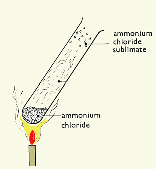
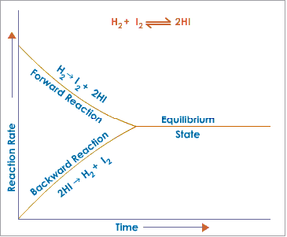

# d) Equilibria

## 4.22 Understand that some reactions are reversible and are indicated by the symbol ⇌ in equations

A reaction that can be reversed is called a reversible reaction. It is indicated by the symbol ⇌.

E.g.:
$$N_2 + 3H_2 \rightleftharpoons 2NH_3$$
When nitrogen and hydrogen react, it produces ammonia. This is the forward reaction.

$$N_2 + 3H_2 \rightarrow 2NH_3 \quad \text{(forward reaction)}$$

The produced ammonia can be decomposed to give nitrogen and hydrogen. This is the backward reaction.

$$2NH_3 \rightarrow N_2 + 3H_2 \quad \text{(backward reaction)}$$

## 4.23 Describe reversible reactions such as the dehydration of hydrated copper(II) sulfate and the effect of heat on ammonium chloride

### Heating copper(II) sulfate crystals

If you heat blue copper(II) sulfate gently, the blue crystals turn to a white powder and water is driven off. Heating causes the crystals to lose their water of crystallization and white anhydrous copper(II) sulfate is formed.

$$\text{CuSO}_4 \cdot 5\text{H}_2\text{O}(s) \rightarrow \text{CuSO}_4(s) + 5\text{H}_2\text{O}(l)$$

Now if you add water to the white solid, it will turn blue and will get warm.

$$\text{CuSO}_4(s) + 5\text{H}_2\text{O}(l) \rightarrow \text{CuSO}_4 \cdot 5\text{H}_2\text{O}(s)$$

### Heating ammonium chloride

If you heat ammonium chloride, the white crystals disappear from the bottom of the tube and reappear further up.

{width="2.4986100174978128in" height="2.701388888888889in"}

Heating ammonium chloride splits it into the colorless gases ammonia and hydrogen chloride.

$$\text{NH}_4\text{Cl}(s) \rightarrow \text{NH}_3(g) + \text{HCl}(g)$$

These gases recombine when the condition is changed from hot to cool.

$$\text{NH}_3(g) + \text{HCl}(g) \rightarrow \text{NH}_4\text{Cl}(s)$$

## 4.24 Understand the concept of dynamic equilibrium

When reversible reactions reach equilibrium, the forward and reverse reactions are still happening but at the same rate, so the concentrations of reactants and products do not change.

### Conditions in dynamic equilibrium:

1. Rate of forward reaction is equal to rate of backward reaction.
2. Concentration of reactant and product remains the same.
3. Both forward and backward reactions are occurring.

{width="3.801388888888889in" height="3.136111111111111in"}

The balance point can be affected by temperature, and also by pressure for gases in equilibrium.

**Position of equilibrium**: Position of equilibrium means the concentration of reactants and products at the equilibrium state.

- When the position of equilibrium shifts to the left, it means the concentration of reactants increases.
- When the position of equilibrium shifts to the right, this means the concentration of products increases.

## 4.25 Predict the effects of changing the pressure and temperature on the equilibrium position in reversible reactions.

### Le Chatelier's Principle

"When a reversible reaction is in equilibrium and you make a change, it will do what it can to oppose that change."

### The effect of pressure:

Changing the pressure has little effect on an equilibrium mixture without gases but can have a big effect on an equilibrium mixture containing gases. If the pressure is increased, the position of equilibrium moves in the direction of the fewest molecules.

Look again at the Haber process, which makes ammonia (NH₃):

$$N_2(g) + 3H_2(g) \rightleftharpoons 2NH_3(g)$$

On the left, there are 1 + 3 = 4 molecules of gas. On the right, there are 2 molecules of gas. If the pressure is increased, the position of equilibrium will move to the right and more ammonia will be made. If the pressure is reduced, the position of equilibrium will move to the left and less ammonia will be made.

### The effect of temperature:

- If the forward reaction is exothermic and the temperature is increased, the yield of products is decreased. If the temperature is decreased, the yield of products is increased.
- If the forward reaction is endothermic and the temperature is increased, the yield of products is increased. If the temperature is decreased, the yield of products is decreased.

### The effect of concentration

When the concentration of a product is increased, the position of equilibrium will move to the left (to remove the extra product).

$$\text{BiCl}_3(aq) + \text{H}_2\text{O}(l) \rightleftharpoons \text{BiOCl}(s) + 2\text{HCl}(aq)$$

If the concentration of hydrochloric acid in the equilibrium mixture is increased, the position of equilibrium moves to the left and the amount of white solid in that new equilibrium mixture is reduced.

### The effect of catalyst

If we remove the products from an equilibrium mixture, more reactants are converted into products. If a catalyst is used, the reaction reaches equilibrium much sooner because the catalyst speeds up the forward and reverse reactions by the same amount. The concentration of reactants and products is nevertheless the same at equilibrium as it would be without the catalyst.
