> **a) Acids, alkalis and salts**
>
> **4.1 describe the use of the indicators litmus, phenolphthalein and
> methyl orange to distinguish between acidic and alkaline solutions**\
> Indicators are mixture of dyes which changes their colour to show
> whether a solution is acidic or alkaline. Some indicators and their
> colour in different solutions are given below.

+-----------------+-----------------+-----------------+-----------------+
| +------------+ | > Colour in | > Colour in | > Colour in |
| | > | | > acid | > alkali | > neutral |
| | Indicators | | | | |
| +============+ | | | |
| +------------+ | | | |
+=================+=================+=================+=================+
| +------------+ | ------------ | **Blue** | **Purple** |
| | > **1. | | **Red** | | |
| | > Litmus** | | ------------ | | |
| +============+ | | | |
| +------------+ | ------------ | | |
+-----------------+-----------------+-----------------+-----------------+
| > **2. Methyl | **Red** | **Yellow** | **Orange** |
| > orange** | | | |
+-----------------+-----------------+-----------------+-----------------+
| > **3. | | **Pink** | _Colourless_ |
| > Ph | -------------- | | |
| enolphthalein** | _Colourless_ | | |
| | | | |
| | -------------- | | |
| | | | |
| | | | |
| | -------------- | | |
+-----------------+-----------------+-----------------+-----------------+
| > **4. | **Red** | **Violet** | **Green** |
| > Universal | | | |
| > indicator** | | | |
+-----------------+-----------------+-----------------+-----------------+

> **4.2 understand how the pH scale, from 0--14, can be used to classify
> solutions as strongly acidic, weakly acidic, neutral, weakly alkaline
> or strongly alkaline**
>
> [pH scale:]{.underline} Some acids are weaker than others. It is the
> same with alkalis. The strength of an acid or alkali is shown using
> the pH scale which goes from 0 to 14.

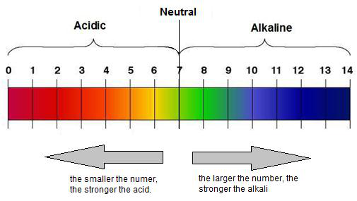{width="5.261111111111111in"
height="2.9680555555555554in"}

> On this scale,
>
> i\. An acidic solution has a pH number less than 7.
>
> ii\. An alkaline solution has a pH number greater than 7.
>
> iii\. A neutral solution has a pH number of exactly 7.
>
> Strongly acidic soln: pH 0 -- 3\
> Weakly acidic soln: pH 3 -- 7\
> Neutral soln: ph 7

+-----------------------------------+-----------------------------------+
| {width="0.4263888888888889in" | |
| height="0.42777668416447945in"} | |
+===================================+===================================+
+-----------------------------------+-----------------------------------+

+-----------------------------------+-----------------------------------+
| 61 | > IGCSE Chemistry Note |
+===================================+===================================+
+-----------------------------------+-----------------------------------+

> Weakly alkaline soln: pH 7 - 11\
> Strongly acidic soln: pH 11 - 14
>
> **4.3 describe the use of universal indicator to measure the
> approximate pH value of a solution**\
> Universal indicator is a mixture of several different indicators.
> Unlike litmus, universal indicator can show usexactlyhow strongly
> acidic or alkaline a solution is by the gradual colour change over a
> range of pH. This is measured using the pH scale. The pH scale runs
> from pH 0 to pH 14.
>
> pH: 1 -- 3: red colour; strong acid\
> pH: 3 -- 7: orange; weak acid\
> pH: 7: green; neutral\
> pH: 7 -- 11: blue -- green; weak alkali\
> pH: 11 -- 14: Violet; strong alkali
>
> **4.4 define acids as sources of hydrogen ions, H+, and alkalis as
> sources of hydroxide ions, OH¯** [Acids:]{.underline}Acids are those
> which provides H+ ions when they are dissolved in water. E.g:
>
> _HCl (aq)_  _H+ (aq) + Cl- (aq)_\
> _HNO3 (aq)_  _H+ (aq) + NO3- (aq)_\
> _H2SO4 (aq)_  _2H+ (aq) + SO4 2-_
>
> _CH3COOH (aq)_ ⇌ _CH3COO- + H+_\
> _HCOOH (aq)_ ⇌ _HCOO- (aq) + H+ (aq)_
>
> Acids can be of two types --
>
> i\. **Strong acid.** Those which ionizes fully in water.
>
> ii\. **Weak acid.** Those which ionizes partially/incompletely in
> water. Eg: Organic acid
>
> If an acid ionizes to give just one hydrogen ion, it is monobasic aid.
> Similarly, dibasic acid are those which provides hydrogen ions.
> Tribasic acid provides three hydrogen ions.
>
> [Alkali:]{.underline} Alkalis are those which provide hydroxide ions
> when they are dissolved in water. E.g:
>
> NaOH Na+ + OH-\
> KOH  K+ + OH-\
> Ca(OH)2 Ca2+ + 2OH-
>
> Alkalis can also be strong or weak. Those which ionize completely are
> strong alkali and those which doesn't ionize completely are weak
> alkalis.

+-----------------------------------+-----------------------------------+
| > NH3(aq) = NH4OH ⇌ NH4 + + OH- | |
+===================================+===================================+
| {width="0.4263888888888889in" | |
| height="0.42777668416447945in"} | |
+-----------------------------------+-----------------------------------+

+-----------------------------------+-----------------------------------+
| IGCSE Chemistry Note | > 62 |
+===================================+===================================+
+-----------------------------------+-----------------------------------+

> **4.5 predict the products of reactions between dilute hydrochloric,
> nitric and sulfuric acids; and metals,**
>
> **metal oxides and metal carbonates (excluding the reactions between
> nitric acid and metals)**
>
> Metals:
>
> Metals above hydrogen, react with acid to produce metal salt and
> hydrogen.
>
> • Hydrochloric acid + metal metal chloride salt + hydrogen
>
> • Nitric acid + metal Not needed
>
> • Sulphuric acid + metal metal sulphate + hydrogen
>
> _Only nitric acid can react with copper_
>
> Metal oxides:
>
> • Hydrochloric acid + metal oxide metal chloride salt + water
>
> • Nitric acid + metal oxide  metal nitrate salt + water
>
> • Sulphuric acid + metal oxide  metal sulphate + water
>
> e.g.:
>
> _ZnO (s) + HCl (aq)_  _ZnCl2 (s) + H2O (l)_
>
> _FeO + H2SO4 (aq)_  _FeSO4 (s) + H2O (l)_
>
> *MgO + HNO3* _Mg(NO3)2 + H2O (l)_
>
> Metal carbonates:
>
> Acids react with metal carbonate to produce metal salt, carbon dioxide
> & water.
>
> • Hydrochloric acid + metal carbonate  metal chloride salt + water +
> carbon dioxide
>
> • Nitric acid + metal carbonate  metal nitrate salt + water + carbon
> dioxide
>
> • Sulphuric acid + metal carbonate  metal sulphate + water + carbon
> dioxide
>
> e.g.:
>
> *CaCO3 + HCl* _CaCl2 + H2O + CO2_
>
> *MgCO3 + H2SO4* _MgSO4 + H2O + CO2_
>
> *FeCO3 + HNO3**Fe(NO3)2 + H2O + CO2*
>
> **4.6 understand the general rules for predicting the solubility of
> salts in water:**

+-----------------------------------+-----------------------------------+
| > •\ | > all common sodium, potassium |
| > •\ | > and ammonium salts are soluble\ |
| > •\ | > all nitrates are soluble\ |
| > •\ | > common chlorides are soluble, |
| > • | > except silver chloride , lead |
| | > (II) chloride\ |
| | > common sulfates are soluble, |
| | > except those of barium, lead |
| | > and calcium\ |
| | > common carbonates are |
| | > insoluble, except those of |
| | > sodium, potassium and ammonium |
+===================================+===================================+
+-----------------------------------+-----------------------------------+

> **4.7 describe experiments to prepare soluble salts from acids**
>
> These all involve reacting a solid with an acid:

+-----------------+-----------------+-----------------+-----------------+
| • | | > acid + metal | |
| | | > (but only for | |
| | | > moderately | |
| | | > reactive | |
| | | > metals from | |
| | | > magnesium to | |
| | | > iron in | |
| | | > reactivity | |
| | | > series) | |
+=================+=================+=================+=================+
| • | | | > acid + metal |
| | | | > oxide or |
| | | | > hydroxide |
+-----------------+-----------------+-----------------+-----------------+
| {width="0.4263 | | | |
| 888888888889in" | | | |
| h | | | |
| eight="0.427776 | | | |
| 68416447945in"} | | | |
+-----------------+-----------------+-----------------+-----------------+

+-----------------------+-----------------------+-----------------------+
| ------------------ | > IGCSE Chemistry | |
| 63 | > Note | |
| ------------------ | | |
| | | |
| ------------------ | | |
+=======================+=======================+=======================+
| | • | > acid + carbonate |
+-----------------------+-----------------------+-----------------------+

> **Method 1: Making soluble crystals of magnesium sulphate:**
>
> 1.Add enough magnesium to dilute sulphuric acid, so that there is no
> acid left and the solution stops bubbling Mg(s) + H2SO4(aq)  MgSO4 +
> H2O
>
> 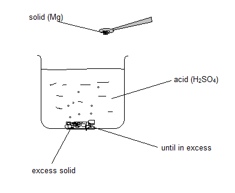{width="4.083333333333333in"
> height="3.3541666666666665in"}
>
> 2.Filter the unused magnesium
>
> 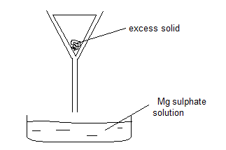{width="3.3652777777777776in"
> height="2.2402777777777776in"}
>
> 3.Heat the solution to evaporate water and to make the solution
> saturated.
>
> 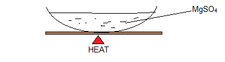{width="3.926388888888889in"
> height="1.0833333333333333in"}
>
> 4.Test the solution whether it is saturated or not, using a glass rod.

+-----------------------------------+-----------------------------------+
| {width="0.4263888888888889in" | |
| height="0.42777668416447945in"} | |
+===================================+===================================+
+-----------------------------------+-----------------------------------+

+-----------------------------------+-----------------------------------+
| IGCSE Chemistry Note | > 64 |
+===================================+===================================+
+-----------------------------------+-----------------------------------+

> 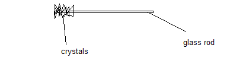{width="4.323611111111111in"
> height="1.125in"}
>
> 5.Leave the solution to cool and crystallize.
>
> 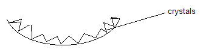{width="3.426388888888889in"
> height="0.8430544619422572in"}
>
> 6.Filter the crystals and dry them by keeping under the sunlight.
>
> 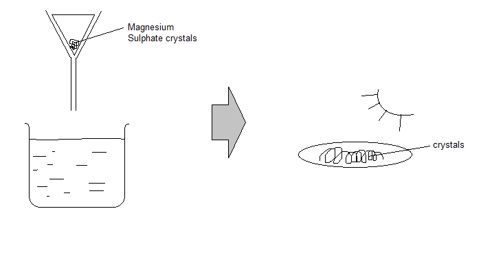{width="6.319444444444445in"
> height="3.3222222222222224in"}
>
> **Method 2: Titration**
>
> _Acid + alkali_  _salt + water_\
> *HCl + NaOH**NaCl + H2O*
>
> 1.Take 25 cm3 of alkali in a conical flask and add a few drops of
> phenalpthalein in it.
>
> 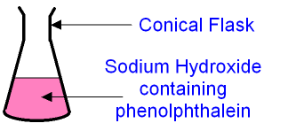{width="3.4680555555555554in"
> height="1.5416666666666667in"}
>
> 2.Run acid through burette until the colour change. Measure the amount
> of acid added by subtracting final volume from initial volume.

+-----------------------------------+-----------------------------------+
| {width="0.4263888888888889in" | |
| height="0.42777668416447945in"} | |
+===================================+===================================+
+-----------------------------------+-----------------------------------+

+-----------------------------------+-----------------------------------+
| 65 | > IGCSE Chemistry Note |
+===================================+===================================+
+-----------------------------------+-----------------------------------+

> 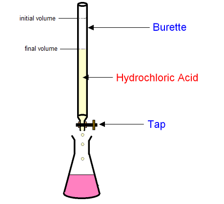{width="4.781944444444444in"
> height="4.354166666666667in"}
>
> 3.Repeat the experiment without using indicator, with same volume of
> acid and alkali. 4.Heat the solution to evaporate water and to make
> the solution saturated.
>
> 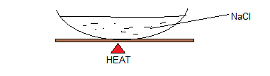{width="3.9680555555555554in"
> height="1.125in"}
>
> 5.Test the solution whether it is saturated or not, using glass rod.
>
> {width="4.323611111111111in"
> height="1.1249989063867016in"}
>
> 6.Leave the solution to cool and crystalise.
>
> {width="3.426388888888889in"
> height="0.8444433508311461in"}
>
> 7.Filter the crystals and dry them by keeping them under the Sun.

+-----------------------------------+-----------------------------------+
| {width="0.4263888888888889in" | |
| height="0.42777668416447945in"} | |
+===================================+===================================+
+-----------------------------------+-----------------------------------+

+-----------------------------------+-----------------------------------+
| IGCSE Chemistry Note | > 66 |
+===================================+===================================+
+-----------------------------------+-----------------------------------+

> 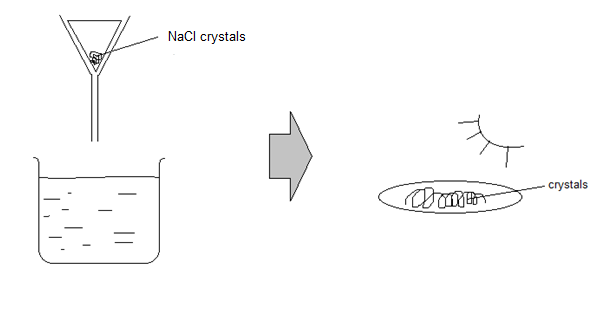{width="6.3652766841644794in"
> height="3.3652777777777776in"}
>
> **4.8 describe experiments to prepare insoluble salts using
> precipitation reactions** The insoluble salts are:

+-----------------------------------+-----------------------------------+
| i\. | > Barium sulphate\ |
| | > Calcium sulphate\ |
| ii\. | > Lead (II) sulphate\ |
| | > Silver chloride\ |
| iii\. | > Silver bromide\ |
| | > Silver iodide\ |
| iv\. | > Lead (II) iodide\ |
| | > Lead (II) chloride\ |
| v\. | > Carbonates except potassium, |
| | > sodium and ammonia |
| vi\. | |
| | |
| vii\. | |
| | |
| > viii.\ | |
| > ix. | |
+===================================+===================================+
+-----------------------------------+-----------------------------------+

> **Preparation of an insoluble salt:**\
> 1.Two soluble salt solutions are mixed.
>
> Take barium nitrate in a beaker and add sodium sulphate solution in it
> until no precipitate forms.

+-----------------------------------+-----------------------------------+
| {width="0.4263888888888889in" | |
| height="0.42777668416447945in"} | |
+===================================+===================================+
+-----------------------------------+-----------------------------------+

+-----------------------------------+-----------------------------------+
| 67 | > IGCSE Chemistry Note |
+===================================+===================================+
+-----------------------------------+-----------------------------------+

> 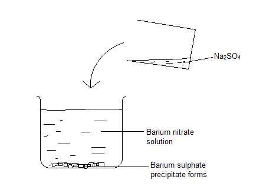{width="4.468055555555556in"
> height="3.4166655730533684in"}
>
> 2.Filter to collect the residue
>
> 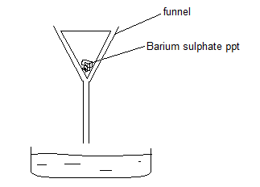{width="3.3652777777777776in"
> height="2.4166666666666665in"}
>
> 3.Wash the residue with cold distilled water.
>
> 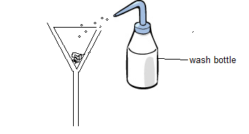{width="3.6569444444444446in"
> height="1.9694444444444446in"}
>
> 4.Leave residue to dry on filter paper/dry in a warm oven
>
> **Example: Describe how to prepare a dry solid sample of silver
> chloride, AgCl, a salt which is insoluble in water.**
>
> Sodium chloride + silver nitrate  silver chloride + sodium nitrate

+-----------------------------------+-----------------------------------+
| {width="0.4263888888888889in" | |
| height="0.42777668416447945in"} | |
+===================================+===================================+
+-----------------------------------+-----------------------------------+

+-----------------------------------+-----------------------------------+
| IGCSE Chemistry Note | > 68 |
+===================================+===================================+
+-----------------------------------+-----------------------------------+

> NaCl (aq) + AgNO3 (aq) AgCl (s) + NaNO3 (aq)
>
> Silver nitrate solution contains silver ions and nitrate ions in
> solution. The positive and negative ions are attracted to each other,
> but the attraction aren't strong enough to make them stick together.
> Similarly, sodium chloride solution contains sodium ions and chloride
> ions -- again, the attractions, aren't strong enough for them to stick
> together.
>
> When you mix the two solutions, the various ions meet each other. When
> silver ions meet chloride ions, the attractions are so strong that the
> ions clump together and form a solid. The sodium and nitrate ions
> remain in the solution.
>
> Ag+(aq) + Cl- (aq) AgCl(s)
>
> **Example: Making pure barium sulfate**\
> Ba2+(aq) + SO4 2-(aq)  BaSO4(s)
>
> Barium chloride and dilute sulphuric acid are mixed together. Hydrogen
> ions and chloride ions are spectator ions and aren't involved in the
> reaction at all. Barium and sulphate ions attract together to form
> white precipitate of barium sulphate.
>
> The mixture is filtered to get the precipitate. The solid barium
> sulphate is impure because of the presence of the spectator ions and
> any excess barium chloride solution or sulphuric acid. It is washed
> with pure water while it is still on the filter paper and then left to
> dry.
>
> **4.9 describe experiments to carry out acid-alkali titrations.**
>
> Titration is a quantitative experimental technique used in
> neutralisation reactions between acids and alkalis. It involves adding
> an acid from a burette into a conical flask containing the alkali. A
> pipette is used to measure out the exact volume of alkali and an
> indicator is added so the end point of the titration can be seen.
>
> **_Procedure:_**

+-----------------------------------+-----------------------------------+
| i\. | > fill the acid up to the mark in |
| | > the burette\ |
| ii\. | > pipette 25.0cm3 sodium |
| | > hydroxide into a conical flask\ |
| iii\. | > add a few drops of methyl |
| | > orange indicator\ |
| iv\. | > add acid from the burette drop |
| | > wise with swirling of flask\ |
| v\. | > stop when colour change is |
| | > permanent (turns pink/red)\ |
| vi\. | > note burette readings\ |
| | > repeat until concordant results |
| vii\. | > are obtained (results are |
| | > within 0.1 of each other) take |
| viii\. | > average of results |
+===================================+===================================+
| {width="0.4263888888888889in" | |
| height="0.42777668416447945in"} | |
+-----------------------------------+-----------------------------------+

+-----------------------------------+-----------------------------------+
| 69 | > IGCSE Chemistry Note |
+===================================+===================================+
+-----------------------------------+-----------------------------------+

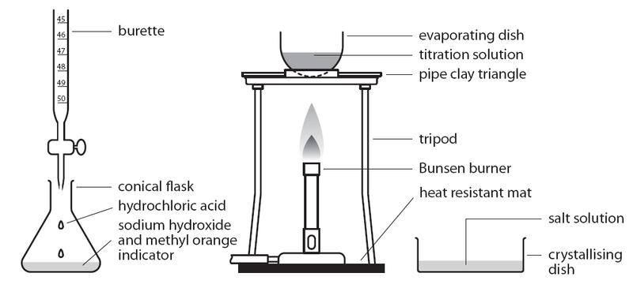{width="6.7375in"
height="3.075in"}

> **_Uses:_**\
> If they ask you how to prepare a soluble salt using an acid and an
> alkali, titration must be used. You first carry out a normal
> titration, and find out the exact amount of acid needed to neutralise
> the alkali. Then you repeat it without an indicator so that the salt
> is not contaminated with its colour. You remove the salt from the
> neutralised solution by evaporation, then you dry it.
>
> **_Calculations:_**

+-----------------------------------------------------------------------+
| +---------------------+---------------------+---------------------+ |
| | ( | > ) ( | > ) | |
| +=====================+=====================+=====================+ |
| +---------------------+---------------------+---------------------+ |
+=======================================================================+
+-----------------------------------------------------------------------+

> Where,\
> M = molarity or concentration in mol/dm3\
> V = volume in cm3\
> n = number of moles shown in the chemical equation
