> **b) Energetics**
>
> **4.10 understand that chemical reactions in which heat energy is
> given out are described as exothermic and those in which heat energy
> is taken in are endothermic**\
> [Exothermic:]{.underline} The chemical reactions which give out heat
> energy to the surrounding is called exothermic reaction.

+-----------------------------------+-----------------------------------+
| {width="0.4263888888888889in" | |
| height="0.42777668416447945in"} | |
+===================================+===================================+
+-----------------------------------+-----------------------------------+

+-----------------------------------+-----------------------------------+
| IGCSE Chemistry Note | > 70 |
+===================================+===================================+
+-----------------------------------+-----------------------------------+

> 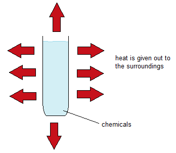{width="3.625in"
> height="3.145832239720035in"}
>
> 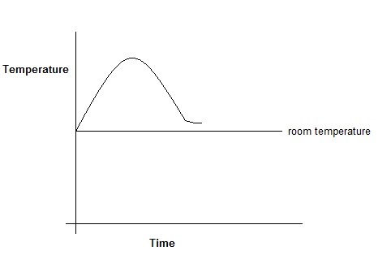{width="5.020833333333333in"
> height="3.4375in"}
>
> Examples:
>
> i\. Combustion
>
> *CH3 + O2* _CO2 + H2O_
>
> ii\. Neutralization reaction
>
> *HCl + NaOH**NaCl + H2O*
>
> iii\. Respiration
>
> *C6H12O6 + 6O2* _6CO2 + 6H2O + energy_
>
> iv\. Condensing
>
> _H2O (g)_  _H2O (l)_
>
> v\. Oxidation
>
> *Mg + O2**MgO*

+-----------------------------------+-----------------------------------+
| {width="0.4263888888888889in" | |
| height="0.42777668416447945in"} | |
+===================================+===================================+
+-----------------------------------+-----------------------------------+

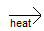{width="0.4583333333333333in"
height="0.3229166666666667in"}

+-----------------------------------+-----------------------------------+
| 71 | > IGCSE Chemistry Note |
+===================================+===================================+
+-----------------------------------+-----------------------------------+

> [Endothermic:]{.underline} The chemical reaction in which heat is
> taken in from the surroundings is called endothermic reaction.
>
> 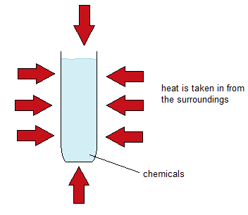{width="3.6666666666666665in"
> height="3.187498906386702in"}
>
> 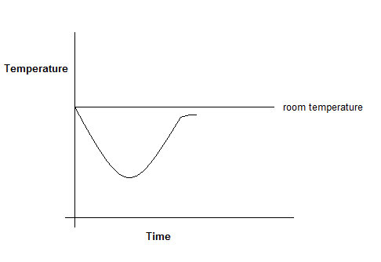{width="5.0625in"
> height="3.4791666666666665in"}
>
> Examples:
>
> i\. Thermal decomposition
>
> CaCO3CaO + CO2
>
> ii\. Photosynthesis
>
> 6CO2 + 6H2O  C6H12O6 + 6O2
>
> iii\. Vaporisation
>
> H2O (l)  H2O (g)

+-----------------------------------+-----------------------------------+
| iv\. | > Dissolving ammonium nitrate |
+===================================+===================================+
| {width="0.4263888888888889in" | |
| height="0.42777668416447945in"} | |
+-----------------------------------+-----------------------------------+

+-----------------------------------+-----------------------------------+
| IGCSE Chemistry Note | > 72 |
+===================================+===================================+
+-----------------------------------+-----------------------------------+

> NH4NO3 (s) + (aq)  NH4NO3 (aq)\
> **4.11 describe simple calorimetry experiments for reactions such as
> combustion, displacement, dissolving and neutralisation in which heat
> energy changes can be calculated from measured temperature changes**

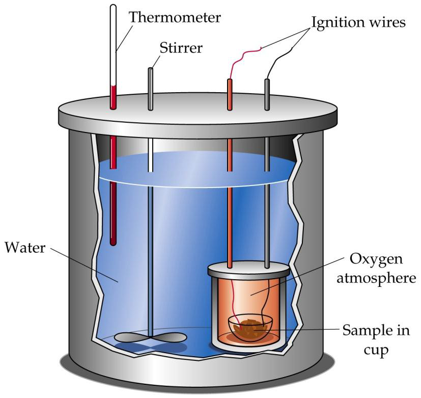{width="3.7597222222222224in"
height="3.548611111111111in"}

> Fig: Calorimeter\
> **_Measuring energy changes involving solution (Dissolving,
> Displacement & Neutralization)_**
>
> Measuring the heat evolved when magnesium reacts with a acid\
> When magnesium reacts with dilute sulfuric acid, the mixture gets very
> warm. The reaction is:\
> _Mg(s) + H2SO4(aq)_  _MgSO4(aq) + H2(g)_\
> 50 cm3 of dilute sulfuric acid is run into a polystyrene cup using a
> pipette or burette and the temperature of the acid is measured. A
> small amount of magnesium powder is placed in a weighing bottle, and
> the mass of the bottle plus magnesium is recorded.
>
> The magnesium is then tipped into the acid, and the maximum
> temperature reached is measured on the thermometer.
>
> The mass of the empty weighing bottle is found and then the experiment
> is repeated to check the reliability of the result.
>
> Volume of acid used = 50.0 cm3

+-----------------------+-----------------------+-----------------------+
| | > Experiment 1 | > Experiment 2 |
+=======================+=======================+=======================+
| > Mass of weighing | 10.810 | 10.800 |
| > bottle + Mg(g) | | |
+-----------------------+-----------------------+-----------------------+
| Mass of weighing | 10.687 | 10.685 |
| bottle afterwards (g) | | |
+-----------------------+-----------------------+-----------------------+
| > Mass of Mg used (g) | 0.123 | 0.115 |
+-----------------------+-----------------------+-----------------------+
| > Initial temperature | 17.4 | 17.3 |
| > (oC) | | |
+-----------------------+-----------------------+-----------------------+
| > Maximum temperature | 27.5 | 26.7 |
| > (oC) | | |
+-----------------------+-----------------------+-----------------------+

+-----------------------------------+-----------------------------------+
| {width="0.4263888888888889in" | |
| height="0.42777668416447945in"} | |
+===================================+===================================+
+-----------------------------------+-----------------------------------+

+-----------------------------------+-----------------------------------+
| ------------------------------ | > IGCSE Chemistry Note |
| 73 | |
| ------------------------------ | |
| | |
| ------------------------------ | |
+===================================+===================================+
+-----------------------------------+-----------------------------------+

+-----------------------+-----------------------+-----------------------+
| > Temperature rise | 10.1 | 9.4 |
| > (oC) | | |
+=======================+=======================+=======================+
+-----------------------+-----------------------+-----------------------+

> If you do a reaction using a known mass of solution and measure the
> temperature rise, the amount of heat given out during the reaction is
> given by:

---

**_Heat given out = mass x specific heat x temperature rise_**

---

---

> The specific heat is the amount of heat needed to raise the
> temperature of 1 gram of a substance by 1oC.
>
> For water, the value is 4.18 J g-1C-1 (joules per gram per degree
> Celsius).
>
> You can normally assume that dilute solutions have the same specific
> heat and density as water. You can also assume that negligibly small
> amounts of heat are used to warm up the cup and the thermometer.
>
> In this case, we will take the mass of the solution as 50g. The mass
> of the magnesium is so small that it can be ignored. There are other
> major sources of error in the experiment which will make much more
> difference to the results.
>
> Calculation:
>
> \(i\) Heat evolved when 0.123 g Mg reacts = M x C x ∆ϴ\
> = 50 x 4.18 x 10.1 J\
> = 2111J\
> = 2.111 kJ
>
> Energy changes in reactions are always quoted in kJ. Diving by 1000
> gives 2.111 kJ evolved when 0.123g of Mg react.
>
> \(ii\) Now we need to calculate how much heat is evolved when 24.3 g
> of Mg react (Molar enthalpy change). 24.3 is an accurate value for the
> relative atomic mass of the magnesium.
>
> If: 0.123 g Mg produce= 2.111 kJ
>
> Then: 24.3g Mg produce =

+-----------------------------------+-----------------------------------+
| > The amount of heat given out by | |
| > the reaction is therefore:\ | |
| > Mg(s) + H2SO4(aq)  MgSO4(aq) + | |
| > H2(g) △H = -417 kJ mol-1 _Or_\ | |
| > Divide Heat change by the moles | |
| > of Magnesium | |
+===================================+===================================+
| {width="0.4263888888888889in" | |
| height="0.42777668416447945in"} | |
+-----------------------------------+-----------------------------------+

+-----------------------------------+-----------------------------------+
| IGCSE Chemistry Note | > 74 |
+===================================+===================================+
+-----------------------------------+-----------------------------------+

> **_Measuring the heat evolved in burning liquids (Combustion)_**

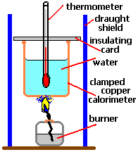{width="2.0416666666666665in"
height="2.25in"}

_C2H5OH_  _2CO2 + 3H2O; ∆H = ?_

+-----------------------------------+-----------------------------------+
| > Volume of water\ | > = 100 cm3\ |
| > Mass of burner + ethanol before | > = 37.355 g\ |
| > experiment Mass of burner + | > = 36.575 g\ |
| > ethanol after experiment | > = 21.5 oC\ |
| > Original temperature of water\ | > = 62.8 oC\ |
| > Final temperature of water\ | > = 0.780 g\ |
| > Mass of ethanol burnt\ | > = 41.3 oC\ |
| > Water temperature increase\ | > = 100 g\ |
| > Mass of water being heated\ | > = 100 x 4.18 x 41.3 J |
| > Heat gained by water | |
+===================================+===================================+
+-----------------------------------+-----------------------------------+

= 17260 J

= 17.26kJ

> Burning 0.780g of ethanol produces 17.26 kJ
>
> Amount of heat produced when 1g of ethanol burns =
>
> The amount of heat produced from 1 mole of ethanol =
>
> The accepted value for ethanol is 1370 kJ of heat evolved when 1 mol
> ethanol is burnt. But the experimental value is
>
> very low. This is because large amount of heat losses for many source
> of error.
>
> i\. There is heat loss from the warming water to the surroundings.
>
> ii\. There is heat loss from the flame which goes straight into the
> air rather than into the water.
>
> iii\. Some heat are being used to raise the temperature of the flask
> and the thermometer.
>
> **4.12 calculate molar enthalpy change from heat energy change**

_Follow 4.11_

> **4.13 understand the use of ΔH to represent enthalpy change for
> exothermic and endothermic reactions**
>
> ΔH is the symbol that represents the amount of energy lost or gained
> in a reaction.

+-----------------------------------+-----------------------------------+
| {width="0.4263888888888889in" | |
| height="0.42777668416447945in"} | |
+===================================+===================================+
+-----------------------------------+-----------------------------------+

+-----------------------------------+-----------------------------------+
| 75 | > IGCSE Chemistry Note |
+===================================+===================================+
+-----------------------------------+-----------------------------------+

> +ΔH is endothermic (because it gains heat)\
> -ΔH is exothermic (because it loses heat)
>
> The unit of ∆H is kJ/mol\
> **4.14 represent exothermic and endothermic reactions on a simple
> energy level diagram**
>
> **Endothermic reaction**
>
> 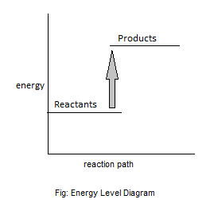{width="2.801388888888889in"
> height="2.7083333333333335in"}

+-----------------------------------+-----------------------------------+
| {width="0.4263888888888889in" | |
| height="0.42777668416447945in"} | |
+===================================+===================================+
+-----------------------------------+-----------------------------------+

+-----------------------------------+-----------------------------------+
| IGCSE Chemistry Note | > 76 |
+===================================+===================================+
+-----------------------------------+-----------------------------------+

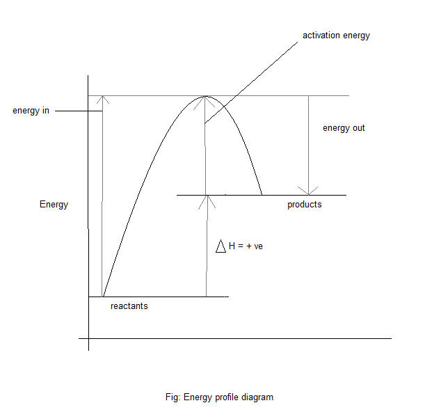{width="4.9375in"
height="4.865277777777778in"}

> **Exothermic reaction**
>
> 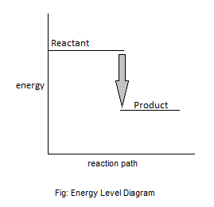{width="2.801388888888889in"
> height="2.7083333333333335in"}

+-----------------------------------+-----------------------------------+
| {width="0.4263888888888889in" | |
| height="0.42777668416447945in"} | |
+===================================+===================================+
+-----------------------------------+-----------------------------------+

+-----------------------------------+-----------------------------------+
| 77 | > IGCSE Chemistry Note |
+===================================+===================================+
+-----------------------------------+-----------------------------------+

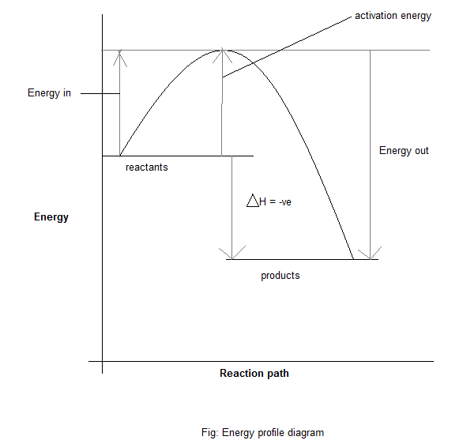{width="4.155555555555556in"
height="3.986111111111111in"}

> **4.15 understand that the breaking of bonds is endothermic and that
> the making of bonds is exothermic** During chemical reactions, bonds
> in the reactants have to be broken, and new ones formed to make the
> products. Breaking bonds needs energy and energy is released when new
> bonds are made. So for a chemical reaction, if the energy of breaking
> bond is greater than the energy of making bond, then the reaction is
> endothermic.
>
> Endothermic reaction = Bond breaking energy **\>** Bond making energy\
> If the energy required to break bond is less than making bond, then
> the reaction is exothermic.
>
> Exothermic reaction = Bond making energy **\>** Bond breaking energy.
>
> ∆H will be energy taken in to break bond (Ein) -- Energy given out to
> make bonds (Eout)

---

**_∆H = Ein- Eout_**

---

---

> **4.16 use average bond energies to calculate the enthalpy change
> during a simple chemical reaction.** _Bond Energies_

<table>
<colgroup>
<col style="width: 9%" />
<col style="width: 9%" />
<col style="width: 9%" />
<col style="width: 9%" />
<col style="width: 9%" />
<col style="width: 9%" />
<col style="width: 9%" />
<col style="width: 9%" />
<col style="width: 9%" />
<col style="width: 9%" />
<col style="width: 9%" />
</colgroup>
<thead>
<tr class="header">
<th><blockquote>

Bonds

</blockquote></th>
<th><blockquote>

H – H

</blockquote></th>
<th><blockquote>

C – C

</blockquote></th>
<th><blockquote>

C – H

</blockquote></th>
<th><blockquote>

C – O

</blockquote></th>
<th><blockquote>

O = O

</blockquote></th>
<th><blockquote>

O = H

</blockquote></th>
<th><blockquote>

H – Cl

</blockquote></th>
<th><blockquote>

N Ξ N

</blockquote></th>
<th><blockquote>

N = H

</blockquote></th>
<th><blockquote>

Cl - Cl

</blockquote></th>
</tr>
</thead>
<tbody>
<tr class="odd">
<td>Energies/mol</td>
<td><blockquote>

= 436

</blockquote></td>
<td><blockquote>

= 348

</blockquote></td>
<td><blockquote>

= 413

</blockquote></td>
<td><blockquote>

= 443

</blockquote></td>
<td><blockquote>

=466

</blockquote></td>
<td><blockquote>

= 463

</blockquote></td>
<td><blockquote>

= 431

</blockquote></td>
<td><blockquote>

= 946

</blockquote></td>
<td><blockquote>

= 488

</blockquote></td>
<td><blockquote>

=242

</blockquote></td>
</tr>
</tbody>
</table>

+-----------------------------------+-----------------------------------+
| {width="0.4263888888888889in" | |
| height="0.42777668416447945in"} | |
+===================================+===================================+
+-----------------------------------+-----------------------------------+

+-----------------------------------+-----------------------------------+
| IGCSE Chemistry Note | > 78 |
+===================================+===================================+
+-----------------------------------+-----------------------------------+

> H2 + O2 2H2O\
> _Bond Breaking:_\
> When the bonds in the hydrogen molecule and oxygen molecule are
> breaking, they have 2 -- free hydrogen atom. This requires energy to
> be absorbed. That means the process is endothermic.
>
> Energy required to break 1 mol of H-H bonds = +436kJ\
> △H = 436 kJ\
> Energy required to break 2 mol of H-H bonds = 2 x 436 kJ = +872kJ\
> △H = +872 kJ\
> Energy required to break 1 mol of O=O bonds = +496 kJ\
> Total energy = 872 + 496 = +1368kJ\
> _Bond making:_\
> Energy released on forming 2 mol of O-H bonds = -468kJ x 2 = -926 kJ\
> Therefore, energy released on forming 2 mol of H2O molecules = 2 x
> -926 = -1852 kJ\
> The overall enthalpy change for the reaction = (+1368) + (-1852) =
> -484 kJ\
