> **c) Rates of reaction**\
> **4.17 describe experiments to investigate the effects of changes in
> surface area of a solid, concentration of solutions, temperature and
> the use of a catalyst on the rate of a reaction**\
> Rate of reaction means the amount of reactant used up or the amount of
> product obtained per unit time.

Or

Or

+-----------------------------------+-----------------------------------+
| {width="0.4263888888888889in" | |
| height="0.42777668416447945in"} | |
+===================================+===================================+
+-----------------------------------+-----------------------------------+

+-----------------------------------+-----------------------------------+
| 79 | > IGCSE Chemistry Note |
+===================================+===================================+
+-----------------------------------+-----------------------------------+

> Reaction rate can be measured in four ways:
>
> i\. [Measuring a gas product]{.underline}:
>
> 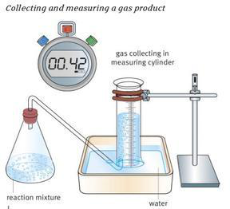{width="3.0in"
> height="2.7291666666666665in"}
>
> Obviously, this method is only suitable when one of the products
> formed is a gas. Ideally, this gas needs to be insoluble, otherwise
> some may dissolve in solution. In practice, this is not always easily
> achieve.
>
> The gas formed is collected at regular intervals, such as every 30 or
> 60 seconds. Commonly, the gas is collected in a measuring cylinder,
> but a gas syringe could also be used.
>
> The volume of gas collected is plotted against time taken; a line of
> best fit is then drawn, completing the graph. The rate of reaction is
> calculated by taking the initial rate from the graph.
>
> ii\. [Measuring loss of mass:]{.underline}
>
> 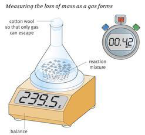{width="2.573611111111111in"
> height="2.395832239720035in"}
>
> Quite similar to measuring the volume of a gas product, this
> particular method relies on the accurate measurement of the mass of
> gas lost.
>
> Again, the mass lost is recorded at regular intervals, allowing a
> graph to be drawn with a curve of best fit. The initial rate of
> reaction can be calculated using this curve.

+-----------------------------------+-----------------------------------+
| iii\. | > [Timing a reactant |
| | > disappearing]{.underline}: |
+===================================+===================================+
| {width="0.4263888888888889in" | |
| height="0.42777668416447945in"} | |
+-----------------------------------+-----------------------------------+

+-----------------------------------+-----------------------------------+
| IGCSE Chemistry Note | > 80 |
+===================================+===================================+
+-----------------------------------+-----------------------------------+

> 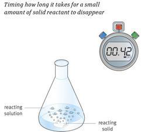{width="2.5097222222222224in"
> height="2.3541666666666665in"}
>
> This method relies on human perception; by that, it is meant that it
> requires the chemist to judge when the reaction is complete. Hence,
> this method is open to human error.
>
> Mixing the solid and solution reactants together and timing until you
> can no longer see any solid allows the chemist to calculate the
> average rate of reaction.
>
> iv\. [Timing a cloudy solution]{.underline}:
>
> 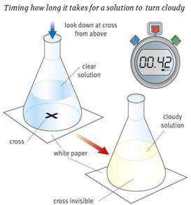{width="2.8430555555555554in"
> height="3.0513877952755903in"}
>
> This is for reactions that produce an insoluble solid, such as
> sulphur.
>
> Initially, you are required to draw a cross on a piece of paper, which
> is then placed under your glassware. Mix the solutions in the flask
> and start timing; you stop once you can no longer see the cross on the
> paper through the solution.
>
> Again, this method relies on the individual. Each person may perceive
> the reaction completed at different timings.

+-----------------------------------+-----------------------------------+
| {width="0.4263888888888889in" | |
| height="0.42777668416447945in"} | |
+===================================+===================================+
+-----------------------------------+-----------------------------------+

+-----------------------------------+-----------------------------------+
| 81 | > IGCSE Chemistry Note |
+===================================+===================================+
+-----------------------------------+-----------------------------------+

> **Experiment: How temperature affects the speed of Reaction**
>
> Sodium thiosulphate reacts with hydrochloric acid to form yellow
> deposit of sulfur.

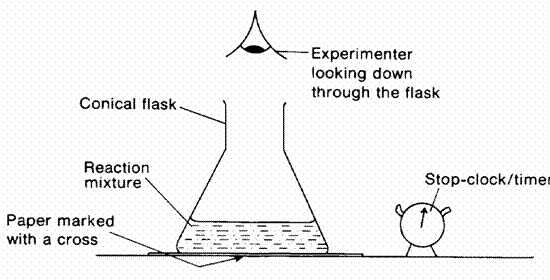{width="4.843055555555556in"
height="2.6083333333333334in"}

> Na2S2O3(aq) +2HCl (aq)  2NaCl (aq) + SO2 (g) + H2O (l) +S (s)
>
> 1.Measure out 10 cm3 of the sodium thiosulphate solution (40 g dm-3)
> into a conical flask and add 40 cm3 of water. 2.If necessary, very
> gently warm the solution to a temperature of approximately 30 oC.\
> 3.Add 5 cm3 of 2 mol dm-3 hydrochloric acid and start the stop clock.
>
> 4.Swirl the mixture and place over the cross marked on the white sheet
> of paper.
>
> 5.Look down vertically onto the cross, and time its 'disappearance'\
> 6.Repeat the experiment at about 40oC, 50oC, 60oC, 70oC by heating the
> thiosulphate solution before you add the
>
> acid. It is advisable to heat the solution to a little above these
> temperatures, to allow for the temperature to fall
>
> before you actually add the acid and start the clock.
>
> 7.Plot graph -- Temperature against time taken for the cross to
> disappear at different temperature.

+-----------------------------------+-----------------------------------+
| {width="0.4263888888888889in" | |
| height="0.42777668416447945in"} | |
+===================================+===================================+
+-----------------------------------+-----------------------------------+

+-----------------------------------+-----------------------------------+
| IGCSE Chemistry Note | > 82 |
+===================================+===================================+
+-----------------------------------+-----------------------------------+

> 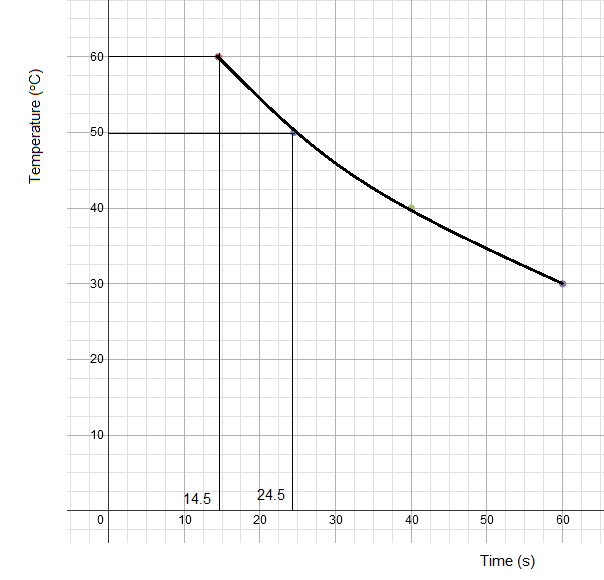{width="5.1305555555555555in"
> height="4.051388888888889in"}
>
> Observation:\
> i. The higher the temperature, the shorter the time taken for the
> cross to disappear from view. This means that the higher the
> temperature, the faster the rate of reaction.
>
> ii\. Observe the gradient of the graph at various temperature. The
> rate of reaction increases rapidly as the temperature increases.
>
> **Experiment: To study the effect of concentration on the speed of the
> reaction between magnesium and hydrochloric acid**\
>
> 1. Two beakers are taken: Beaker A: 50 cm3 dilute (1 mol/dm3)
>    hydrochloric acid and 5cm clean magnesium ribbon.
>
> Beaker B: 25 cm3 dilute (1 mol/dm3) hydrochloric acid + 25 cm3
> distilled water and 5cm clean magnesium ribbon.
>
> 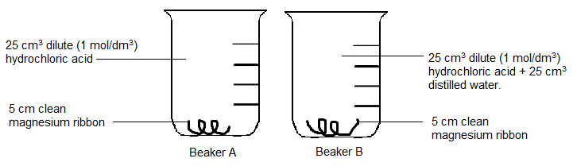{width="6.561111111111111in"
> height="1.9013877952755907in"}
>
> 2\. The time taken for each piece of magnesium ribbon to dissolve is
> recorded.

+-----------------------+-----------------------+-----------------------+
| > Beaker | > A | > B |
+=======================+=======================+=======================+
+-----------------------+-----------------------+-----------------------+

+-----------------------------------+-----------------------------------+
| {width="0.4263888888888889in" | |
| height="0.42777668416447945in"} | |
+===================================+===================================+
+-----------------------------------+-----------------------------------+

+-----------------------------------+-----------------------------------+
| ------------------------------ | > IGCSE Chemistry Note |
| 83 | |
| ------------------------------ | |
| | |
| ------------------------------ | |
+===================================+===================================+
+-----------------------------------+-----------------------------------+

+-----------------------+-----------------------+-----------------------+
| > Time taken for | > 39 | > 78 |
| > magnesium to | | |
| > dissolve (g) | | |
+=======================+=======================+=======================+
+-----------------------+-----------------------+-----------------------+

> Observation: In the above experiment, the acid in beaker A is twice as
> concentrated as the acid in beaker B. the time taken for magnesium to
> react completely in beaker A is shorter. Thus, we can conclude that a
> reaction proceeds faster when the concentration of a reactant is
> increased.
>
> **Experiment: To study the effect of particle size on the speed of
> reaction.**

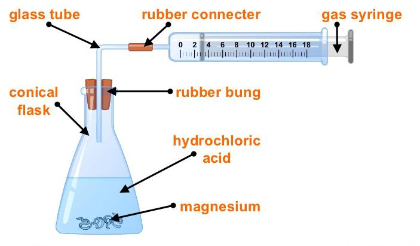{width="4.347222222222222in"
height="2.5416666666666665in"}

> 1\. A conical flask is set up and attached to a gas syringe(to measure
> the amount of CO2 produced). Marbles chips are placed in hydrochloric
> acid in the flask. The volume of gas produced is recorded at
> one-minute intervals for investigation 1.
>
> 2\. The experiment is repeated for investigation II, with marble chips
> that have been crushed into much smaller pieces.
>
> Observation:

+-----------------------------------+-----------------------------------+
| {width="0.4263888888888889in" | |
| height="0.42777668416447945in"} | |
+===================================+===================================+
+-----------------------------------+-----------------------------------+

+-----------------------------------+-----------------------------------+
| IGCSE Chemistry Note | > 84 |
+===================================+===================================+
+-----------------------------------+-----------------------------------+

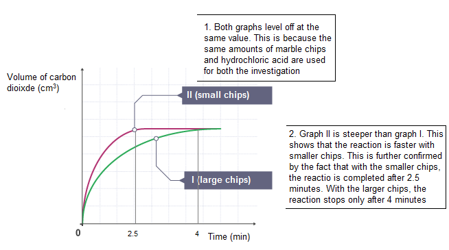{width="6.8125in"
height="3.8027777777777776in"}

> **Experiment: Investigating the effect of catalyst in decomposition of
> hydrogen peroxide**

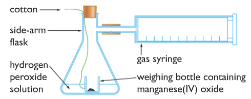{width="4.498610017497813in"
height="1.7722211286089238in"}

> 1.Hydrogen peroxide solution is placed in a beaker with a weighing
> bottle containing catalyst (manganese (IV) oxide).
>
> 2.The weighing bottle is dropped, and the reaction starts.
>
> 3.Measure the time, need to complete the reaction. (Usually when the
> volume of oxygen in gas syringe doesn't increase anymore).
>
> 4.Repeat the above experiment with no catalyst, with different mass of
> catalyst and different catalyst itself.
>
> Observation:
>
> 1.Experiment using more mass of catalyst produce a steeper graph. This
> means adding more catalyst increases the rate of reaction.

+-----------------------------------+-----------------------------------+
| {width="0.4263888888888889in" | |
| height="0.42777668416447945in"} | |
+===================================+===================================+
+-----------------------------------+-----------------------------------+

+-----------------------------------+-----------------------------------+
| 85 | > IGCSE Chemistry Note |
+===================================+===================================+
+-----------------------------------+-----------------------------------+

> 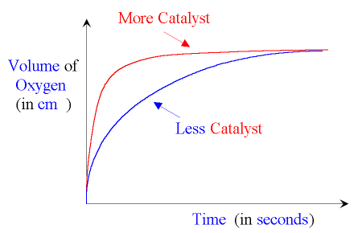{width="3.8736100174978128in"
> height="2.5541666666666667in"}
>
> 2.With different catalyst, it is observed that only some catalyst
> produce higher rate of reaction than others. In this experiment,
> Manganese IV Oxide is proved to be the best catalyst for this
> reaction.
>
> 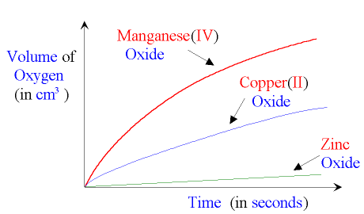{width="3.9569433508311462in"
> height="2.3222222222222224in"}
>
> **4.18 describe the effects of changes in surface area of a solid,
> concentration of solutions, pressure of gases, temperature and the use
> of a catalyst on the rate of a reaction**\
> Temperature: The higher the temperature, the faster the rate of
> reaction.
>
> Concentration: The more concentrated the substance used, the faster
> the speed of a chemical reaction.
>
> Pressure: The speed of reactions which involve gases is faster at
> higher pressures.
>
> Particle Size: Smaller particles like powders have a much greater
> surface area than larger lumps or crystals. Within a greater surface
> area, the other reactant can attack it more easily and thereby
> increase the speed of reaction.
>
> **4.19 understand the term activation energy and represent it on a
> reaction profile**\
> Activation energy is the minimum energy that molecules must possess
> during their collisions in order for a chemical reaction to occur. In
> other words, it is the total energy which is needed to break all the
> bonds in the reactant.

+-----------------------------------+-----------------------------------+
| {width="0.4263888888888889in" | |
| height="0.42777668416447945in"} | |
+===================================+===================================+
+-----------------------------------+-----------------------------------+

+-----------------------------------+-----------------------------------+
| IGCSE Chemistry Note | > 86 |
+===================================+===================================+
+-----------------------------------+-----------------------------------+

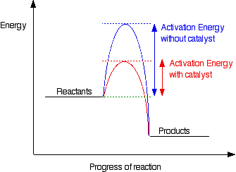{width="3.488888888888889in"
height="2.5416666666666665in"}

> **4.20 explain the effects of changes in surface area of a solid,
> concentration of solutions, pressure of gases and temperature on the
> rate of a reaction in terms of particle collision theory**\
> [Collision theory]{.underline}: It states that for a reaction to occur
> between two particles,
>
> a)The reactant particles must collide with each other.
>
> b)They must collide with a certain minimum energy which is called
> activation energy.
>
> [Successful collision]{.underline}: A collision that results in the
> formation of products is called successful or effective collision.
>
> Factors that affect rate of reaction:
>
> Temperature: When the temperature is raised, the reactant particles
> have a greater heat energy, causing them to move about more and with a
> greater kinetic energy. They, therefore, stand an increase of
> frequency of successful collision which results in higher rate of
> reaction.
>
> Concentration: When concentrated substance is used, there is a greater
> likelihood that reacting molecules will collide with one another with
> sufficient energy to form products.
>
> Pressure: When the pressure is increased, the particles get closer. So
> more particles are in per unit volume and this results more frequency
> of successful collision. And hence, the rate of reaction increases.
>
> Surface area: When the substance is powdered then more number of
> particles are exposed to get collided. So the number of successful
> collision per unit time increases resulting the higher speed.
>
> **4.21 explain that a catalyst speeds up a reaction by providing an
> alternative pathway with lower activation energy.**
>
> A catalyst is a substance which increases the rate of chemical
> reaction, without itself being chemically changed at the end of the
> reaction.
>
> Catalysts work by proving a more direct route from reactants to
> products. If we plot energy against time for a reaction, there is an
> energy barrier over which the reactants have to pass. The height of
> this barrier above the energy of the reactants is called the
> activation energy. What catalysts do, is to lower this activation
> energy, so as to allow the reactants to change into products more
> quickly.
