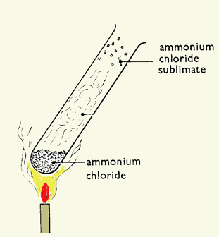
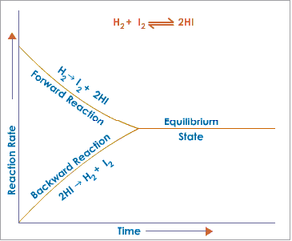

> **d) Equilibria**

+-----------------------------------+-----------------------------------+
| {width="0.4263888888888889in" | |
| height="0.42777668416447945in"} | |
+===================================+===================================+
+-----------------------------------+-----------------------------------+

+-----------------------------------+-----------------------------------+
| 87 | > IGCSE Chemistry Note |
+===================================+===================================+
+-----------------------------------+-----------------------------------+

> **4.22 understand that some reactions are reversible and are indicated
> by the symbol** ⇌ **in equations** Reaction which can be reversed is
> called reversible reaction. It is indicated by the symbol ⇌.
>
> E.g.:
>
> *N2 + 3H2*⇌ _2NH3_\
> When nitrogen and hydrogen react, it produces ammonia. This is forward
> reaction.

*N2 + 3H2* _2NH3_(forward reaction)

> The produced ammonia can be decomposed to give nitrogen and hydrogen.
> This is backward reaction.
>
> *2NH3* _N2 + 3H2_ (backward reaction)\
> **4.23 describe reversible reactions such as the dehydration of
> hydrated copper(II) sulfate and the effect of heat on ammonium
> chloride**\
> **Heating copper(II) sulphate crystals**\
> If you heat blue copper(II) sulphate gently, the blue crystals turn to
> a white powder and water is driven off. Heating causes the crystals to
> lose their water of crystallisation and white anhydrous copper(II)
> sulphate is formed.
>
> _CuSO4 . 5H2O(s)_  _CuSO4(s) + 5H2O(l)_ Now if you add water to the
> white solid, it will turn blue and will get warm.
>
> _CuSO4(s) + 5H2O(l)_  _CuSO4 . 5H2O(s)_\
> **Heating ammonium chloride**\
> If you heat ammonium chloride, the white crystals disappear from the
> bottom of the tube and reappear further up.

{width="2.4986100174978128in"
height="2.701388888888889in"}

> Heating ammonium chloride splits it into the colourless gases ammonia
> and hydrogen chloride. _NH4Cl(s)_ *NH3(g) + HCl(g)*

+-----------------------------------+-----------------------------------+
| {width="0.4263888888888889in" | |
| height="0.42777668416447945in"} | |
+===================================+===================================+
+-----------------------------------+-----------------------------------+

+-----------------------------------+-----------------------------------+
| IGCSE Chemistry Note | > 88 |
+===================================+===================================+
+-----------------------------------+-----------------------------------+

> These gases recombine when the condition is changed from hot to cool.

_NH3(g) +HCl(g)_  _NH4Cl(s)_

> **4.24 understand the concept of dynamic equilibrium**\
> When reversible reactions reach equilibrium the forward and reverse
> reactions are still happening but at the same rate, so the
> concentrations of reactants and products do not change.
>
> Conditions in dynamic equilibrium:
>
> i\. Rate of forward reaction is equal to rate of backward reaction.
> ii. Concentration of reactant and product remains same.\
> iii. Both forward and backward reactions are occurring.
>
> {width="3.801388888888889in"
> height="3.136111111111111in"}
>
> The balance point can be affected by temperature, and also by pressure
> for gasses in equilibrium.
>
> [Position of equilibrium]{.underline}: Position of equilibrium means
> the concentration of reactant and products at the equilibrium state.
>
> • When the position of equilibrium shifts to the left, it means the
> concentration of reactant increases. • When the position of
> equilibrium shifts to right, this means the concentration of product
> increases.
>
> **4.25 predict the effects of changing the pressure and temperature on
> the equilibrium position in reversible reactions.**
>
> **_Le Chatelier's Principle_**\
> "When a reversible reaction is in equilibrium and you make a change,
> it will do what it can to oppose that change."
>
> **_The effect of pressure:_**\
> Changing the pressure has little effect on an equilibrium mixture
> without gases - but can have a big effect on an equilibrium mixture
> containing gases. If the pressure is increased, the position of
> equilibrium moves in the direction of the fewest molecules.
>
> Look again at the Haber process, which makes ammonia (NH3):

+-----------------------------------+-----------------------------------+
| {width="0.4263888888888889in" | |
| height="0.42777668416447945in"} | |
+===================================+===================================+
+-----------------------------------+-----------------------------------+

+-----------------------------------+-----------------------------------+
| 89 | > IGCSE Chemistry Note |
+===================================+===================================+
+-----------------------------------+-----------------------------------+

_N2(g) + 3H2(g)_ ⇌ _2NH3(g)_

> On the left, there are 1 + 3 = 4 molecules of gas. On the right, there
> are two molecules of gas. If the pressure is increased, the position
> of equilibrium will move to the right and more ammonia will be made.
> If the pressure is reduced, the position of equilibrium will move to
> the left and less ammonia will be made.
>
> **_The effect of temperature:_**\
> • If the forward reaction is exothermic and the temperature is
> increased, the yield of products is decreased. If the temperature is
> decreased, the yield of products is increased.
>
> • If the forward reaction is endothermic and the temperature is
> increased, the yield of products is increased. If the temperature is
> decreased, the yield of products is decreased.
>
> **_The effect of concentration_**\
> When the concentration of a product is increased, the position of
> equilibrium will move to the left (as to remove the extra product).

BiCl3 (aq) + H2O (l) ⇌*BiOCl (s)+ 2HCl (aq)*

> If the concentration of hydrochloric acid in the equilibrium mixture
> is increased, the position of equilibrium moves to the left and the
> amount of white solid in that new equilibrium mixture is reduced.
>
> **_The effect of catalyst_**\
> If we remove the products from an equilibrium mixture, more reactants
> are converted into products. If a catalyst is used, the reaction
> reaches equilibrium much sooner, because the catalyst speeds up the
> forward and reverse reactions by the same amount. The concentration of
> reactants and products is nevertheless the same at equilibrium as it
> would be without the catalyst.

+-----------------------------------+-----------------------------------+
| {width="0.4263888888888889in" | |
| height="0.42777668416447945in"} | |
+===================================+===================================+
+-----------------------------------+-----------------------------------+

+-----------------------------------+-----------------------------------+
| IGCSE Chemistry Note | > 90 |
+===================================+===================================+
+-----------------------------------+-----------------------------------+
