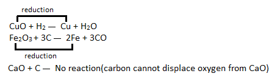
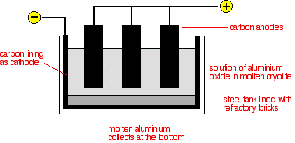
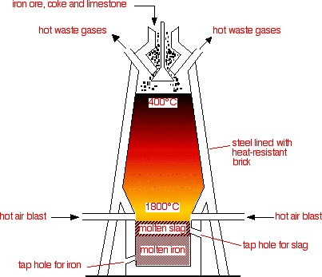

# a) Extraction and Uses of Metals

## 5.1 Explain How the Methods of Extraction of the Metals in This Section Are Related to Their Positions in the Reactivity Series

Metals can be extracted in four different ways:

1. With Carbon
2. By Electrolysis
3. By More Reactive Material
4. Heating

Metals that are below zinc in the reactivity series can be extracted using carbon and carbon monoxide. Carbon is cheap and can also be used as the source of heat.

Metals above zinc in the reactivity series are usually extracted by electrolysis. Unfortunately, the large amounts of electricity involved make this an expensive process.

If a metal is more reactive than a metal in a compound, the reactive material will displace it, and our targeted metal will be extracted.

Metals below copper can be extracted from their compounds only by heating.

### Q: Explain Why More Reactive Metals Are Extracted by Electrolysis.

**A:** The extraction process is a reduction process. The more reactive metals are, the harder they are to reduce. They need a powerful method of extraction, which is electrolysis.

### Q: Why Can Iron Be Extracted by Carbon Reduction Process?

**A:** Carbon is more reactive than iron, and that's why it can displace iron from their oxides.

## 5.2 Describe and Explain the Extraction of Aluminium from Purified Aluminium Oxide by Electrolysis, Including:

- The use of molten cryolite as a solvent and to decrease the required operating temperature
- The need to replace the positive electrodes
- The cost of the electricity as a major factor

Aluminium is extracted from aluminium oxide, which comes from bauxite. Aluminium oxide has a very high melting point, and it isn't practical to electrolyse molten aluminium oxide. So, aluminium oxide is dissolved in molten cryolite to decrease the working temperature.

The electrolyte is a solution of aluminium oxide in molten cryolite at a temperature of about 1000°C. The molten aluminium is siphoned off from time to time, and fresh aluminium oxide is added to the cell. The cell operates at 5-6 volts and with a current of 100,000 amps. The heat generated by the huge current keeps the electrolyte molten. The large amounts of electricity needed are a major expense.

### Cathode:

Aluminium ions are attracted to the cathode and are reduced to aluminium by gaining electrons.

$$\text{Al}^{3+}(l) + 3e^- \rightarrow \text{Al}(l)$$

The molten aluminium produced sinks to the bottom of the cell.

### Anode:

The oxide ions are attracted to the anode and lose electrons to form oxygen gas.

$$2\text{O}^{2-}(l) \rightarrow \text{O}_2(g) + 4e^-$$

This creates a problem. Because of the high temperatures, the carbon anodes burn in the oxygen to form carbon dioxide. The anodes have to be replaced regularly, and this also adds to the expense of the process.

## The Use of Molten Cryolite

The melting point of alumina is very high. If the alumina is dissolved in cryolite, it becomes 950°C. This reduces the expense for the heating purpose.

## The Need to Replace the Positive Electrode

The oxide ions give up electrons to form oxygen gas.

$$2\text{O}^{2-}(l) \rightarrow \text{O}_2(g) + 4e^-$$

Oxygen gas attacks the carbon anode at high temperature to form gaseous products, mainly carbon dioxide. This causes the carbon anodes to burn away, so they must be replaced regularly.

## The Cost of Electricity as a Major Factor

The cell operates at about 5-6 volts but with a current of up to about 100,000 amps. The heat generated by the huge current keeps the electrolyte molten. The large amount of electricity is a major expense.

## 5.3 Write Ionic Half-Equations for the Reactions at the Electrodes in Aluminium Extraction

At the anode:
$$2\text{O}^{2-}(l) \rightarrow \text{O}_2(g) + 4e^-$$

At the cathode:
$$\text{Al}^{3+}(l) + 3e^- \rightarrow \text{Al}(l)$$

## 5.4 Describe and Explain the Main Reactions Involved in the Extraction of Iron from Iron Ore (Haematite), Using Coke, Limestone, and Air in a Blast Furnace

### Raw Materials:

1. Iron ore
2. Coke
3. Limestone

Coke is used as the starting material. It is an impure carbon and it burns in hot air blast to form carbon dioxide. This is a strongly exothermic reaction.

$$\text{C}(s) + \text{O}_2(g) \rightarrow \text{CO}_2(g)$$

At the high temperatures in the furnace, the carbon dioxide is reduced by more carbon to give carbon monoxide.

$$\text{CO}_2(g) + \text{C}(s) \rightarrow 2\text{CO}(g)$$

Carbon monoxide is the reducing agent. Iron is gained from hematite (\(\text{Fe}\_2\text{O}\_3\)).

$$\text{Fe}_2\text{O}_3(s) + 3\text{CO}(g) \rightarrow 2\text{Fe}(l) + 3\text{CO}_2(g)$$

The iron melts and flows to the bottom of the furnace, where it can be tapped off.

In the hotter parts of the furnace, some of the iron oxide is also reduced by carbon itself.

$$\text{Fe}_2\text{O}_3(s) + 3\text{C}(s) \rightarrow 2\text{Fe}(l) + 3\text{CO}(g)$$

Limestone is added to the furnace to remove impurities in the ore. Limestone thermally decomposes to calcium oxide and carbon dioxide. It is an endothermic reaction.

$$\text{CaCO}_3(s) \rightarrow \text{CaO}(s) + \text{CO}_2(g)$$

Silicon dioxide occurs naturally as quartz and it is a form of impurities that needs to be removed. Calcium oxide reacts with it to form calcium silicate. This melts and trickles to the bottom of the furnace as a molten slag, which floats on top of the molten iron and can be tapped off separately.

$$\text{CaO}(s) + \text{SiO}_2(s) \rightarrow \text{CaSiO}_3(l)$$

## 5.5 Explain the Uses of Aluminium and Iron, in Terms of Their Properties

### Uses of Aluminium

Pure aluminium isn't very strong, so aluminium alloys are used instead. As aluminium has low density, it resists corrosion and is strong. It has various uses, such as in airplanes, pans, etc. For its good conductivity of electricity, it is used as cables.

### Uses of Iron

| Types of Iron     | Iron Mixed With     | Properties                   | Some Uses                                  |
| ----------------- | ------------------- | ---------------------------- | ------------------------------------------ |
| Wrought Iron      | (Pure Iron)         | Soft                         | Decorative work such as gates and railings |
| Mild Steel        | Up to 0.25% Carbon  | Hard                         | Nails, car bodies, ship building, girders  |
| High-Carbon Steel | 0.25-1.5% Carbon    | Very hard, sometimes brittle | Cutting tools, masonry nails               |
| Cast Iron         | About 4% Carbon     | Hard but brittle             | Manhole covers, guttering, engine blocks   |
| Stainless Steel   | Chromium and Nickel | Resistant to corrosion       | Cutlery, cooking utensils, kitchen sinks   |
