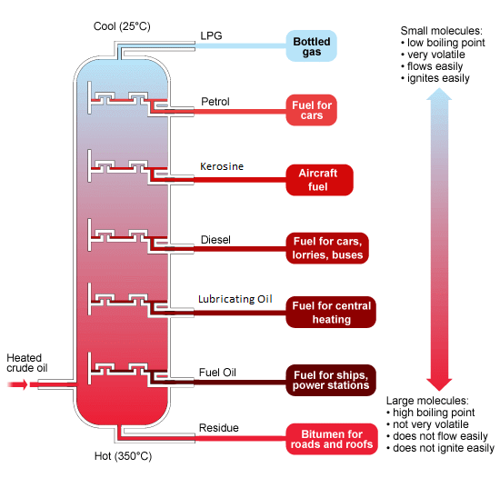
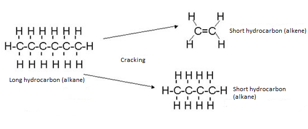

# b) Crude Oil

## 5.6 Understand that Crude Oil is a Mixture of Hydrocarbons

Crude oil is a mixture of hydrocarbons—compounds containing carbon and hydrogen only. If any fraction from crude oil is burned, then carbon dioxide and water are produced, which shows that crude oil is a complex mixture of hydrocarbons.

For example, a fraction of petrol, if it is burnt, produces carbon dioxide and water:

$$
\text{C}_5\text{H}\_{12} + 8\text{O}_2 \rightarrow 5\text{CO}_2 + 6\text{H}_2\text{O}
$$

If crude oil is separated by fractional distillation, various fractions are produced. All the fractions are mixtures of different kinds of hydrocarbons.

## 5.7 Describe and Explain How the Industrial Process of Fractional Distillation Separates Crude Oil into Fractions

The process of refining involves separating the hydrocarbons into fractions or batches using a technique called fractional distillation. Each fraction separates as they have different boiling points. The crude oil is heated in a furnace to around 400°C.

1. In the furnace at the bottom of the fractionating column, petroleum is heated into vapor.
2. The vapor is pumped into a huge fractionating column. The column is cool at the top but hot at the bottom.
3. Hot vapor rises up the column and begins to cool down. The smaller hydrocarbons are collected at the top of the fractionating column as gases. The bigger hydrocarbons are collected at the lower sections of the fractionating column.

## 5.8 Recall the Names and Uses of the Main Fractions Obtained from Crude Oil

- **Refinery Gases**: A mixture of methane, ethane, propane, and butane, which can be separated into individual gases if required. These gases are commonly used as LPG (liquefied petroleum gas) for domestic heating and cooking.
- **Gasoline (Petrol)**: A mixture of hydrocarbons with similar boiling points, used mainly in car engines.

- **Naphtha**: Used as raw material in petrochemical industries.

- **Kerosene**: Used as fuel for jet aircraft, as domestic heating oil, and as 'paraffin' for small heaters and lamps.

- **Diesel Oil (Gas Oil)**: Used for buses, lorries, some cars, and railway engines where the line hasn't been electrified. Some is also cracked to make other organic chemicals and produce more petrol.

- **Lubricating Oil**: Used as oil for car engines and other machines.

- **Fuel Oil**: Used for ships' boilers and for industrial heating.

- **Paraffin Wax**: Used to make candles, polish, wax paper, waterproofing, and grease.

- **Bitumen**: A thick black material, which is melted and mixed with rock chippings to make the top surfaces of roads.

## 5.9 Describe the Trend in Boiling Point and Viscosity of the Main Fractions

- **Viscosity**: Refers to the ease of flow of a liquid. As the number of carbon atoms increases, the attraction between the hydrocarbon molecules also increases, resulting in the liquid becoming more viscous with the increasing length of the hydrocarbon chain. The liquid flows less easily with increasing molecular mass.

- **Melting Point/Boiling Point**: As the molecules get larger, the intermolecular attraction becomes greater. More heat is needed to separate the molecules, which results in an increase in boiling point.

- **Volatility**: Refers to the state of changing physical state. With increasing molecular size, hydrocarbon liquids become less volatile due to increased attraction between the molecules.

- **Flammability**: Smaller hydrocarbons burn easily. Therefore, the larger the size, the less flammable the hydrocarbons are.

### Summary

As the molecules get bigger, the following changes occur:

- Boiling point increases.
- The liquids become less volatile.
- The liquid flows less easily (they become more viscous) and burn less easily.

## 5.10 Understand that Incomplete Combustion of Fuels May Produce Carbon Monoxide

If there isn't enough air (or oxygen), incomplete combustion occurs, leading to the formation of carbon or carbon monoxide instead of carbon dioxide:

$$
2\text{CH}_4 (g) + 3\text{O}_2(g) \rightarrow 2\text{CO}(g) + 4\text{H}_2\text{O}(l)
$$

Carbon monoxide is colorless, odorless, and very poisonous. It combines with hemoglobin, preventing it from carrying oxygen, which can lead to illness or even death due to lack of oxygen in the body.

## 5.11 Understand that in Car Engines, the Temperature Reached is High Enough to Allow Nitrogen and Oxygen from Air to React

$$
\text{N}_2(g) + \text{O}_2(g) \rightarrow \text{NO}(g)
$$

## 5.12 Understand that Nitrogen Oxides and Sulfur Dioxide are Pollutant Gases Contributing to Acid Rain

Acid rain is formed when acidic air pollutants such as sulfur dioxide and nitrogen dissolve in rainwater. Sulfur dioxide dissolves in water to form sulfurous acid:

$$
\text{SO}_2(g) + \text{H}_2\text{O}(l) \rightarrow \text{H}_2\text{SO}_3(aq)
$$

In the presence of oxygen in the air, the acid is slowly oxidized to sulfuric acid:

$$
\text{H}_2\text{SO}_3(aq) + \text{O}_2(g) \rightarrow \text{H}_2\text{SO}_4(aq)
$$

Oxides of nitrogen also contribute to acid rain. In the presence of oxygen and water, nitrogen dioxide is converted to nitric acid:

$$
4\text{NO}_2(g) + 2\text{H}_2\text{O}(l) + \text{O}_2(g) \rightarrow 4\text{HNO}_3(aq)
$$

Carbon dioxide in the air dissolves in rainwater to form carbonic acid:

$$
\text{CO}_2(g) + \text{H}_2\text{O}(l) \rightarrow \text{H}_2\text{CO}_3(aq)
$$

The pH value of normal rain is slightly below 7, while the pH value of acid rain is approximately 3.4.

### Problems of Acid Rain

- Acid rain reacts with metals and carbonates in marble and limestone, damaging metal bridges and stone buildings.
- It can reduce the pH value of natural water bodies from 6.5 and 8.5 to below 4, killing fish and other aquatic life.
- Acid rain leaches important nutrients from the soil, destroying plants and stunting growth. It can also dissolve aluminum hydroxide in the soil, producing toxic aluminum ions.

## 5.13 Understand that Fractional Distillation of Crude Oil Produces More Long-Chain Hydrocarbons than Can Be Used Directly

If 100 ml of crude oil is distilled:

| Fraction | Volume (ml) |
| -------- | ----------- |
| Gas      | 2           |
| Petrol   | 25          |
| Kerosene | 10          |
| Fuel Oil | 40          |
| Naphtha  | 15          |
| Bitumen  | 8           |

Long-chain hydrocarbons that can't be used directly aren't very useful. With increasing chain length, the hydrocarbons become less flammable, more viscous, and therefore less useful. Short-chain hydrocarbons burn well and flow well, making them useful, but they are produced less in the fractional distillation of crude oil. Thus, chemists convert these large, less useful, heavy fractions into smaller, more useful ones by means of cracking.

- Cracking is used to produce petrol.
- Cracking is used to produce alkenes, which are raw materials in the plastic industry.
- Cracking is used to produce hydrogen gas, which is a raw material in the manufacture of ammonia in the Haber process.

## 5.14 Describe How Long-Chain Alkanes are Converted to Alkenes and Shorter-Chain Alkanes by Catalytic Cracking

Cracking is the process of splitting larger molecules into simpler ones. The molecules are broken up in a random way, producing a mixture of alkanes and alkenes. The gas oil fraction is heated to give a gas and then passed over a catalyst of mixed silicon dioxide and aluminum oxide at about 600–700°C. Cracking can also be carried out at higher temperatures without a catalyst.
