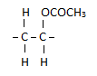

# c) Synthetic Polymers

## 5.15 Understand that an addition polymer is formed by joining up many small molecules called monomers

**Monomer**: Monomers are small units which are joined to form a polymer.

**Polymer**: When repeating monomers are joined together by polymerisation, they form a macromolecule called a polymer.

There are two types of polymers:

1. **Natural Polymers**: e.g., starch, carbohydrates, fats, proteins, etc.
2. **Synthetic Polymers (Man-made Polymers)**: e.g., polythene, polypropene, polychloroethene (PVC), polystyrene, nylon, terylene.

**Polymerisation**: The process of joining together a large number of small molecules (monomers) to form a macromolecule/polymer is called polymerisation.

There are two basic types of reactions for forming polymers:

1. **Addition Polymerisation**: Occurs when unsaturated monomer units join together without losing any molecules or atoms.
2. **Condensation Polymerisation**: Occurs when two monomers join together alternately, and each time two monomers combine, a small molecule is lost. This is known as a condensation reaction.

## Polymerisation of Ethene to Form Poly(ethene)

At high temperature, pressure, and in the presence of a catalyst, the carbon-carbon bonds of the alkene molecules (monomers) break. Each monomer forms single bonds with two other monomers. Eventually, they join to form a giant molecule. This is what happens during the addition polymerisation of ethene.

1. One bond in each double bond breaks.

2. Each monomer forms single bonds with two other monomers.

3. Poly(ethene) is formed.

The equation of the polymerisation of ethene is therefore written as:

## 5.16 Draw the Repeat Unit of Addition Polymers, Including Poly(ethene), Poly(propene), and Poly(chloroethene)

## 5.17 Deduce the Structure of a Monomer from the Repeat Unit of an Addition Polymer

In the previous unit, we learnt how to draw a polymer given its monomer. How can we do the reverse? Let's examine this using PVA (polyvinyl acetate) as an example. PVA is used as the main constituent in emulsion paints. It has the formula:

To deduce the structural formula of its monomer, we follow the steps below:

1. Identify the repeat unit in the polymer.

2. Write down the formula of the repeat unit.

3. Convert the carbon-carbon single bond into a carbon-carbon double bond. The structural formula of the monomer, vinyl acetate, is:

## 5.18 Describe Some Uses for Polymers, Including Poly(ethene), Poly(propene), and Poly(chloroethene)

**Poly(ethene)**: Poly(ethene) comes in two types -- low-density poly(ethene) (LDPE) and high-density poly(ethene) (HDPE). Low-density poly(ethene) is mainly used as a thin film to make polythene bags. It is very flexible and not very strong. High-density poly(ethene) is used where greater strength and rigidity are needed -- for example, to make plastic bottles such as milk bottles.

**Poly(propene)**: Poly(propene) is somewhat stronger than poly(ethene). It is used to make ropes and crates (among many other things).

**Poly(chloroethene)**: It is quite strong and rigid and can be used for drainpipes or replacement windows. It can also be made flexible by adding 'plasticisers', making it useful for sheet floor coverings and even clothing. These polymers don't conduct electricity, and PVC is used for electrical insulation.

## 5.19 Explain that Addition Polymers are Hard to Dispose of as Their Inertness Means That They Do Not Easily Biodegrade

Addition polymers are unreactive, so they don't easily biodegrade.

## 5.20 Understand that Some Polymers, Such as Nylon, Form by a Different Process Called Condensation Polymerisation

Some polymers are made by reacting two different types of monomers. Each of the monomers involved has a functional group at each end of the molecule. When these monomers react, a polymer is produced, and a small molecule such as water is also produced as a by-product of the reaction. This type of reaction is called condensation polymerisation.

### Nylon -- A Synthetic Polymide

Nylon was the first synthetic fibre made by condensation polymerisation. It is made from the monomers dicarboxylic acid and diamine. We can represent these two monomer units as follows:

This is how the two monomers react:

The reaction between a dicarboxylic acid and a diamine can be represented by the equation shown below.

Notice the following:

1. Each monomer for making nylon has two identical functional groups. The chain can be extended in two directions by the removal of water molecules.
2. A whole family of nylons can be formed using different dicarboxylic acid and diamine monomers. The reactive group in nylon is shown below.

### Terylene -- A Synthetic Polyester

Terylene is another example of a condensation polymer. It is included in a polyester group.

The monomers are:

These monomers react to form Terylene and water:

The reactive group or functional group in Terylene is shown below.

## 5.21 Understand that Condensation Polymerisation Produces a Small Molecule, Such as Water, as Well as the Polymer

### Difference Between Condensation and Addition Polymerisation

| **Addition**                                        | **Condensation**                                               |
| --------------------------------------------------- | -------------------------------------------------------------- |
| Unsaturated monomers are used to produce a polymer. | Each monomer has two functional groups.                        |
| Elimination of water doesn't take place.            | Elimination of water takes place.                              |
| Unsaturated monomers become saturated.              | The monomers join among themselves by a linkage.               |
| Addition polymerisation is a fast process.          | Condensation polymerisation is comparatively a slower process. |
| Examples: polythene, poly(propene), polystyrene     | Examples: nylon, polyester.                                    |
