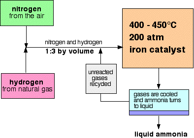
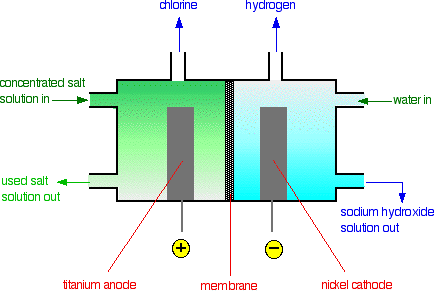

# d) The Industrial Manufacture of Chemicals

## 5.22 Understand that nitrogen from air, and hydrogen from natural gas or the cracking of hydrocarbons, are used in the manufacture of ammonia

Ammonia (NH₃) is manufactured by using nitrogen from air and hydrogen from natural gas.

$$
\text{N}_2(g) + 3\text{H}_2(g) \rightarrow 2\text{NH}_3(g)
$$

## 5.23 Describe the manufacture of ammonia by the Haber process, including the essential conditions:

1. A temperature of about 450°C
2. A pressure of about 200 atmospheres
3. An iron catalyst

Ammonia is manufactured by combining nitrogen and hydrogen in an important industrial process called the Haber process.

### The Haber Process:

- **Raw materials:** nitrogen (from the air), hydrogen (made from natural gas)
- **The proportions:** 1 volume of nitrogen to 3 volumes of hydrogen
- **The temperature:** 450°C
- **The pressure:** 200 atmospheres
- **The catalyst:** iron

The raw materials for the process are hydrogen and nitrogen. Hydrogen is produced industrially from cracking oil, and nitrogen from liquefaction of the air. The two gases are combined directly in a ratio of 3:1 and are passed over an iron catalyst at 450°C and 200 atmospheres.

$$
\text{N}_2(g) + 3\text{H}_2(g) \rightleftharpoons 2\text{NH}_3(g)
$$

As shown in the equation, the reaction is reversible with the forward reaction producing ammonia and the back reaction decomposing ammonia back into hydrogen and nitrogen gases. In order to favor the forward reaction, to produce more ammonia, high pressures are needed, as this will help to convert four volumes of hydrogen and nitrogen into two volumes of ammonia. The temperature of 450°C is a compromise, because the reaction is also exothermic. This means it gives out heat and prefers a low temperature, but if the temperature drops too low, the rate becomes too slow. A moderate temperature of 450°C is therefore used.

The catalyst in the Haber Process is the transition metal iron, with promoters of iron oxide. This speeds up both the forward and backward reactions, so the point of equilibrium between the two reactions is reached more quickly. When the ammonia has been produced, it is liquefied by reducing the temperature to -34°C, and the unconverted nitrogen and hydrogen gases are recycled to avoid wastage.

## 5.24 Understand how the cooling of the reaction mixture liquefies the ammonia produced and allows the unused hydrogen and nitrogen to be recirculated

The products from the reactant are sent through a cooling mechanism, this is at a temperature that condenses ammonia, but not hydrogen and nitrogen. Liquid ammonia is then collected, but hydrogen and nitrogen float right back into the reactor.

{width="4.104166666666667in" height="2.926388888888889in"}

Only 50% ammonia is produced in the converter. The reaction mixture is cooled, the ammonia condenses as liquid and as ammonia has a lower boiling point than nitrogen and hydrogen, which will be tapped off and collected in a storage tank.

## 5.25 Describe the use of ammonia in the manufacture of nitric acid and fertilizers

### Manufacture of Nitric Acid:

Industrially, nitric acid is made by the catalytic oxidation of ammonia over heated platinum. Oxidizing ammonia produces oxides of nitrogen which can then be dissolved in water to produce nitric acid.

Initially, nitrogen(II) oxide will be formed from the catalytic oxidation of ammonia using the transition metal platinum at a temperature of 800°C to 1000°C.

$$
4\text{NH}_3(g) + 5\text{O}_2(g) \rightarrow 4\text{NO}(g) + 6\text{H}_2\text{O}(g)
$$

The nitrogen(II) oxide is rapidly cooled before combining with oxygen (from excess air) to form nitrogen(IV) oxide.

$$
2\text{NO}(g) + \text{O}_2(g) \rightleftharpoons 2\text{NO}_2(g)
$$

The nitrogen(IV) oxide is now allowed to react with water to form nitric acid.

$$
4\text{NO}_2(g) + \text{O}_2(g) + 2\text{H}_2\text{O}(l) \rightarrow 4\text{HNO}_3(aq)
$$

Most of the nitric acid made is used to make the all-important fertilizers such as ammonium nitrate.

### Manufacture of Fertilizers:

The main use of ammonia is in the manufacture of fertilizers. Approximately 75% of all ammonia produced is converted into various ammonium compounds like ammonium sulfate \((\text{NH}\_4)\_2\text{SO}\_4\), ammonium nitrate \(\text{NH}\_4\text{NO}\_3\), and urea \(\text{NH}\_2\text{CONH}\_2\). These compounds are called nitrogenous fertilizers. They are solids for ease in handling and water-soluble so that they seep into the soil to be absorbed by the roots of the plant.

$$
\text{NH}_3(aq) + \text{HNO}_3(aq) \rightarrow \text{NH}_4\text{NO}_3(aq)
$$

$$
2\text{NH}_3(aq) + \text{H}_2\text{SO}_4(aq) \rightarrow (\text{NH}_4)_2\text{SO}_4(aq)
$$

## 5.26 Recall the raw materials used in the manufacture of sulfuric acid

- Sulfur (found in rocks and some natural gases)
- Oxygen from the air.

## 5.27 Describe the manufacture of sulfuric acid by the contact process, including the essential conditions:

- A temperature of about 450°C
- A pressure of about 2 atmospheres
- A vanadium(V) oxide catalyst

### I) First Sulfur Dioxide is Produced:

The raw materials are sulfur and air (oxygen). To produce sulfur dioxide, either burn sulfur in air:

$$
\text{S}(s) + \text{O}_2(g) \rightarrow \text{SO}_2(g)
$$

Or heat sulfide ores strongly in air:

$$
4\text{FeS}_2(s) + 11\text{O}_2(g) \rightarrow 2\text{Fe}_2\text{O}_3(s) + 8\text{SO}_2(g)
$$

### II) Purification of Sulfur Dioxide

The sulfur dioxide is then purified by removing impurities like arsenic compounds which would otherwise poison the catalyst. It is then passed through an electrostatic dust precipitator, which, as its name implies, charges dust particles which are then removed by being attracted to oppositely charged plates.

### III) Sulfur Trioxide is Produced:

Sulfur dioxide and air are then washed, dried, and passed over a vanadium(V) oxide catalyst at 450°C and 2-3 atmospheres. The reaction is reversible but at these temperatures and pressures, 98% conversion to sulfur trioxide is achieved:

$$
2\text{SO}_2(g) + \text{O}_2(g) \rightleftharpoons 2\text{SO}_3(g)
$$

Because the forward reaction is exothermic, there would be a higher percentage conversion of sulfur dioxide into sulfur trioxide at a low temperature. However, at a low temperature, the rate of reaction would be very slow. 450°C is a compromise.

There are 3 gas molecules on the left-hand side of the equation, but only 2 on the right. Reactions in which the numbers of gas molecules decrease are favored by high pressures. In this case, though, the conversion is good at low pressures that it isn't economically worthwhile to use higher ones.

The catalyst, vanadium(V) oxide, has no effect on the percentage conversion but helps to speed up the reaction. Without the catalyst, the reaction would be extremely slow.

### IV) Making the Sulfuric Acid

In principle, you can react sulfur trioxide with water to make sulfuric acid. In practice, this produces an uncontrolled fog of concentrated sulfuric acid. Instead, the sulfur trioxide is absorbed in concentrated sulfuric acid to give fuming sulfuric acid (oleum).

$$
\text{H}_2\text{SO}_4(l) + \text{SO}_3(g) \rightarrow \text{H}_2\text{S}_2\text{O}_7(l)
$$

This is converted into twice as much concentrated sulfuric acid by careful addition of water.

$$
\text{H}_2\text{S}_2\text{O}_7(l) + \text{H}_2\text{O}(l) \rightarrow 2\text{H}_2\text{SO}_4(l)
$$

## 5.28 Describe the use of sulfuric acid in the manufacture of detergents, fertilizers, and paints

1. The production of fertilizers such as ammonium sulfate, potassium sulfate, calcium superphosphate, etc.

   - Ammonium sulfate can be prepared by reacting ammonia and sulfuric acid.

   $$
   \text{NH}_3(g) + \text{H}_2\text{SO}_4(l) \rightarrow (\text{NH}_4)_2\text{SO}_4
   $$

   - Sulfur phosphate is the main source of phosphorus in agriculture. To make super phosphate, calcium phosphate is treated with concentrated sulfuric acid, a product containing two calcium sulfates is formed.

   $$
   \text{Ca}_3(\text{PO}_4)_2(s) + 2\text{H}_2\text{SO}_4(aq) + 4\text{H}_2\text{O}(l) \rightarrow \text{Super Phosphate} \left[\text{Ca}(\text{H}_2\text{PO}_4)_2(s) + 2\text{CaSO}_4 \cdot 2\text{H}_2\text{O}\right]
   $$

2. The manufacture of non-soapy detergents: modern detergents are organic compounds 'sulphonated' with concentrated sulfuric acid.

   - In the manufacture of detergent, hydrocarbons are treated with concentrated sulfuric acid to form an organic acid. The organic acid is then neutralized with sodium hydroxide solution to produce a detergent.

   $$
   \text{Hydrocarbon} + \text{Concentrated sulfuric acid} \rightarrow \text{Organic acid}
   $$

   $$
   \text{Organic acid} + \text{Sodium hydroxide solution} \rightarrow \text{Detergent}
   $$

3. In paint manufacture, sulfuric acid is used in extracting the white pigment titanium dioxide, TiO₂, from titanium ores.

4. The making of artificial silks like rayon: here, the fine threads in the alkaline cellulose solution are neutralized by passing them through a bath of sulfuric acid.

5. The cleaning of metals by removing the surface oxide coating: this is called pickling and is important in preparing articles for electroplating.

6. It's used as an electrolyte inside batteries for cars: most car batteries are made up of lead plates in a sulfuric acid electrolyte; occasionally, the electrolyte needs to be 'topped up' with distilled water; this is because small amounts of hydrogen and oxygen gases are given off by the chemical changes inside the battery, and therefore the sulfuric acid loses water and becomes too concentrated.

## 5.29 Describe the manufacture of sodium hydroxide and chlorine by the electrolysis of concentrated sodium chloride solution (brine) in a diaphragm cell

The concentrated salt solution can be electrolyzed to produce three useful chemicals -- sodium hydroxide, chlorine, and hydrogen. The electrolysis can be carried out in a diaphragm cell.

{width="4.5625in" height="3.0527777777777776in"}

At the titanium anode, chloride ions are discharged to produce chlorine gas.

$$
2\text{Cl}^-(aq) \rightarrow \text{Cl}_2(g) + 2e^-
$$

At the steel cathode, it is too difficult for sodium ions, so hydrogen ions from the water are discharged instead to produce hydrogen gas.

$$
2\text{H}^+(aq) + 2e^- \rightarrow \text{H}_2(g)
$$

More and more water keeps splitting up to replace the hydrogen ions as soon as they are discharged. Each time a water molecule splits up, it produces a hydroxide ion as well. That means that there will be a build-up of sodium ions and hydroxide ions in the right-hand compartment—sodium hydroxide solution is formed. This is contaminated with uncharged sodium chloride.

The sodium hydroxide solution is concentrated by evaporating it. During this process, most of the sodium chloride crystallizes out as solid salt. This can be separated, redissolved in water, and recycled back through the cell again.

### FAQ

**What happens if chlorine comes into contact with sodium hydroxide or hydrogen?**

The cell is designed to keep the products apart. If chlorine comes into contact with sodium hydroxide solution, it reacts to make bleach—a mixture of sodium chloride and sodium chlorate(I) solution. If chlorine comes into contact with hydrogen, it produces a mixture that would explode violently on exposure to sunlight or heat to give hydrogen chloride.

**Why is it important that the liquid level in the left-hand compartment of a diaphragm cell is higher than that in the right-hand side?**

This is to make sure that the flow of liquid is always from left to right, preventing any of the sodium hydroxide solution formed from finding its way back to where chlorine formed.

## 5.30 Write ionic half-equations for the reactions at the electrodes in the diaphragm cell

### 5.31 Describe important uses of sodium hydroxide, including the manufacture of bleach, paper, and soap; and of chlorine, including sterilizing water supplies and in the manufacture of bleach and hydrochloric acid.

Uses of sodium hydroxide include:

- The purification of bauxite to make aluminum oxide ('alumina') as a part of the manufacture of aluminum.
- Paper making—the sodium hydroxide helps break the wood down into pulp.
- Soap making—sodium hydroxide reacts with animal and vegetable fats and oils to make compounds, such as sodium stearate, that are present in soap.

$$
2\text{NaOH}(aq) + \text{Cl}_2(g) \rightarrow \text{NaCl}(aq) + \text{NaOCl}(aq) + \text{H}_2\text{O}(l)
$$

Uses of chlorine include:

- Sterilizing water to make it safe to drink
- Making hydrochloric acid (by controlled reaction with hydrogen)
- Making bleach, weedkillers, pesticides
- Making PVC (nearly 1/3 of it is used for this)
- Making solvents with perchloroethylene for degreasing and dry-cleaning
- Making paints and dye stuffs
- Making pharmaceuticals
- Making titanium dioxide, a white pigment used in paints, ceramics, cosmetics, and paper
- Killing bacteria in swimming pools
