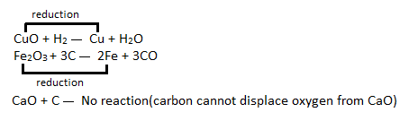
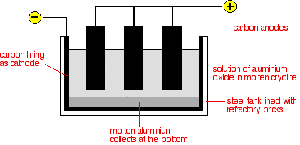
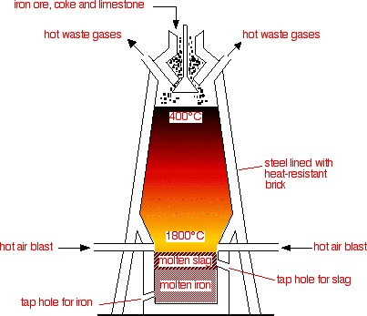

> **a) Extraction and uses of metals**\
> **5.1 explain how the methods of extraction of the metals in this
> section are related to their positions in the reactivity series**\
> Metals can be extracted in four different ways: (i) With Carbon, (ii)
> By electrolysis, (iii)By more reactive material& (iv) Heating
>
> Metals that are below zinc in reactivity series can be extracted using
> carbon and carbon monoxide. Carbon is cheap and can also be as the
> source of heat.
>
> Metals above zinc in reactivity series are usually extracted by
> electrolysis. Unfortunately, the large amounts of electricity involved
> make this an expensive process.
>
> If a metal is more reactive than a metal in a compound, the reactive
> material will displace it and our targeted metal will be extracted.
>
> Metals below Copper can be extracted from their compounds only by
> heating.
>
> **Q:** Explain why more reactive metal are extracted by electrolysis.
>
> **A:** Extraction process is a reduction process. The more reactive
> metal are, the harder they are to reduce. They need a powerful method
> of extraction which is electrolysis.
>
> {width="4.729166666666667in"
> height="1.4055555555555554in"}
>
> **Q:** Why iron can be extracted by carbon reduction process?
>
> **A:** Carbon is more reactive than iron and that's why it can
> displace iron from their oxides.
>
> **5.2 describe and explain the extraction of aluminium from purified
> aluminium oxide by electrolysis, including:**\
> **the use of molten cryolite as a solvent and to decrease the required
> operating temperature the need to replace the positive electrodes**\
> **the cost of the electricity as a major factor**

+-----------------------------------+-----------------------------------+
| {width="0.4263888888888889in" | |
| height="0.42777668416447945in"} | |
+===================================+===================================+
+-----------------------------------+-----------------------------------+

+-----------------------------------+-----------------------------------+
| 91 | > IGCSE Chemistry Note |
+===================================+===================================+
+-----------------------------------+-----------------------------------+

{width="4.384722222222222in"
height="2.125in"}

> Aluminium is extracted from aluminium oxide which comes from
> bauxite.Aluminium oxide has very high melting point, and it isn't
> practical to electrolyse molten aluminium oxide. So aluminium oxide is
> dissolved in molten cryolite to decrease working temperature.
>
> The electrolyte is a solution of aluminium oxide in molten cryolite at
> a temperature of about 1000oC. The molten aluminium is siphoned off
> from time to time and fresh aluminium oxide is added to the cell. The
> cell operates at 5-6 volts and with current 100,000amps. The heat
> generated by the huge current keeps the electrolyte molten. The large
> amounts of electricity needed are a major expense.
>
> **Cathode:**\
> Aluminium ions are attracted to the cathode and are reduced to
> aluminium by gaining electrons.
>
> Al3+(l) + 3e- Al(l)\
> The molten aluminium produced sinks to the bottom of the cell.
>
> **Anode:**\
> The oxide ions are attracted to the anode and lose electrons to from
> oxygen gas.
>
> 2O2-(l) O2(g) + 4e-\
> This creates a problem. Because of the high temperatures, the carbon
> anodes burn in the oxygen to from carbon dioxide. The anodes have to
> be replaced regularly, and this also adds to the expense of the
> process.
>
> **\# The use of molten cryolite**\
> The melting point of alumina is very high. If the alumina is dissolved
> in cryolite, it becomes 950oC. This reduces the expense for the
> heating purpose.
>
> **\# The need to replace the positive electrode**\
> The oxide ions give up electrons to form oxygen gas.
>
> 2O2-(l) O2(g) + 4e-\
> Oxygen gas attacks the carbon anode at high temperature to form
> gaseous products mainly carbon dioxide. This causes

+-----------------------------------+-----------------------------------+
| {width="0.4263888888888889in" | |
| height="0.42777668416447945in"} | |
+===================================+===================================+
+-----------------------------------+-----------------------------------+

+-----------------------------------+-----------------------------------+
| IGCSE Chemistry Note | > 92 |
+===================================+===================================+
+-----------------------------------+-----------------------------------+

> the carbon anodes to burn away, so they must be replaced regularly.
>
> **\# The cost of electricity as a major factor.**
>
> The cell operates about 5-6 volts but with current of up to about
> 1,00,000 amps. The heat generated by the huge current keeps the
> electrolyte molten. The large amount of electricity are major expense.
>
> **5.3 write ionic half-equations for the reactions at the electrodes
> in aluminium extraction**\
> At the anode: 2O2-(l) O2(g) + 4e-\
> At the cathode: Al3+(l) + 3e- Al(l)\
> **5.4 describe and explain the main reactions involved in the
> extraction of iron from iron ore (haematite), using coke, limestone
> and air in a blast furnace**

{width="4.198611111111111in"
height="3.613888888888889in"}

> Raw materials:\
> i. Iron ore\
> ii. Coke\
> iii. Limestone\
> Coke is used as the starting material. It is an impure carbon and it
> burns in how air blast to form carbon dioxide. This is strongly
> exothermic reaction.
>
> C(s) + O2(g)  CO2(g)\
> At the high temperatures in the furnace, the carbon dioxide is reduced
> by more carbon to give carbon monoxide.
>
> CO2(g) + C(s)  2CO(g)\
> Carbon monoxide is the reducing agent. Iron is gained from hematite
> (Fe2O3)

+-----------------------------------+-----------------------------------+
| {width="0.4263888888888889in" | |
| height="0.42777668416447945in"} | |
+===================================+===================================+
+-----------------------------------+-----------------------------------+

+-----------------------------------+-----------------------------------+
| 93 | > IGCSE Chemistry Note |
+===================================+===================================+
+-----------------------------------+-----------------------------------+

> Fe2O3(s) + 3CO (g)  2Fe(l) +3CO2(g)
>
> The iron melts and flows to the bottom of the furnace, where it can be
> tapped off.
>
> In the hotter parts of the furnace, some of the iron oxide is also
> reduced by carbon itself.
>
> Fe2O3(s) + 3C(s) 2Fe(l) + 3CO(g)\
> Limestone is added to the furnace to remove impurities in the ore.
> Limestone thermally decomposed to calcium oxide and carbon dioxide. It
> is an endothermic reaction.
>
> CaCO3(s) CaO (s) + CO2 (g)\
> Silicon dioxide occurs naturally as quartz and it is a form of
> impurities that needs to be removed. Calcium oxide reacts with it to
> form calcium silicate. This melts and trickles to the bottom of the
> furnace as a molten slag, which floats on top of the molten iron and
> can be tapped off separately.
>
> CaO(s) + SiO2(s) CaSiO3 (l)\
> **5.5 explain the uses of aluminium and iron, in terms of their
> properties.**
>
> **Uses of aluminium:**\
> Pure aluminium isn't very strong, so aluminium alloys are used
> instead. As aluminium has low density, it resists corrosion and is
> strong. It has various uses. Like it is used in aero planes, pans etc.
> For its good conductivity of electricity, it is used as cables.
>
> **Uses of iron:**

+-----------------+-----------------+-----------------+-----------------+
| > Types of iron | > Iron mixed | > Properties | > Some uses |
| | > with | | |
+=================+=================+=================+=================+
| > Wrought iron | > (pure iron) | > Soft | Decorative work |
| | | | such as gates |
| | | | and railings |
+-----------------+-----------------+-----------------+-----------------+
| > Mild steel | > Up to 0.25% | > Hard | > Nails, car |
| | > carbon | | > bodies, ship |
| | | | > building, |
| | | | > girders |
+-----------------+-----------------+-----------------+-----------------+
| High-carbon | > 0.25-1.5% | Very hard, | > Cutting |
| steel | > carbon | sometimes | > tools, |
| | | brittle | > masonry nails |
+-----------------+-----------------+-----------------+-----------------+
| > Cast iron | > About 4% | > Hard but | Manhole covers, |
| | > carbon | > brittle | guttering, |
| | | | engine blocks |
+-----------------+-----------------+-----------------+-----------------+
| > Stainless | Chromium and | > Resistant to | > Cutlery, |
| > steel | nickel | > corrosion | > cooking |
| | | | > utensils, |
| | | | > kitchen sinks |
+-----------------+-----------------+-----------------+-----------------+
