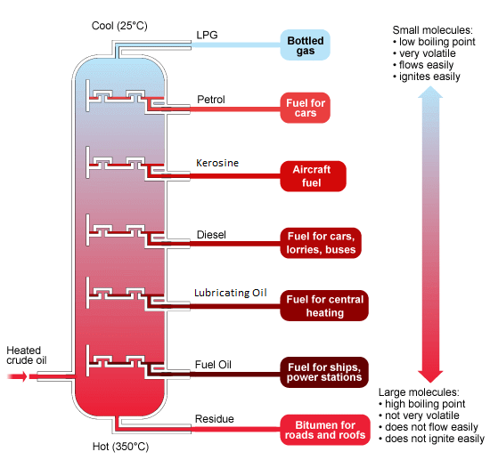
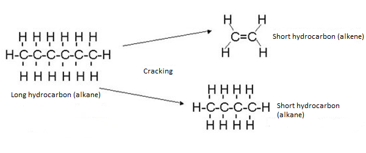

> **b) Crude oil**\
> **5.6 understand that crude oil is a mixture of hydrocarbons**\
> Crude oil is a mixture of hydrocarbons -- compounds containing carbon
> and hydrogen only. If any fraction from crude oil is burned, then
> carbon dioxide and water is produced -- this shows that crude oil is a
> complex mixture of hydrocarbons.
>
> E.g: A fraction petrol, if it is burnt, it produces carbon dioxide and
> water.
>
> *C5H12 + 8O2* _5CO2 + 6H2O_\
> If crude oil is separated by fractional distillation, various fraction
> are produced. All the fraction are mixture of different kinds of
> hydrocarbon.
>
> **5.7 describe and explain how the industrial process of fractional
> distillation separates crude oil into fractions**

+-----------------------------------+-----------------------------------+
| {width="0.4263888888888889in" | |
| height="0.42777668416447945in"} | |
+===================================+===================================+
+-----------------------------------+-----------------------------------+

+-----------------------------------+-----------------------------------+
| IGCSE Chemistry Note | > 94 |
+===================================+===================================+
+-----------------------------------+-----------------------------------+

> The process of refining involves separating the hydrocarbons into
> fractions or batches using a technique called fractional distillation.
> Each fraction separates as they have different boiling points. The
> crude oil is heated in a furnace to around 400°C.

{width="5.729166666666667in"
height="5.477777777777778in"}

> 1.In the furnace at the bottom of the fractionating column, petroleum
> is heated into vapour.
>
> 2.The vapour is pumped into huge fractionating column. The column is
> cool at the top but hot at the bottom. 3.Hot vapour rises up the
> column and begins to cool down. The smaller hydrocarbons are collected
> at the top of the fractionating column as gases. The bigger
> hydrocarbons are collected at the lower sections of the fractionating
> column.
>
> **5.8 recall the names and uses of the main fractions obtained from
> crude oil: refinery gases, gasoline, kerosene, diesel, fuel oil and
> bitumen**\
> **Refinery gases**: Refinery gases are a mixture of methane, ethane,
> propane and butane, which can be separated into individual gases if
> required. These gases are commonly used as LPG (liquefied petroleum
> gas) for domestic heating and cooking.
>
> **Gasoline (petrol)**: As with all other fractions, petrol is a
> mixture of hydrocarbons with similar boiling points. It is used in
> cars engine mainly.

+-----------------------------------+-----------------------------------+
| {width="0.4263888888888889in" | |
| height="0.42777668416447945in"} | |
+===================================+===================================+
+-----------------------------------+-----------------------------------+

+-----------------------------------+-----------------------------------+
| 95 | > IGCSE Chemistry Note |
+===================================+===================================+
+-----------------------------------+-----------------------------------+

> **Naptha:** It is used as raw material in petrochemical industries.
>
> **Kerosine:**Kerosine is used as fuel for jet aircraft, as domestic
> heating oil and as 'paraffin' for small heaters and lamps. **Diesel
> oil (gas oil)**:This is used for buses, Iorries, some cars, and
> railway engines where the line hasn't been electrified. Some is also
> cracked to make other organic chemicals and produced more petrol.
>
> **Lubricating oil:** It is used as oil for car engines and other
> machines.
>
> **Fuel oil**: This is used for ships' boilers and for industrial
> heating.
>
> **Paraffin wax:** Used to make candles, polish, wax paper, water
> proofing and grease.
>
> **Bitumen**: Bitumen is a thick black material, which is melted and
> mixed with rock chippings to make the top surfaces of roads.
>
> **5.9 describe the trend in boiling point and viscosity of the main
> fractions**\
> **Viscosity:** Viscosity refers to the less ease of flow of a liquid.
> If the number of carbon increases, the attraction between the
> hydrocarbon molecules also increases which results the liquid become
> more viscous with the increasing length of the chain of hydrocarbon.
> The liquid flow less easily with the increasing molecular mass. That
> means the hydrocarbons become more viscous.
>
> **Melting point/ Boiling point:** As the molecules get larger, the
> intermolecular attraction becomes greater. So more heat is needed to
> separate the molecules which results increasing the molecular size,
> increases the boiling point.
>
> **Volatility:** Volatility means the state of changing physical state.
> With the increasing molecular size, the hydrocarbon liquids become
> less volatile. As the attraction between the molecules increases with
> the increasing molecular size.
>
> **Flambility:** The small hydrocarbons burn easily. So, the bigger the
> size, the less flammable the hydrocarbons are.
>
> **Summary:**\
> As the molecules get bigger, the following changes occur:

+-----------------------------------+-----------------------------------+
| > •\ | > boiling point increases\ |
| > •\ | > The liquids become less |
| > •\ | > volatile. |
| > • | > |
| | > The liquid flow less easily |
| | > (they become more viscous) they |
| | > burn less easily |
+===================================+===================================+
+-----------------------------------+-----------------------------------+

> **5.10 understand that incomplete combustion of fuels may produce
> carbon monoxide and explain that carbon monoxide is poisonous because
> it reduces the capacity of the blood to carry oxygen**\
> If there isn't enough air (or oxygen), you get incomplete combustion.
> This leads to the formation of carbon or carbon monoxide instead of
> carbon dioxide.
>
> 2CH4 (g) + 3O2(g)  2CO(g) + 4H2O(l)\
> Carbon monoxide is colourless, odourless and is very poisonous. Carbon
> monoxide is poisonous because it combines with hemoglobin, preventing
> it from carrying oxygen. People can be made ill or even die, because
> of lack of oxygen in

+-----------------------------------+-----------------------------------+
| {width="0.4263888888888889in" | |
| height="0.42777668416447945in"} | |
+===================================+===================================+
+-----------------------------------+-----------------------------------+

+-----------------------------------+-----------------------------------+
| IGCSE Chemistry Note | > 96 |
+===================================+===================================+
+-----------------------------------+-----------------------------------+

> your body.
>
> **5.11 understand that, in car engines, the temperature reached is
> high enough to allow nitrogen and oxygen from air to react, forming
> nitrogen oxides**\
> In car engines there is a high enough temperature to cause a reaction
> between oxygen and nitrogen in the air.
>
> N2(g) + O2(g)  NO(g)\
> **5.12 understand that nitrogen oxides and sulfur dioxide are
> pollutant gases which contribute to acid rain, and describe the
> problems caused by acid rain**\
> Acid rain is formed when acidic air pollutants such as sulphur dioxide
> and nitrogen dissolve in rainwater. Sulphur dioxide dissolves in water
> to form sulphurous acid (H2SO3).
>
> SO2(g) + H2O(l)  H2SO3(aq)
>
> In the presence of oxygen in the air, the acid is slowly oxidized to
> sulphuric acid (H2SO4).
>
> Oxides of nitrogen also contribute to acid rain. In the presence of
> oxygen and water, nitrogen dioxide is converted to nitric acid.
>
> 4NO2(g) + 2H2O(l) + O2(g)  4HNO3(aq)
>
> Carbon dioxide in the air dissolves in rainwater to form carbonic
> acid, which is a weak acid. CO2(g) + H2O(l)  H2CO3(aq)
>
> The pH value of normal rain is slightly below 7. The pH value of acid
> rain is approximately 3.4.
>
> **_Problems of acid rain:_**\
> • Acid rain reacts with metals and with carbonates in marble and
> limestone. When this happens, metal bridges and stone buildings are
> damaged.
>
> • Acid rain can reduce the pH value of natural water bodies from 6.5
> and 8.5 to below 4. This will kill fish and other aquatic life.
>
> • Acid rain also leaches important nutrients from the soil and
> destroys plants. Without these nutrients, plant growth is stunted. In
> some cases, acid rain dissolves aluminium hydroxide in the soil to
> produce aluminium ions, which are toxic to plants.
>
> **5.13 understand that fractional distillation of crude oil produces
> more long-chain hydrocarbons than can be used directly and fewer
> short-chain hydrocarbons than required and explain why this makes
> cracking necessary**\
> The amounts of each fraction you get will depend on the proportions of
> the various hydrocarbons in the original crude oil, not in the amount
> in which they are needed.
>
> If 100 ml of crude oil is distilled:

+-----------------------------------+-----------------------------------+
| {width="0.4263888888888889in" | |
| height="0.42777668416447945in"} | |
+===================================+===================================+
+-----------------------------------+-----------------------------------+

{width="3.559721128608924in"
height="1.929847987751531in"}

+-----------------+-----------------+-----------------+-----------------+
| ------------ | > IGCSE | Gas | > Petrol |
| 97 | > Chemistry | | |
| ------------ | > Note | | |
| | | | |
| ------------ | | | |
+=================+=================+=================+=================+
+-----------------+-----------------+-----------------+-----------------+

> Naptha\
> Bitumen

Kerosine

Fuel oil

> Long chain hydrocarbons which can't be used directly aren't very
> useful. With increasing chain length, the hydrocarbons become less
> flammable, more viscous and therefore less useful.
>
> Short chain hydrocarbons burn well and flow well. Therefore, they are
> useful but these are produced less in the fractional distillation of
> crude oil. Thus chemists convert these large, less useful, heavy
> fractions into smaller, more useful ones by means of cracking. There
> are other necessities of cracking too.
>
> • Cracking is used to produce petrol.
>
> Cracking is used to produce alkenes which are raw material in plastic
> industry. •\
> • Cracking is used to produce hydrogen gas which is a raw material in
> manufacture of ammonia in Haber process. **5.14 describe how
> long-chain alkanes are converted to alkenes and shorter-chain alkanes
> by catalytic cracking, using silica or alumina as the catalyst and a
> temperature in the range of 600--700oC.**

{width="6.249998906386701in"
height="2.625in"}

> Cracking is simply splitting of larger molecules to simpler ones. The
> molecules are broken up in an random way which produce a mixture of
> alkanes and alkenes.
>
> The gas oil fraction is heated to give a gas and then passed over a
> catalyst of mixed silicon dioxide and aluminium oxide at about 600 --
> 700oC. Cracking can also be carried out at higher temperature without
> a catalyst.

+-----------------------------------+-----------------------------------+
| {width="0.4263888888888889in" | |
| height="0.42777668416447945in"} | |
+===================================+===================================+
+-----------------------------------+-----------------------------------+

+-----------------------------------+-----------------------------------+
| IGCSE Chemistry Note | > 98 |
+===================================+===================================+
+-----------------------------------+-----------------------------------+
