> **c) Synthetic polymers**\
> **5.15 understand that an addition polymer is formed by joining up
> many small molecules called monomers Monomer**: Monomers are small
> units which are joined to form polymer.
>
> **Polymer**: When repeating monomers are joined together by
> polymerisation, them form a macromolecule called polymer.
>
> There are two types of polymers:\
> i. Natural Polymers.
>
> e.g.: starch, carbohydrate, fat, protein etc.
>
> ii\. Synthetic polymers (Man-made polymers).
>
> e.g.: polythene, polypropene, polychloroethene (PVC), polystyrene,
> nylon, terylene.
>
> **Polymerisation:** The process of joining together a large number of
> small molecules (monomers) to from a macromolecule/polymer is called
> polymerisation.
>
> There are two basic types of reactions for forming polymers:\
> Addition polymerisation (polythene, polypropene, polychloroethene
> (PVC), polystyrene, nylon) i.
>
> ii\. Condensation polymerisation (nylon, terylene)\
> **Addition polymerisation** occurs when unsaturated monomer units join
> together without losing any molecules or atoms.
>
> **Condensations polymerisation** occurs when two monomer join together
> alternately. And each time two monomers combine, a small molecule is
> lost. This is known as a condensation reaction.
>
> **Polymerisation of Ethene to form Poly (ethene)**\
> At high temperature, pressure, and in the presence of a catalyst, the
> carbon-carbon bonds of the alkene molecules (monomers) break. Each
> monomer forms single bonds with two other monomers. Eventually, they
> join to form a giant molecule.

This is what happens during the addition polymerisation of ethene.

> 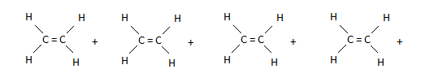{width="5.395833333333333in"
> height="1.0527766841644794in"}

1\. One bond in each double bond breaks.

> 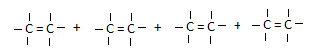{width="3.3652777777777776in"
> height="0.5736111111111111in"}

+-----------------------------------+-----------------------------------+
| {width="0.4263888888888889in" | |
| height="0.42777668416447945in"} | |
+===================================+===================================+
+-----------------------------------+-----------------------------------+

+-----------------------------------+-----------------------------------+
| 99 | > IGCSE Chemistry Note |
+===================================+===================================+
+-----------------------------------+-----------------------------------+

2\. Each monomer forms single bonds with two other monomers.

> 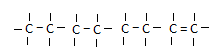{width="2.323611111111111in"
> height="0.5722211286089239in"}

3\. Poly (ethene) is formed.

> The equation of the polymerisation of ethene is therefore written as
>
> 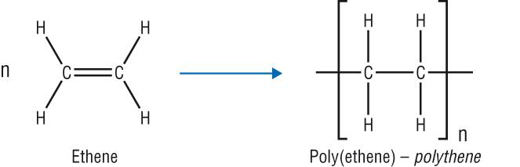{width="4.020833333333333in"
> height="1.136111111111111in"}
>
> **5.16 draw the repeat unit of addition polymers, including
> poly(ethene), poly(propene) and**
>
> **poly(chloroethene)**
>
> 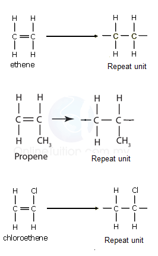{width="2.7708333333333335in"
> height="4.479166666666667in"}
>
> **5.17 deduce the structure of a monomer from the repeat unit of an
> addition polymer**

In the previous unit, we learnt how to draw a polymer given its monomer.
How can we do the reverse? Lets examine this

> using PVA (polyvinyl acetate) as an example. PVA is used as the main
> constituent in emulsion paints. It has the formula.

+-----------------------------------+-----------------------------------+
| {width="0.4263888888888889in" | |
| height="0.42777668416447945in"} | |
+===================================+===================================+
+-----------------------------------+-----------------------------------+

---

IGCSE Chemistry Note 100

---

---

> 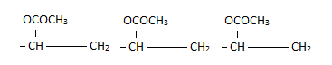{width="3.823611111111111in"
> height="0.75in"}
>
> To deduce the structural formula of its monomer, we follow the steps
> below.
>
> 1\. Identify the repeat unit in the polymer.
>
> 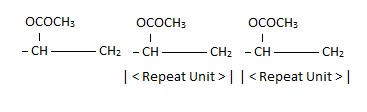{width="3.823611111111111in"
> height="1.1666666666666667in"}
>
> 2\. Write down the formula of the repeat unit.
>
> 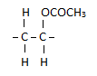{width="1.1152777777777778in"
> height="0.875in"}
>
> 3\. Convert the carbon-carbon single bond into a carbon-carbon double
> bond. The structural formula of the monomer, vinyl acetate, is

+-----------------------------------+-----------------------------------+
| > {width="1.1152777777777778in" | |
| > height="0.875in"} | |
+===================================+===================================+
+-----------------------------------+-----------------------------------+

> **5.18 describe some uses for polymers, including poly (ethene),
> poly(propene) and poly(chloroethene) Poly (ethene):**\
> Poly (ethene) comes in two types -- low-density poly (ethene) (LDPE)
> and high-density poly (ethene) (HDPE). Low-density poly (ethene) is
> mainly used as a thin film to make polythene bags. It is very flexible
> and not very strong.
>
> High-density poly (ethene) is used where rather greater strength and
> rigidity is needed -- for example, to make plastic bottles such as
> milk bottles.
>
> **Poly (propene):**Poly(propene) is somewhat stronger than
> poly(ethene). It is used to make ropes and crates (among many other
> things).
>
> **Poly (chloroethene):** It is quite strong and rigid and so can be
> used for drainpipes, or replacement windows. It can also be made
> flexible by adding 'plasticisers'. That makes it useful for sheet
> floor coverings, and even clothing. These polymers don't conduct
> electricity and PVC is used for electrical insulation.
>
> **5.19 explain that addition polymers are hard to dispose of as their
> inertness means that they do not easily biodegrade**

+-----------------------------------+-----------------------------------+
| {width="0.4263888888888889in" | |
| height="0.42777668416447945in"} | |
+===================================+===================================+
+-----------------------------------+-----------------------------------+

+-----------------------------------+-----------------------------------+
| 101 | > IGCSE Chemistry Note |
+===================================+===================================+
+-----------------------------------+-----------------------------------+

> Addition polymers are unreactive. So they don't easily biodegrade.
>
> **5.20 understand that some polymers, such as nylon, form by a
> different process called condensation polymerisation**\
> Some polymers are made by reacting two different types of monomers.
> Each of the monomers involved has a functional group at each end of
> the molecule. When these monomers react, a polymer is produced, and a
> small molecule such as water is also produced as a by-product of the
> reaction. This type of reaction is called condensation polymerisation.
>
> [Nylon -- A Synthetic Polymide]{.underline}
>
> Nylon was the first synthetic fibre made by condensation
> polymerisation. It is made from the monomers dicarboxylic acid and
> diamine. We can represent these two monomers units as follows:

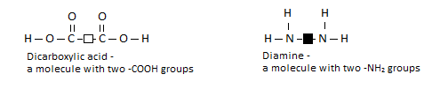{width="5.0625in"
height="1.051388888888889in"}

> This is how the two monomers react:
>
> 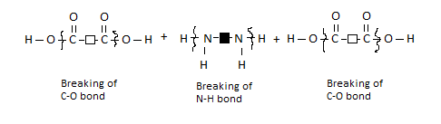{width="5.0625in"
> height="1.4263877952755906in"}
>
> 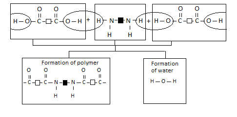{width="5.0625in"
> height="2.509721128608924in"}
>
> The reaction between a dicarboxylic acid and a diamine can be
> represented by the equation shown below.

+-----------------------------------+-----------------------------------+
| {width="0.4263888888888889in" | |
| height="0.42777668416447945in"} | |
+===================================+===================================+
+-----------------------------------+-----------------------------------+

---

IGCSE Chemistry Note 102

---

---

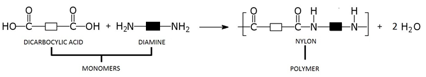{width="7.5in"
height="1.3541666666666667in"}

> Notice the following:\
> 1.Each monomer for making nylon has two identical functional groups.
> The chain can be extended in two directions by the removal of water
> molecules.
>
> 2.A whole family of nylons can be formed using different dicarboxylic
> acid and diamine monomers. The reactive group in nylon is shown below.
>
> 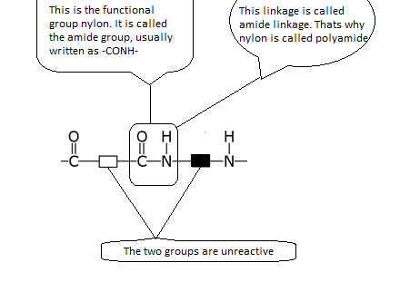{width="4.698611111111111in"
> height="3.2402766841644794in"}
>
> [Terylene -- A Synthetic Polyester]{.underline}\
> Terylene is another example of a condensation polymer. It is included
> in a polyester group.
>
> The monomers are:

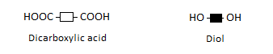{width="3.5208333333333335in"
height="0.6972211286089239in"}

> These monomers react to form Terylene and water:

+-----------------------------------+-----------------------------------+
| {width="0.4263888888888889in" | |
| height="0.42777668416447945in"} | |
+===================================+===================================+
+-----------------------------------+-----------------------------------+

+-----------------------------------+-----------------------------------+
| 103 | > IGCSE Chemistry Note |
+===================================+===================================+
+-----------------------------------+-----------------------------------+

> {width="5.104166666666667in"
> height="2.2291666666666665in"}
>
> The reactive group or functional group in Terylene is shown below.
>
> 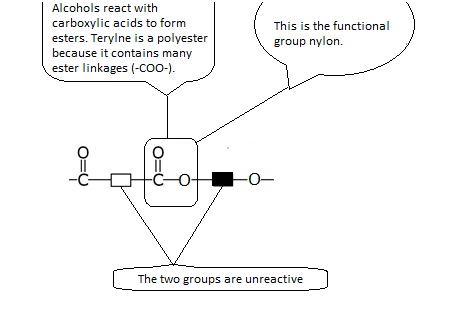{width="4.740277777777778in"
> height="3.2805555555555554in"}
>
> **5.21 understand that condensation polymerisation produces a small
> molecule, such as water, as well as the polymer.**

_(Follow 5.20)_

> **\# Difference between condensation and addition polymerisation**

+-----------------------------------+-----------------------------------+
| **Addition** | **Condensation** |
+===================================+===================================+
| > Unsaturated monomers are used | > Each monomer have two |
| > to produce a polymer. | > functional group. |
+-----------------------------------+-----------------------------------+
| > Elimination of water doesn't | > Elimination of water takes |
| > take place. | > place. |
+-----------------------------------+-----------------------------------+
| > Unsaturated monomers become | > The monomers join among them by |
| > saturated. | > a linkage. |
+-----------------------------------+-----------------------------------+
| > Addition polymerisation is a | > Condensation polymerisation is |
| > fast process. | > comparatively a slower process. |
+-----------------------------------+-----------------------------------+
| > Examples: polythene, | > Examples: nylon, polyester. |
| > poly(propene), polystyrene | |
+-----------------------------------+-----------------------------------+

+-----------------------------------+-----------------------------------+
| {width="0.4263888888888889in" | |
| height="0.42777668416447945in"} | |
+===================================+===================================+
+-----------------------------------+-----------------------------------+

---

IGCSE Chemistry Note 104

---

---
