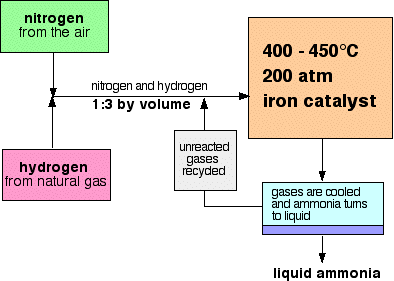
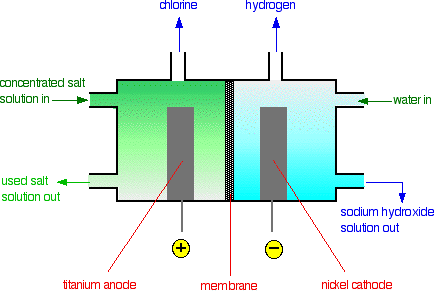

> **d) The industrial manufacture of chemicals**
>
> **5.22 understand that nitrogen from air, and hydrogen from natural
> gas or the cracking of hydrocarbons, are used in the manufacture of
> ammonia**\
> Ammonia (NH3) is manufactured by using nitrogen from air and hydrogen
> from natural gas.
>
> N2(g) + H2(g)  NH3 (g)
>
> **5.23 describe the manufacture of ammonia by the Haber process,
> including the essential conditions:** **i.** **a temperature of about
> 450°C**\
> **ii.** **a pressure of about 200 atmospheres**\
> **iii.** **an iron catalyst**
>
> Ammonia is manufactured by combining nitrogen and hydrogen in an
> important industrial process called the Haber process.
>
> **_The Haber process:_**\
> • Raw materials: nitrogen (from the air)\
> hydrogen (made from natural gas)

+-----------------------------------+-----------------------------------+
| > •\ | > The proportions: 1 volume of |
| > •\ | > nitrogen to 3 volumes of |
| > •\ | > hydrogen The temperature: 450oC |
| > • | > |
| | > The pressure: 200 atmospheres |
| | > |
| | > The catalyst: iron |
+===================================+===================================+
+-----------------------------------+-----------------------------------+

> The raw materials for the process are hydrogen and nitrogen. Hydrogen
> is produced industrially from cracking oil, and nitrogen from
> liquefaction of the air. The two gases are combined directly in a
> ratio of 3:1, and are passed over an iron catalyst at 450oC and 200
> atmospheres.

_nitrogen + hydrogen_ ⇌ _symbol ammonia_

_N2(g) + 3H2(g)_ ⇌ _symbol 2NH3(g)_

> As shown in the equation, the reaction is reversible with the forward
> reaction producing ammonia and the back reaction decomposing ammonia
> back into hydrogen and nitrogen gases. In order to favour the forward
> reaction, to produce more ammonia, high pressures are needed, as this
> will help to convert four volumes of hydrogen and nitrogen into two
> volumes of ammonia. The temperature of 450oC is a compromise, because
> the reaction is also exothermic. This means it gives out heat and
> prefers a low temperature, but if the temperature drops too low, the
> rate becomes too slow. A moderate temperature of 450oC is therefore
> used.
>
> The catalyst in the Haber Process is the transition metal iron, with
> promoters of iron oxide. This speeds up both the forward and backward
> reactions, so the point of equilibrium between the two reactions is
> reached more quickly. When the ammonia has been produced, it is
> liquefied 'out', by reducing the temperature to -34oC, and the
> unconverted nitrogen and hydrogen gases are recycled to avoid wastage.
>
> **5.24 understand how the cooling of the reaction mixture liquefies
> the ammonia produced and allows the unused hydrogen and nitrogen to be
> recirculated**\
> The products from the reactant are sent through a cooling mechanism,
> this is at a temperature that condenses ammonia, but not hydrogen and
> nitrogen. Liquid ammonia is then collected but hydrogen and nitrogen
> float right back

+-----------------------------------+-----------------------------------+
| {width="0.4263888888888889in" | |
| height="0.42777668416447945in"} | |
+===================================+===================================+
+-----------------------------------+-----------------------------------+

+-----------------------------------+-----------------------------------+
| 105 | > IGCSE Chemistry Note |
+===================================+===================================+
+-----------------------------------+-----------------------------------+

> into the reactor.

{width="4.104166666666667in"
height="2.926388888888889in"}

> Only 50% ammonia is produced in the converter. The reaction mixture is
> cooled, the ammonia condenses as liquid and as ammonia has lower
> boiling point than nitrogen and hydrogen which will be tapped off and
> will be collected in a storage tank.
>
> **5.25 describe the use of ammonia in the manufacture of nitric acid
> and fertilisers**
>
> **_Manufacture of Nitric acid:_**\
> Industrially, nitric acid is made by the catalytic oxidation of
> ammonia over heated platinum. Oxidising ammonia produces oxides of
> nitrogen which can then be dissolved in water to produce nitric acid.
>
> Initially nitrogen(II) oxide will be formed from the catalytic
> oxidation of ammonia using the transition metal platinum at a
> temperature of 800oC to 1000oC.
>
> _4NH3 (g) + 5O2 (g)_ *4NO(g) + 6H2O (g)*
>
> The nitrogen(II) oxide is rapidly cooled before combining with oxygen
> (from excess air) to form nitrogen(IV) oxide. _2NO(g) + O2(g)_ ⇌ _2NO2
> (g)_
>
> The nitrogen(IV) oxide is now allowed to react with water to form
> nitric acid. _4NO2 (g) + O2 (g) + 2H2O (l)_  _4HNO3 (aq)_
>
> Most of the nitric acid made is used to make the all-important
> fertilisers such as ammonium nitrate.
>
> **_Manufacture of Fertilizers:_**\
> The main use of ammonia is in the manufacture of fertilizers.
> Approximately 75% of all ammonia produced is converted into various
> ammonium compounds like ammonia sulphate ((NH4)2SO4), ammonium nitrate
> (NH4NO3) and urea (NH2CONH2). These compounds are called nitrogenous
> fertilizers. They are solids for ease in handling and water soluble so
> that they seep into the soil to be absorbed by the roots of the plant.
>
> _NH3 (aq) + HNO3 (aq)_  _NH4NO3 (aq)_

+-----------------------------------+-----------------------------------+
| {width="0.4263888888888889in" | |
| height="0.42777668416447945in"} | |
+===================================+===================================+
+-----------------------------------+-----------------------------------+

---

IGCSE Chemistry Note 106

---

---

> _2NH3 (aq) + H2SO4 (aq)_ ((NH4)2SO4) (aq)
>
> **5.26 recall the raw materials used in the manufacture of sulfuric
> acid**
>
> • Sulphur (sulphur is found in rocks and some natural gasses)
>
> • Oxygen from the air.
>
> **5.27 describe the manufacture of sulfuric acid by the contact
> process, including the essential conditions:**
>
> • **a temperature of about 450°C**
>
> • **a pressure of about 2 atmospheres**
>
> • **a vanadium(V) oxide catalyst**
>
> **I) First Sulphur dioxide is produce:**
>
> The raw materials are sulphur and air(oxygen). To produce sulphur
> dioxide, **either** burn sulfur in air:

_S(s) + O2(g)_  _SO2(g)_

> **Or** heat sulphide ores strongly in air:

_4FeS2(s) + 11O2(g)_  _2Fe2O3(s) +8SO2(g)_

> **II) Purification of Sulphur dioxide**
>
> The sulphur dioxide is then purified, by removing impurities like
> arsenic compounds which would otherwise poison the
>
> catalyst. It is then passed through an electrostatic dust
> precipitator, which, as its name implies, charges dust particles
>
> which are then removed by being attracted to oppositely charged
> plates.
>
> **III) Sulphur trioxide is produced:**
>
> Sulphur dioxide and air are then washed, dried and passed over a
> vanadium(V) oxide catalyst at 450oC and 2-3
>
> atmospheres. The reaction is reversible but at these temperature and
> pressures, 98% conversion to sulphur trioxide is
>
> achieved:

_2SO2(g) + O2(g)_ ⇌ _2SO3(g)_

> Because of the forward reaction is exothermic, there would be a higher
> percentage conversion of sulfur dioxide into
>
> sulfur trioxide at a low temperature. However, at a low temperature
> the rate of reaction would be very slow. 450oC is a
>
> compromise.

There are 3 gas molecules on the left-hand side of the equation, but
only 2 on the right. Reactions in which the numbers

> of gas molecules decrease are favored by high pressures. In this case,
> though, the conversion is good at low pressures
>
> that it isn't economically worthwhile to use higher ones.
>
> The catalyst, vanadium(V) oxide, has no effect on the percentage
> conversion, but helps to speed up the reaction.
>
> Without the catalyst, the reaction would be extremely slow.
>
> **IV) Making the sulphuric acid**

In principal you can react sulfur trioxide with water to make sulphuric
acid. In practice, this produce an uncontrolled fog

> of concentrated sulfuric acid. Instead the sulfur trioxide is absorbed
> in concentrated sulfuric acid to give fuming sulfuric

+-----------------------------------+-----------------------------------+
| {width="0.4263888888888889in" | |
| height="0.42777668416447945in"} | |
+===================================+===================================+
+-----------------------------------+-----------------------------------+

+-----------------------------------+-----------------------------------+
| 107 | > IGCSE Chemistry Note |
+===================================+===================================+
+-----------------------------------+-----------------------------------+

> acid (oleum).

_H2SO4(l) + SO3(g)_  _H2S2O7(l)_

> This is converted into twice as much concentrated sulfuric acid by
> careful addition of water.
>
> H2S2O7(l) + H2O(l)  2H2SO4(l)
>
> **5.28 describe the use of sulfuric acid in the manufacture of
> detergents, fertilisers and paints**\
> i. The production of fertilizers such as ammonium sulphate, potassium
> sulphate, calcium superphosphate, etc.
>
> Ammonia sulphate can be prepared by reacting ammonia and sulphuric
> acid. _NH3 (g) + H2SO4 (l)_  _(NH4)2SO2_
>
> Sulphur phosphate is the main source of phosphorus in agriculture. To
> make super phosphate, calcium phosphate is treated with concentrated
> sulphuric acid, a product containing two calcium sulphate is form.
>
> _Ca3(PO4)2 (s) + 2H2SO4 (aq) + 4H2O (l)_  _Super Phosphate
> \[Ca(H2PO4)2 (s) + 2CaSO4.2H2O\]_
>
> ii\. The manufacture of non-soapy detergents: modern detergents are
> organic compounds 'sulphonated' with concentrated sulphuric acid.
>
> In the manufacture of detergent, hydrocarbons are treated with
> concentrated sulphuric acid to form an organic acid. The organic acid
> is then neutralized with sodium hydroxide solution to produce a
> detergent.
>
> _Hydrocarbon + Concentrated sulphuric acid_  _Organic acid_\
> _Organic acid + Sodium hydroxide solution_  _Detergent_
>
> iii\. In paint manufacture, sulfuric acid is used in extracting the
> white pigment titanium dioxide, TiO2, from titanium ores.
>
> iv\. The making of artificial silks like rayon: here, the fine threads
> in the alkaline cellulose solution are neutralized by passing them
> through a bath of sulphuric acid.
>
> v\. The cleaning of metals by removing the surface oxide coating: this
> is called pickling and is important in preparing articles for
> electroplating.
>
> vi\. It's used as an electrolyte inside batteries for cars: most car
> batteries are made up of lead plates in a sulphuric acid electrolyte;
> occasionally, the electrolyte needs to be 'topped up' with distilled
> water; this is because small amounts of hydrogen and oxygen gases are
> given off by the chemical changes inside the battery, and therefore
> the sulphuric acid loses water and becomes too concentrated.
>
> **5.29 describe the manufacture of sodium hydroxide and chlorine by
> the electrolysis of concentrated sodium chloride solution (brine) in a
> diaphragm cell**\
> The concentrated salt solution can be electrolysed to produce three
> useful chemicals -- sodium hydroxide, chlorine and hydrogen. The
> electrolysis can be carried out in a diaphragm cell.

+-----------------------------------+-----------------------------------+
| {width="0.4263888888888889in" | |
| height="0.42777668416447945in"} | |
+===================================+===================================+
+-----------------------------------+-----------------------------------+

---

IGCSE Chemistry Note 108

---

---

{width="4.5625in"
height="3.0527777777777776in"}

> At the titanium anode, chloride ions are discharged to produce
> chlorine gas. 2Cl-(aq) Cl2(g) + 2e-
>
> At the steel cathode, it is too difficult sodium ions, so hydrogen
> ions from the water are discharged instead to produce hydrogen gas.
>
> 2H+(aq) + 2e- H2(g)
>
> More and more water keeps splitting up to replace the hydrogen ions as
> soon as they discharged. Each time a water molecule splits up it
> produces a hydroxide ion as well. That means that there will be a
> build-up of sodium ions and hydroxide ions in the right-hand
> compartment-sodium hydroxide solution is formed. This is contaminated
> with uncharged sodium chloride.
>
> The sodium hydroxide solution is concentrated by evaporating it.
> During this process, most of the sodium chloride crystallizes out as
> solid salt. This can be separated, redissolved in water and recycled
> back through the cell again.
>
> **_FAQ_**\
> _What happens if chlorine comes into contact with sodium hydroxide or
> hydrogen?_
>
> The cell is designed to keep the products apart. If chlorine comes
> into contact with sodium hydroxide solution, it reacts to make bleach
> -- a mixture of sodium chloride and sodium chlorate(I) solution. If
> chlorine comes into contact with hydrogen it produces a mixture which
> would explode violently on exposure to sunlight or heat to give
> hydrogen chloride.
>
> _Why is it important that the liquid level in the left hand
> compartment of a diagram cell is higher than that in the right hand
> side?_
>
> This is to make sure that the flow of liquid is always from left to
> right, preventing any of the sodium hydroxide solution formed finding
> its way back to where chlorine formed.
>
> **5.30 write ionic half-equations for the reactions at the electrodes
> in the diaphragm cell** _(Follow 5.29)_

+-----------------------------------+-----------------------------------+
| {width="0.4263888888888889in" | |
| height="0.42777668416447945in"} | |
+===================================+===================================+
+-----------------------------------+-----------------------------------+

+-----------------------------------+-----------------------------------+
| 109 | > IGCSE Chemistry Note |
+===================================+===================================+
+-----------------------------------+-----------------------------------+

> **5.31 describe important uses of sodium hydroxide, including the
> manufacture of bleach, paper and soap;**
>
> **and of chlorine, including sterilising water supplies and in the
> manufacture of bleach and hydrochloric**
>
> **acid.**
>
> Uses of sodium hydroxide include:
>
> • The purification of bauxite to make aluminium oxide ('alumina') as a
> part of the manufacture of aluminium.
>
> • Paper making -- the sodium hydroxide helps break the wood down into
> pulp.
>
> • Soap making -- sodium hydroxide reacts with animal and vegetable
> fats and oils to make compounds, such as
>
> sodium stearate, that are present in soap.
>
> • Making bleach -- bleach is formed when sodium hydroxide and chlorine
> react together in the cold; it is a mixture
>
> of sodium chloride and sodium chlorate(I) solution.
>
> 2NaOH(aq) + Cl2(g) NaCl(aq) + NaOCl(aq) + H2O(l)
>
> Uses of chlorine include:

+-----------------------+-----------------------+-----------------------+
| • | | > Sterilising water |
| | | > to make it safe to |
| | | > drink |
+=======================+=======================+=======================+
| • | | > Making hydrochloric |
| | | > acid (by controlled |
| | | > reaction with |
| | | > hydrogen) |
+-----------------------+-----------------------+-----------------------+
| • | | > Making bleach, |
| | | > weedkillers, |
| | | > pesticides |
+-----------------------+-----------------------+-----------------------+
| • | | > Making PVC (nearly |
| | | > 1/3 of it is used |
| | | > for this) |
+-----------------------+-----------------------+-----------------------+
| • | | > Making solvents |
| | | > with |
| | | > perchlroethylene |
| | | > for degreasing and |
| | | > dry-cleaning |
+-----------------------+-----------------------+-----------------------+
| • | | > Making paints and |
| | | > dye stuffs |
+-----------------------+-----------------------+-----------------------+
| • | | > Making |
| | | > pharmaceuticals |
+-----------------------+-----------------------+-----------------------+
| • | | > Making titanium |
| | | > dioxide, a white |
| | | > pigment used in |
| | | > paints, ceramics, |
| | | > cosmetics and |
| | | > paper. |
+-----------------------+-----------------------+-----------------------+
| • | | > Killing bacteria in |
| | | > swimming pools |
+-----------------------+-----------------------+-----------------------+
| {width=" | | |
| 0.4263888888888889in" | | |
| height="0. | | |
| 42777668416447945in"} | | |
+-----------------------+-----------------------+-----------------------+
