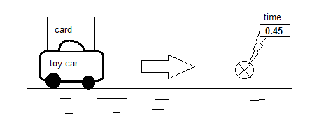
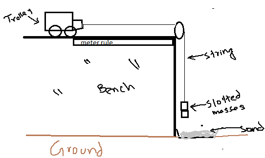
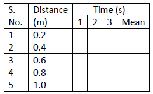
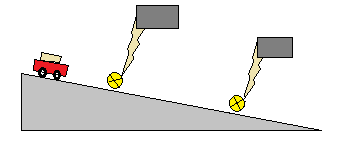
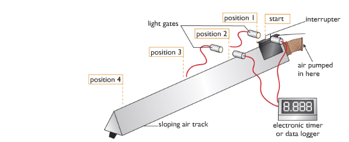
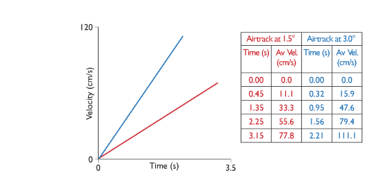
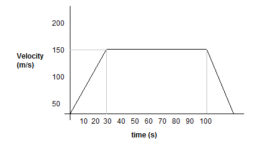

# (b) Movement and Position

## **1.2 plot and interpret distance-time graphs**

**Distance =** The change of position of an object is called distance. The diagram shows an example:


Figure 1 shows an object changes its position from A to B. So the distance travelled by the object is AB.

**Displacement =** The change of position of an object in a particular direction is called displacement.


Figure 2 shows another object changes its position from C to D through curved path but the displacement will be straight distance from C to D.


**Distance-time graph**

A distance-time graph represents the speed or velocity of any object. In this graph the object is moving at 1 m per second. It is in a constant speed. In a distance-time graph, distance should go to the Y-axis while time should go over the X-axis.

> Speed = gradient = distance/time = 3m/3s = 1m/s

Few points that should be noted:

1. In a displacement – time graph or distance- time graph, the average velocity is found by the ratio △s△t where △s = change in displacement/distance and △t=time interval
2. A positive gradient of the displacement-time graph indicates that the car is moving in the same direction as the displacement.
3. A negative gradient of the displacement-time graph indicates that the car is moving in the opposite direction to the displacement.
4. A zero gradient of the displacement-time curve shows that the car is stationary.

Some explanation of motion from graph:

|                                                                                                              |                                                                                                                  |
| :----------------------------------------------------------------------------------------------------------- | :--------------------------------------------------------------------------------------------------------------- |
| <p>**Zero displacement** </p><p></p> | <p>**Constant displacement** </p><p></p> |
| <p>**Not moving**</p><p></p>         | <p>**Acceleration**</p><p></p>           |
| <p>**Deceleration**</p><p></p>       |                                                                                                                  |

## **1.3 know and use the relationship between average speed, distance moved and time:**

**average speed = distance moved /time taken**

Speed: Speed is defined as the rate of change of distance. In other words, speed is the distance moved per unit time. It tells us how fast or slow an object is moving.

Most objects or bodies do not move at constant speed. For example, the MRT train starts from rest at a station, moves faster and faster until it reaches a constant speed and then slows down to a stop at the next station. It is therefore more useful to define average speed rather than the actual speed.

Average speed: Average speed is the total distance moved divided by total time taken. If you see the graph in 1.2 it had an average speed of 1 m/s. This is the relation between speed and distance,time. Distance and time has no relation individually. They are both different types of values.

Instantaneous speed: The speed of an object at a particular moment is called instantaneous speed. It is measured by taking ratio of distance travelled by shortest possible time.

Difference between speed and velocity:

| **Speed**                                   | **Velocity**                                       |
| :------------------------------------------ | :------------------------------------------------- |
| i. The rate of distance travelled is speed. | i. The rate of displacement travelled is velocity. |
| ii. Speed can be in any direction.          | ii. Velocity is speed in particular direction.     |
| iii. Speed is a scalar quantity.            | <p>iii. Velocity is a vector quantity.</p><p></p>  |

## **1.4 describe experiments to investigate the motion of everyday objects such as toy cars or tennis balls**

::: details Experiment: Measuring speed using click and stopwatch

Suppose you want to find the speed of cars driving down your road. You may have seen the police using speed guns to check that drivers are keeping to the speed limit. Speed guns use microprocessors to produce an instant reading of the speed of a moving vehicle, but you can conduct a very simple experiment to measure car speed.

Measure the distance between two points along a straight section of road with a tape measure or “click” wheel. Use a stopwatch to measure the time taken for a car to travel the measured distance.

Use the speed, distance and time equation to work out the speed of the car.


:::

::: details Experiment: Measuring speed using light gate method



1. Attach a cart of measured length centrally to the top of the toy car.
2. Air track ensures a frictionless way for the toy car.
3. A gentle push can move the toy car at a steady speed.
4. Arrange for the card to block a light gates beam as it passes through it.
5. Electronic timer measures how long the card takes to pass through the beam.
6. Now calculate the toy car's average velocity as it passes the light gate by:

> v = length of the card / interuption time

:::

::: details Experiment: Measuring speed using ticker-time method

TODO

:::

::: details Experiment: Video (sequence) method – Measuring the velocity of a tennis ball.

A tennis ball is let to move on a track at a steady speed. During the ball moves, video the ball moving along in front of calibrated scale (a scale where there is marking in length) attached to the slope.

Play the video back to get the snap shots taken at a time. Measure how far the ball advances between snaps from the scale. The video camera can take 25 snaps each second. So the time between each snap is 0.04 second.

Now calculate the balls average velocity between snaps using the following equation:

> Velocity = distance moved between snaps ÷ 0.04
> :::

::: details Experiment: To find out Average Speed of Toy car or trolley

**Apparatus:** Toy car or tennis ball, meter rule, slotted masses, stopwatch, thread.



**Procedure:**

1. Put toy car on bench and attach pulley to the corner of the bench as shown in figure.
2. Attach one end of the thread with toy car and other end with slotted masses while hanging them over pulley.
3. Keep toy car & pulley one meter apart with meter rule.
4. Hold the toy with hand so that it remains there immovable.
5. Time stop watch when you let toy to move a meter distance.
6. Repeat this & record reading for different distances in the following chart.



7. Draw graph to find out average speed, which can be found by finding the gradient of the graph.

**Precautions:**

1. Do not hang heavier masses as this may break the thread.
2. Wear shoes as to avoid injury to foot in case of broken thread and fall of mass.
3. Put something soft under the hanging mass, like tray filled with sand.

**Sources of error:**

1. Reaction time
2. Ruler may not be straight
3. Parallax error
4. Friction in the bench.

**Ways to improve:**

1. Bench should be very polished friction.
2. Tyres of the toy should not be very rough.
3. Use light-gates instead of the stopwatch and connect light-gates to datalogger and then to computer, to get more accurate results.

:::

::: details Experiment: Measuring acceleration using light gate method



- A card is mounted on the top of a trolley. The length of the card is measured.
- One light is set at the top of the track and the second one is at the end of the track.
- The trolley is given a gentle push to move through the track.
- When the trolley passes through the first light gate the electronic timer measures the t<sub>1</sub> to cross the length of the card.
- So the velocity at the position of first light gate is measured by velocity.
  - <i>V<sub>1</sub> = length of the first card</i> ÷<i>t<sub>1</sub></i>
- During passing the second light gate, if the time measured by electronic timer is t2 then thevelocity can be measured by:
  - <i>V<sub>2</sub> = length of the second card</i> ÷<i>t<sub>2</sub></i>
- The time t<sub>3</sub> is measured for the trolley to travel from first light gate to the second light gate by using a stopwatch.
- Now acceleration is = <i>velocity difference</i>÷<i>t<sub>3</sub></i>

```
     (length of first card / t2) - (length of second card / t1)
  =  ----------------------------------------------------------
                                 t3
```

:::

::: details Experiment: Measuring acceleration using Video (sequence) method

TODO

:::

::: details Experiment: Measuring acceleration using Modern Version of Galileo’s experiment

Apparatus -

- Light gate
- Interrupter
- Air pumper
- Air track
- Data logger or electronic timer

Diagram –



Working Procedure - We can measure the acceleration by conducting an experiment using an air-track which can be referred as the modern-version of Galileo experiment.

From the diagram show the investigation where we can see that the air-track reduces friction because the glider rides on a cushion of air that is pumped continuously through holes along the air track. As the glider accelerates down the sloping track the white card mounted on it breaks a light beam, and the time the glider takes to pass is measured electronically. If the length of the card is measured, and this is entered into the spreadsheet, the velocity of the glider can be calculated by the spreadsheet programme using v = d/t.

Observation - Here from the above procedure it is observed that the distance travelled in equal intervals is increased and that the rate of increase of speed is steady or uniform i.e. it is uniform acceleration.

Table and Graph



Conclusion

The gradient of a velocity-time graph gives the acceleration

:::

::: details Experiment: Measuring acceleration using double light gate.


1. A card is mounted on the top of a trolley.
2. The length of the card is measured.
3. One light gate is at the top of the track and another light gate is at the end of the track.
4. The trolley is given a gentle push to move through the track.
5. When the trolley passes through the first light gate, the electronic timer measure the time (t<sub>1</sub>) to cross the length of the cord.
6. So the velocity at the position of first light gate is measured by:

   - velocity, v<sub>1</sub> = length of the cord / t<sub>2</sub>

7. The time, t<sub>3</sub> is measured for the trolley to travel from first light gate to 2<sup>nd</sup> light gate by using a stopwatch.
8. Now, acceleration = velocity difference / t<sub>3</sub>

```
     (length of card / t2) - (length of card / t1)
  =  -------------------------------------------
                      t3
```

:::

::: details Experiment: Measuring acceleration using ticker tape.

**Apparatus:** Ticker timer and tape, a.c. power supply, trolley, runway


**Procedure:**

1. Set up the apparatus as in the diagram.
2. Connect the ticker timer to a suitable low-voltage power supply.
3. Allow the trolley to roll down the runway.
4. The trolley is accelerating as the distance between the spots is increasing.
5. The time interval between two adjacent dots is 0.02 s, assuming the ticker timer mars fifty dots per second.
6. Mark out five adjacent spaces near the beginning of the tape. Measure the length s1.
7. The time t1 is 5 × 0.02 = 0.1 s.
8. We can assume that the trolley was travelling at constant velocity for a small time interval.

Thus initial velocity u = distance/time = s1/t1

1. Similarly mark out five adjacent spaces near the end of the tape and find the final velocity v.
2. Measure the distance s in metres from the centre point of u to the centre point of v.
3. The acceleration is found using the formula: v2 = u2 + 2as or a = v2 – u2 / 2t
4. By changing the tilt of the runway different values of acceleration are obtained. Repeat a number of times.
5. Tabulate results as shown.


:::

## **1.5 know and use the relationship between acceleration, velocity and time:**

Acceleration is the rate at which objects change their velocity. The rate of decease of velocity is called deceleration. It is just a negative acceleration. It is defined as follows:

> Acceleration = change in velocity / time taken

_or_

> Acceleration = (final velocity - initial velocity) / time taken

This is written as an equation:

`a = (v - u) / t`

where a=acceleration, v=final velocity, u=initial velocity and t=time

## **1.6 plot and interpret velocity-time graphs**


Velocity-time graphs represent the acceleration of any object. Velocity(m/s) is in the Y-axis while Time is the X-axis.

Some common velocity-time graphs:


## **1.7 determine acceleration from the gradient of a velocity-time graph**


```
Acceleration  = gradient
              = (y2 - y1) / (x2 - x1)
              = (200 - 0) / (50 - 0)
              = 4 meter per second squared
```

## **1.8 determine the distance travelled from the area between a velocity-time graph and the time axis.**

Distance can be determined by finding the area under a velocity-time graph as shown below:

\#



```
Distance travelled  = area under the graph
                    = ½ (a + b) h
                    = ½ (100 + 40) x 150
                    = ½ x 140 x 150
                    = 10500m
```

\#


```
i) Acceleration in first 60s  = (y2-y1)/(x2-x1)
                              = 40-060-0
                              = 23 meter per second squared

ii) Distance in 100s  = ½ x b x h + l x b
                      = ½ x 60 x 40 + 40 x 60
                      = 1200 + 2400
                      = 3600 m

iii) Average Speed  = dt
                    = 2800/100
                    = 28 m/s
```

\#


Maximum speed = 60 m/s

Acceleration =

```
Part 1  = (y2 - y1) / (x2 - x1)
        = 60/20
        = 3 meter per second squared


Part 2  = (y2 - y1) / (x2- x1)
        = (40 - 0) / (60 - 40)
        = 2 meter per second squared

Part 3  = (y2 - y1) / (x2 - x1)
        = (40 - 0) / (90 - 80)
        = 4 meter per second squared

```
