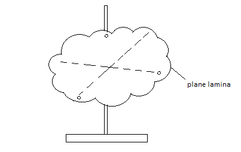

# (c) Forces, movement, shape and momentum

1.9 describe the effects of forces between bodies such as changes in speed, shape or direction

Force is that which can change the state of rest or uniform motion of an object. It is simply pushes and pulls of one thing on another.

If a body is thrown up in the air, what is the effect of gravity on the body? At first gravity reduces the speed of upward movement of the body and at a certain height it stops. So Force effects the speed.

Take a sponge and squeeze it will change its shape.

Throw a ball at a person in one direction. That person will hit the ball again i.e. apply force to the ball and it will change its direction.

To sum up the examples, the effects that occur when a force is applied to an object are:

1. The object may start to move or stop moving.
2. The object may speed up or slow down.
3. The object may change its shape
4. The object may change its direction of movement.

**1.10 identify different types of force such as gravitational or electrostatic**

Different sorts of Force:

1. Gravitational force or weight: The pull of earth due to gravity.
2. Normal Reaction: Simple reaction that stops something when to apply force to it. E.g.: A book is kept on the table which has a normal reaction on it. Otherwise the book would fall down.
3. Air Resistance: The resistivity or drag in the air while an object moves is called Air Resistance.E.g.: When a parachutist open the parachute the movement slows down for the opposite force acting in it.
4. Upthrust: Upthrust force acts only on liquid or air. It pushes an object upwards inspite of gravity. E.g.: A helium balloon moves upwards due to up thrust force.
5. Magnetic: Magnetic force is the attraction force between the poles of magnets. N=S
6. Electrostatic: Electrostatic force is the attraction force between charges. +=-
7. Tension: The pull at both ends of a stretched spring ,string, or rope.
8. Frictional force: the force produced when two objects slide one over another is called frictional force.

**1.11 distinguish between vector and scalar quantities**

Scalar quantities are physical quantities that have magnitude only.

Vector quantities however are physical quantities that possess both magnitude as well as direction.

| **Scalar** |  **Vector**  |
| :--------: | :----------: |
|    Mass    | Displacement |
|    Time    |   Velocity   |
|  Distance  | Acceleration |
|   Speed    |    Force     |
|   Volume   |              |
|  Density   |              |
|    Work    |              |
|   Energy   |              |
|   Power    |              |

Difference:

|                             **Scalar**                              |                                            **Vector**                                             |
| :-----------------------------------------------------------------: | :-----------------------------------------------------------------------------------------------: |
|                   Needs only size to express them                   |                          Needs both size and direction to express them.                           |
|                      Changes by changing size.                      |                        Changes by changing size or direction or even both.                        |
| Product of two scalar is a scalar i.e _scalar_ X _scalar = scalar._ | Products of two vectors can be either be scalar or vector i.e. _vector X vector = scalar/vector._ |

**1.12 understand that force is a vector quantity**

Force is a vector quantity due to the following reasons -

- It has magnitude i.e has the value of its size.
- It has direction.
- When applied force, an object moves with particular motion in a fixed direction.

E.g: Gravitational force has one direction which is downwards. Upthrust has the direction of upwards.

**1.13 find the resultant force of forces that act along a line**

Forces which act along a straight line can be added if the forces are in the same direction or subtracted if the forces are in the opposite direction. The force that you get after adding or subtracting is called the resultant force. The resultant force is a single force that has the same effect as all the other forces combined.


Figure a shows that two forces: 150N and 50N are acting on an object A in the same direction and the object is moving.

Figure b shows that a single from 200N is acting on the same object and the object moves at the same motion. So 200N is the resultant force of 150N and 50N.

**Examples are -**

**i.**


```
Resultant force = (500 - 200)N
                = 300 N (towards right)
```

**ii.**


```
Resultant force = 1000 – 1000
                = 0 N (rest object)
```

**1.14 understand that friction is a force that opposes motion**

Friction is the force that causes moving objects to slow down and finally stop. The kinetic energy of the moving object is converted to heat as work is done by the friction force. Friction occurs when solid objects rub against other solid object and also when objects move through fluids(liquids and gases).

Types of frictions:

- Kinetic friction: The friction that occurs when the object is in motion is called kinetic friction. E.g: Friction deduced in a moving car.
- Static friction: The friction produced when force is applied but the object doesn’t move is called static friction. E.g: a block is pulled but it doesn’t move because the force is not enough to move it. The friction produced in the block in this situation is the static friction.
- Rolling friction: When an object rolls around another object, a friction is produced. This is called rolling friction. E.g.: The car wheel moves around the axel and rolling friction is produced.
- Fluid friction: The friction produced when two liquid layer side by side moves at different speed is called fluid friction.
- Solid-fluid friction: When a solid moves through a fluid, a friction is produced to the motion. This is called solid-fluid friction.

Causes of friction:

- Ridges and bumps between the surfaces.
- The attraction force between the molecules of containing surfaces.

Ways to reduce friction:

- By making the surface smooth,
- By using lubricating oil such as mobile, grease etc.

Advantages of friction:

- We can walk and run due to friction.
- We can fix a nail in the wall due to friction.
- We can hold a pen due to friction.

Disadvantages of friction:

- Friction causes wear and tear in the surface.
- It reduces the efficiency of the machines.
- There is wastage of energy due to friction.

::: details Experiment: To investigate friction


As shown on the diagram above, a block is set on the surface of the track. A nylon line is connected to it which passes over a pulley to a weight. There is friction between the surface of the block and the surface of the track. When the pull of weight equals to the friction then the block starts moving. So the amount of the weight that starts the block to move is equal to the friction.

We can increase the friction by putting some masses over the and we will see that the more is the mass the more is the friction. We can make the track surface rougher such as byusing sand paper we will see the friction increases.

:::

**1.15 know and use the relationship between unbalanced force, mass and acceleration:**

**Balanced force:** When two or more forces acting on an object cancels each other and there is no resultant force, then the forces are called balanced force.


200N and 300N are acting towards left on the object A. 500N force is acting on it towards right. The forces cancel each other. So there is no resultant force. So these forces are called balanced forces.

**Unbalanced force:** When two or more forces acting on an object do not cancel each other fully and there is a resultant force, then the forces are called unbalanced force.


400N and 200N are acting on the object A towards right direction. 300N is acting towards left direction. The forces do not cancel each other fully. There is resultant force of 300N towards right. So their forces are unbalanced.

`Force = mass x acceleration`

In equation, `F = ma` (where, m=mass and a=acceleration)

`F α a`

Force is directly proportional to acceleration. If force increases acceleration increases.

::: details Experiment: To investigate `F α a`

Working principle **-** The rate of change of momentum is directly proportional to the applied force and takes place in the direction of force.

Apparatus required -

- Trolley
- Nylon line
- Pulley
- Ramp
- Bench top
- Mass hanger

**Diagram**


Working procedure: The force acting on the trolley is produced by the masses on the end of the nylon line. As the mass is increased, the trolley accelerates as well, so the force is increased by the transferring one of the masses from the trolley to the mass hanger.

In the diagram, this increases the pulley force on the trolley, while keeping the total mass of the system the same. The acceleration of the trolley can be measured by taking a series of pictures at equal intervals of time using a digital video camera.

Observation: Here, using the digital video camera, as sequences of pictures are taken, the distance travelled from the start for each image is measured, since the time between each image is known, a graph of displacement against time can be drawn. The gradient of the displacement-time graph gives the velocity at a particular instant, so using the value data for a velocity-time graph can be obtained. The gradient of the velocity-time graph produced is the acceleration of the trolley.

**Graph**


Conclusion: The force and acceleration is same and this produces a straight-line graph which determines that force is directly proportional to force. So doubling the force acting on an object doubles its acceleration.

:::

::: details Experiment: To investigate a α 1/m

The same experiment as above, only the force is kept constant and the mass of the trolley is varied.


The graph shows the acceleration of the trolley plotted against 1/m. This is also a straight line passing through the origin, showing that acceleration is inversely proportional to mass.

`a α 1/m`

This means that for a given unbalanced force acting on a body, doubling the mass of the body will halve the acceleration.

Combining Experiment 1 and 2, we get:

`F = ma`

One newton is the force needed to make a mass of one kilogram accelerate at one metre per second squared.

:::

**1.16 know and use the relationship between weight, mass and g:**

Weight is the pull of earth. To calculate it, use the formula:

```
Weight = mass x gravitational acceleration

W = mg
```

Gravitational field strength: The pull of planet on an object of 1 kilogram is called gravitational field strength. It is also denoted by g, where in earth g= 10 m/s<sup>2</sup> if there is no opposite force.

::: details Experiment: To verify acceleration due to gravity using video camera


We could measure the distance between two images of the tennis ball – say, the second and the third. This is the distance that the ball travelled during the second interval of one tenth of a second. The average velocity during this time is found by diving the distance travelled, 14.7 cm, by the time taken, 0.1s. This gives an average velocity of 147 cm/s or 1.47 m/s over the interval. If we repeat the calculation for the next tenth of a second, between 3 and 4m we find the average velocity has increased to 2.45 m/s. We can then use the equation for acceleration.


The result of this experiment gives us a value for acceleration caused by the force of gravity.

:::

::: details Experiment: To measure acceleration due to gravity using electromagnet

**Apparatus:** Millisecond timer, metal ball, trapdoor and electromagnet.


**Procedure:**

1. Set up the apparatus as shown. The millisecond timer starts when the ball is released and stops when the ball hits the trapdoor.
2. Measure the distance, s using a meter stick.
3. Flick the switch to release the ball and record the time, t from the millisecond timer.
4. Repeat for different values of s.
5. Calculate the values of g using the equation s = (g/2) t<sup>2</sup>. Obtain an average value for g.
6. Draw a graph of s against t<sup>2</sup> and use the slope to find the value for g.

**Precautions/ Source of error:**

1. For each height s repeat three times and take the smallest time as the correct value for t.
2. Place a piece of paper between the ball bearing and the electromagnet to ensure a quick release.
3. Remember to convert from milliseconds to seconds.

:::

**1.17 describe the forces acting on falling objects and explain why falling objects reach a terminal velocity**

Terminal velocity is the steady velocity of a falling object whose drag is balanced by the weight.

**How does a falling object reach terminal velocity?**


In a free falling object two types of force acts: Drag and Weight. The size of the drag force acting on an object depends on its shape and its speed. If the drag force of an object increases to a point which is equal to Weight, then the acceleration stops. It falls in a constant velocity known as terminal velocity.

**Reaching terminal velocity on a parachute**


When a skydiver jumps from a plane at high altitude he will accelerate for a time and eventually reach terminal velocity. When she will open her parachute, this will cause a sudden increase in the drag force. At that time drag force will be higher than the weight and he will decelerate for some time. Later those forces will become equal and reach a new terminal velocity.

**1.18 describe experiments to investigate the forces acting on falling objects, such as sycamore seeds or parachutes**

**Sycamore seeds**

We can measure the weight of the sycamore seeds using an electric balance. Now the sycamore seed is released from a high point. We will use a digital video camera to take the snaps of the moving seed. The video camera can take 25 snaps in one second. We can measure the acceleration of the ball at any point using the snaps of the moving seed. Now multiplying the mass of the seed by acceleration at any point we can find the unbalanced force acting on it. If we subtract the unbalanced weight from its weight, we will get the air resistance acting on the seed.

**Parachutes**

When a parachute is released only the weight acts on it. We can use a force meter to determine the weight. When the parachute falls downward, air resistance acts on it in the upward direction. So the downward unbalanced force decreases. The force meter attached to the parachute gives a lower reading. As the parachute goes down the speed increases. The drag force also increases. The reading on the force meter decreases as well. A moment comes when the drag force becomes equal to the weight. In this situation the reading in the force meter becomes zero. If we want to find the air resistance at any momentum we will have to subtract the weight from the unbalanced force. This is how we can investigate the forces acting on a falling object.

**1.19 describe the factors affecting vehicle stopping distance including speed, mass, road condition and reaction time**

Stopping distance: The stopping distance is the sum of Thinking distance and Braking distance.

Thinking distance: The distance travelled after seeing an obstacle and till reaction.

Braking distance: The distance travelled after the brakes are applied.

The thinking distance depends on the following factors -

1. Whether the driver is tired or has taken alcohol or drugs.
2. On the visibility power of the driver.
3. On the speed of the car.

The braking distance depends on the following factors -

1. **Speed of the car**: The more the speed is, the more the braking distance will be; <b><i>S</i> α <i>V<sup>2</sup></i></b>.
2. **Mass of the car**: As acceleration is equal to F/m, for constant braking force, the more is the mass, the less is the deceleration, the more is the braking distance.
3. **Road condition**: If the road is rough, the braking distance will be less.
4. **Tyre condition**: If the tyre is new (rough), there will be less braking distance.
5. **Braking system**: For loose braking system, the braking distance will be more.

**1.20 know and use the relationship between momentum, mass and velocity:**

Momentum is a quantity possessed by masses in motion (product of mass and velocity). Momentum is measure of how difficult it is to stop something that is moving. We calculate the momentum of a moving object using the formula:

Momentum,p (kg m/s) = mass, m(in kg) x velocity, v (in m/s)

`P = m x v`

**1.21 use the idea of momentum to explain safety features**

Objects in a car have mass, speed and direction. If the object, such as a person, is not secured in the car they will continue moving in the same direction (forward) with the same speed (the speed the car was going) when the car abruptly stops until a force acts on them.

Every object has momentum. Momentum is the product of a passenger's mass and velocity (speed with a direction). In order to stop the passenger's momentum they have to be acted on by a force. In some situations the passenger hits into the dashboard or windshield which acts as a force stopping them but injuring them at the same time.


**1 Crumple Zone**

Cars are now designed with various safety features that increase the time over which the car’s momentum changes in an accident. Crumple zones are one of the safety features now used in modern cars to protect the passengers in an accident. The car has a rigid passenger cell with crumple zones in front and behind. During a collision, it increases the time during which the car is decelerating. This also reduce the force impacting on the passenger increasing their chances of survival.


**2 Air Bags**

Many cars are now fitted with air bags to reduce the forces acting on passengers. The purpose of an airbag is to help the passenger in the car reduce their speed in collision without getting injured. An airbag provides a force over time. This is known as impulse. The more time the force has to act on the passenger to slow them down, the less damage caused to the passenger.

**1.22 use the conservation of momentum to calculate the mass, velocity or momentum of objects**

If a moving object hits another slow or stationary object, it will result an equal force to both of the objects (according to Newton’s Third Law). That forces act in opposite directions and obviously for the same amount of time. This means the F x t for each is the same size. The moving object lost its momentum while the stationary object gained its momentum. So it is balanced. The total moment of the two objects is unchanged before and after the collision- _momentum is conserved_.

Momentum before the collision = momentum after the collision

<i>m<sub>1</sub>u<sub>1</sub> + m<sub>2</sub>u<sub>2</sub> = m<sub>1</sub>v<sub>1</sub> + m<sub>2</sub>v<sub>2</sub>.</i>


Elastic and inelastic collisions

In a collision, if the kinetic energy remains conserved, the collision is called elastic collision.

**Example** - Collision between two gas molecules.

In a collision if the kinetic energy does not remain conserved, the collision is called inelastic collision.

**Example** - Collision between a truck and a micro-bus.

Application of momentum principle: Explosion


Two gliders are tied by a thread while the two ends contain two like poles of a magnet. The gliders are on the air track. Using a match stick we can burn the thread. When the thread is cut, the two gliders move away in opposite direction. If the masses of the two gliders are same, the speed of the gliders will also be equal. It means that the momentum of the two gliders is equal and opposite. That is the total momentum difference is zero which was the same before the collision. It verifies the law of conservation of momentum.

| **Before collision** | **After collision**          |
| :------------------- | :--------------------------- |
| Both rest            | Both can stop                |
| Both moving          | Both moving (same/ opposite) |
| One moving           | Both can be one object       |

Law of conservation of momentum is only verified if two forces act on it - action & reaction.

**Application of momentum principle: Rockets**

Rocket motors use the principle of conservation of momentum to propel spacecraft through space. They produce a continuous, controlled explosion that forces large amount of fast-moving gases (produced by fuel burning) out of the back of the rocket. The spacecraft gains an equal amount of momentum in the opposite direction to that of the moving exhaust gases and moves upward with a very high speed.

**1.23 use the relationship between force, change in momentum and time taken:**

Initial momentum of object = mu

Final momentum = mv

Therefore increase in momentum = `mv - mu`

| Rate of increase of momentum | = (mv-mu)/t  |
| :--------------------------- | :----------- |
|                              | = m(v-u)/t   |
|                              | = ma = Force |

Force = Rate of increase of momentum

Force = Change in momentum / time

**1.24 demonstrate an understanding of Newton’s third law**

Newton’s thirds law: “For every action there is an equal and opposite reaction.”

Newton’s third law states four characteristics of forces:

- Forces always occur in pairs (action and reaction force.)
- The action and reaction are equal in magnitude.
- Action and reaction act opposite to one another.
- Action and reaction act on different bodies.
- Action and reaction do not cancel each other


**1.25 know and use the relationship between the moment of a force and its distance from the pivot:**

```
moment = force * perpendicular distance from the pivot

moment = F * d
```

The turning effect of a force about a hinge or pivot is called its moment. In other words, it is the product of force and the perpendicular distance from the pivot to the line of action of the force. It is measured in Newton meter (Nm).


There are two types of moment: (i) Clockwise moment & (ii) Anti-clockwise moment

When a force causes an object to turn in a clockwise direction, it is called a Clockwise Moment.


When a force causes an object to turn in an anti-clockwise direction, it is called a Anti-clockwise moment.


**1.26 recall that the weight of a body acts through its centre of gravity**


Mass is the amount of matter an object has. Every part of an object forms part of its overall mass. But when we try to balance an object on a point, there will only be one place where it will balance. You can therefore think of the mass of an object being concentrated at this point, known as the centre of mass or gravity.

If we support the centre of gravity of the object, the object won’t fall no matter how wide it is. Because the moment of the all sides are balanced and there will be no clockwise or anti-clockwise movement.


Stability of centre of gravity

A stable object is one that is difficult to push over; when pushed and then released it will tend to return to its original position. Stability can be increased by:

1. By increasing the base area.
2. By decreasing the height of COG.

::: details Experiment: To determine the position of the centre of gravity of an uniform object using balancing method


Balance the object keeping over a scale and draw the line of contact. Balance the object on another axis keeping it over the same scale and draw the line of contact again. The two lines intersect at a point. This point gives the COG.

:::

::: details Experiment: To determine the position of the centre of gravity of a plane lamina with irregular shape of non-uniform thickness or density

**Apparatus:** Retord stand, plumbline, cork and pin



**Procedure:**

1. Make three small holes near the edge of the lamina. The holes should be as far apart as possible from one another.
2. Suspend the lamina through one of the holes using a pin.
3. Hang a plumbline on the pin in front of the lamina.
4. When the plumbline is steady, draw a line on the lamina over the plumbline.
5. Repeat the above for other two holes.
6. The point of intersection of the three lines is the position of the centre of gravity.

**Precautions**:

1. The holes must be small so that not too much of the lamina is removed.
2. The lamina should be free to swing above its point of suspension.

:::

**1.27 know and use the principle of moments for a simple system of parallel forces acting in one plane**

**Solving Problems related to Principle of Moments**

::: details Example 1

Step 1:

Identify what are forces that will give rise to clockwise / anti-clockwise moment


Step 2:

Find the clockwise / anticlockwise moment


Step 3:

Equate the clockwise and anticlockwise moments

:::

::: details Example 2


F<sub>2</sub> d<sub>2</sub> + F<sub>1</sub> d<sub>1</sub> = F<sub>3</sub> d<sub>3</sub> + F<sub>4</sub> d<sub>4</sub>

10 x 20 + 20 x 10 = 5 x 20 + 15 x d<sub>4</sub>

400 – 100 = 15 x d<sub>4</sub>

d<sub>4</sub> = 300/15

d<sub>4</sub> = 20m

:::tip


F<sub>2</sub> d<sub>2</sub> + F<sub>1</sub> d<sub>1</sub> = F<sub>3</sub> d<sub>3</sub> + F<sub>4</sub> d<sub>4</sub>

10 x 20 + 20 x 10 = 5 x 20 + 15 x d<sub>4</sub>

400 – 100 = 15 x d<sub>4</sub>

d<sub>4</sub> = 300/15

d<sub>4</sub> = 20m
:::

::: details Example 3


At position A, the object is of 400N at a distance 1.5m from the pivot. What should be the distance of object B from the pivot is of 500N and the see-saw is at equilibrium position.

At equilibrium, sum of clockwise moment = sum of anti-clockwise moment

F<sub>1</sub> d<sub>1</sub> = F<sub>2</sub> d<sub>2</sub>

400 x1.5 = 500 x d<sub>2</sub>

d<sub>2</sub> = 600/500

d<sub>2</sub> = 1.2 m

:::

::: details Example 4


In a crane, the force arm d<sub>1</sub> = 2m and weight of 5000N is put at the force arm. What maximum load the crane can raise in the load arm d<sub>2</sub> is 10m?

Sum of CWM = Sum of ACWM

W x d<sub>1</sub> = F x d<sub>2</sub>

F = W×dd2

F = 5000×210

F = 1000N

:::

::: details Experiment: To verify the principle of moment


A uniform beam AD is put at point P on a support.

The beam is balanced.

Now, we will put four different beam at different distances in a way so that the beam restores the balance again.

Now, calculate the moment for the weights

Moment for W<sub>1</sub> = W<sub>1</sub>d<sub>1</sub>

Moment for W<sub>2</sub> = W<sub>2</sub>d<sub>2</sub>

Moment for W<sub>3</sub> = W<sub>3</sub>d<sub>3</sub>

Moment for W<sub>4</sub> = W<sub>4</sub>d<sub>4</sub>

Now, sum of clockwise moments = W<sub>3</sub>d<sub>3</sub> + W<sub>4</sub>d<sub>4</sub>

Sum of anti-clockwise moments = W<sub>1</sub>d<sub>1</sub> + W<sub>2</sub>d<sub>2</sub>

Now, if we put the values of constants, we will see that W<sub>1</sub>d<sub>1</sub> + W<sub>2</sub>d<sub>2</sub> = W<sub>3</sub>d<sub>3</sub> + W<sub>4</sub>d<sub>4</sub>

i.e. Sum of anti-clockwise moment = sum of clockwise moment

So the principle of moment is verified.

:::

**1.28 understand that the upward forces on a light beam, supported at its ends, vary with the position of a heavy object placed on the beam**


a) An object weighing 400 N is placed in the middle of the beam. The beam is not moving,so the upward and downward forces must be balanced.

b) As the object is placed in the middle of the beam, the upward forces on the ends of the beam are same as each other. If it is moved right to one end of the beam, then the upward force will all be at that end of the beam. As it is moved along the beam, the upward forces at the ends of the beam change.

In c) he is ¼ away from the plant. The upward force on the support nearest to him is ¾ of his weight and the upward force on the end of furthest beam is only ¼ of his weight.

```
x + y = 400x * ¼ = y * ¾x * ¼ = (400 - x) * ¾x = 3(400 - x)x = 1200 – 3x4x = 1200x = 300

y = 400 – x = 400 – 300 = 100
```

**1.29 describe experiments to investigate how extension varies with applied force for helical springs, metal wires and rubber bands**

::: details Experiment: Investigating extension with applied force in spring

Apparatus:

- Spring/Wire/Rubber-band
- Scale
- Some masses
- Clamp and stand
- Mass hanger


Working procedure:

1. Take the length of the normal condition.
2. Add a mass in the mass hanger and determine the extension by using the porter and the scale.
3. Add another mass gradually and determine the extension in all cases.
4. Plot a graph of extension and relevant loads.

Observation with helical spring:


Since the graph of load & extension is a straight line, which proves the extension and load are directly proportional.

Observation with rubberband:


Since the graph didn’t produce a straight line, extension is not directly proportional to load force. But extension still increases as the force is applied.

Observation with metal wire:


:::

**1.30 understand that the initial linear region of a force-extension graph is associated with Hooke’s law**

Hooke’s law, “Within the elastic limit, extension is directly proportional to the load i.e. e α f”

Hooke measured the increase in length (extension) produced by different load forces on springs. The graph he obtained by plotting force against extension looked like that below. This straight line passing through the origin shows that the extension of the spring is proportional to the force. The relationship is known as _Hooke’s law._


Hooke’s Law only applies if you do not stretch a spring to far. At a point the elastic limit it starts to stretch more for each successive increase in the load force. Once you have stretch a spring beyond this limit it has changed shape permanently and will not return to its original shape.


**1.31 describe elastic behaviour as the ability of a material to recover its original shape after the forces causing deformation have been removed.**

Objects showing elastic behaviour has the ability to return to its original shape after the forces causing its shape are removed. This property is called elasticity. Examples of objects showing elastic behaviour are coiled springs.

Uses of spring:

1. Use to absorb bumps in the road or suspension spring in the car or cycle.
2. In beds and furnitures they used to make sleeping and sitting more comfortable.
3. Used in door locks to hold bolts and catches closed and to make doors close automatically.
4. Used in measuring devices like spring balance or bathroom scales.

The materials which do not exhibit elasticity i.e. they do not return to its original position after stretching force is removed are called plastic materials. Examples are putty, plasticine.
