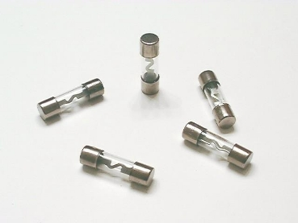
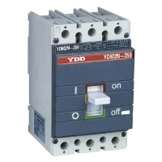
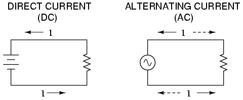
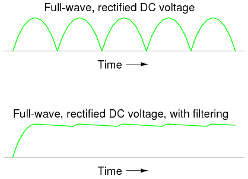

# (b) Mains electricity

**2.2 understand and identify the hazards of electricity including frayed cables, long cables, damaged plugs, water around sockets, and pushing metal objects into sockets**

Mains electricity: The source of electricity in our houses is called mains electricity.

Electricity meter: The meter that measures the electrical energy we consume in our house is called electricity meter.

Fuse box(or Consumer unit): The box that contains all fuse and circuit breakers in a circuit is called fuse box.

Ring main circuit: Wires that leave the fuse box are hidden in the walls or floors around each room. These wires are connected to form ring main circuits. Individual equipments are connected to these circuits using plugs. It consists of three wires: live wire, neutral wire and earth wire.

Live wire: The wire that contains the electricity all the time is called live wire.

Neutral wire: The wire that usually doesn’t contain the electricity but when it is connected with the live wire then it also become live. The neutral wire completes the circuit.

Earth wire: The earth wire usually has no current flowing through it. It is there to protect user if an appliance develops a fault.

Electricity is very useful, but it can be dangerous if it is not used safely. The following hazards that increase the chances of severe and possibly fatal electric shocks are:

- frayed cables, any damaged insulation can expose ‘live’ wires.
- Long cables, as they are more likely to get damaged or trip people up.
- Damage to plugs or any insulating casing on any mains operated devices.
- Water around electric sockets or mains operated devices.
- Pushing metal objects into the mains sockets – usually only a problem with very young children, solved by using socket covers.

**2.3 understand the uses of insulation, double insulation, earthing, fuses and circuit breakers in a range of domestic appliances**

Insulation: Some appliances are cased with insulators like plastic rather than metal to prevent user from receiving shock. This casing is called insulation.

Double Insulation:Some appliances are double insulated; as well as all their wiring being insulated the outer casing of the appliances is also made of an insulating material. This means there is no chance of an electric shock from the casing – double insulation is often used with electric kettles and power tools like electric drills.

Earthing: Many appliances have a metal casing. This should be connected to earth wire so that if the live wire becomes frayed or breaks and comes into contact with the casing, the current will pass through the earth wire rather than the user. The current in the earth wire is always large enough to blow the fuse and turning off the circuit. So the user is safe from electric shock.

Fuses: Fuse is a safety device usually in the form of a cylinder or cartridge which contains a thing piece of wire made from a metal that has low melting point. If too large a current flows in the circuit the fuse wire becomes very hot and blows, shutting the circuit off. This prevents you getting a shock and reduces the possibility of an electrical fire. One the fault in the current is corrected, it should be replaced again.



Circuit Breakers or Trip switches: Circuit Breaker is similar to fuses. If too large a current flows in a current a switch opens making the circuit incomplete. Once the fault in the circuit is corrected, the switch is reset, usually by pressing a reset button.

|  |  |
| :----------------------------------------------------------------------: | :-----------------------------------------------------------------------: |
|                                  inside                                  |                                  outside                                  |

How does a circuit breaker work?

When high current flows, the electromagnet in it gains its magnetism and attract the iron catch towards it. This separated the contact and the circuit discloses.

Switches: Switches in main circuit should always be included in the live wire so that when the switch is open, no electrical energy can reach an appliance. If the switch is included in the neutral wire, electrical energy can still enter an appliance, and could possibly cause an electric shock.


**2.4 understand that a current in a resistor results in the electrical transfer of energy and an increase in temperature, and how this can be used in a variety of domestic contexts**

Normal wiring in the house are said to have low resistance and the current pass through them easily. Heating elements like nichrome wire have high resistance. When current flows through them current cannot pass, and the energy is transferred to heat energy and the element heats up.It is also used in the lights – normal light bulbs have a very thin filament which gets so hot when current passes through it that it glows white. We use the heating effect of current in electric kettle, iron, filament lamps, fan heaters, hair dryers etc.

**2.5 know and use the relationship: power = current × voltage, P = I × V and apply the relationship to the selection of appropriate fuses**

Power is amount that represents how much voltage or energy is converted every second. It is calculated using this equation:

Power, P (in watts) = current, I (in amps) x voltage, V (in volts)

`P = I x V`

Fuses in plugs are made in standard ratings. The most common are 3A, 5A and 13A. The fuse should be rated at a slightly higher current than the device needs:

- if the device works at 3A, use a 5A fuse
- if the device works at 10A, use a 13A fuse

**2.6 use the relationship between energy transferred, current, voltage and time:**

Energy transferred = current × voltage × time

`E = I × V × t`

The power of an appliance (P) tells you how much energy it converts each second. This means that the total energy (E) converted by an appliances is equal to its power multiplied by the length of time the appliance is being used.

Total energy, E (in joules) = power, P (in watts) x time, t (in seconds)

```
E = P x t
Since, P = I x V
E = I x V x t
```

**2.7 understand the difference between mains electricity being alternating current (a.c.) and direct current (d.c.) being supplied by a cell or battery.**

**Alternating current:**


If the current constantly changes direction, it is called alternating current, or a.c.. Mains electricity is an a.c. supply, with the UK mains supply being about 230V. It has a frequency of 50Hz (50 hertz), which means it changes direction, and back again, 50 times a second. The diagram shows an oscilloscope screen displaying the signal from an a.c. supply. Alternating current is useful in electricity generator and transformers.



**Direct current:**


If the current flows in only one direction it is called direct current, or d.c. Batteries and cells supply d.c. electricity, with a typical battery supplying maybe 1.5V. The diagram shows an oscilloscope screen displaying the signal from a d.c. supply.

Alternating current can be converted to direct current by using a rectifier. This direct current is made uniform by filter circuit.


