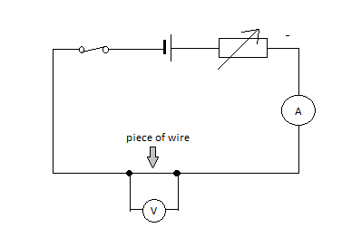
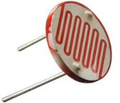
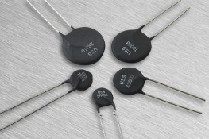
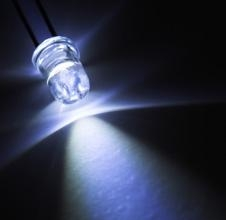
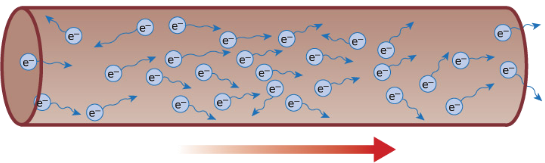

# (c) Energy and potential difference in circuits

**2.8 explain why a series or parallel circuit is more appropriate for particular applications, including domestic lighting**

Series Circuit:

- one switch can turn off the components on and off together
- if one bulb ( or other component) breaks, it causes a gap in the circuit and all of the other bulbs will go off
- the voltage supplied by the cell or mains supply is “shared” between all the components, so the more bulbs you add to a series circuit the dimmer they all become. The larger the resistance of the component, the bigger its “share of voltage”

Parallel Circuit:

- switches can be placed in different parts of the circuit to switch each bulb on and off individually or all together
- if one bulb (or other components) breaks, only the bulbs on the same branch of the circuit will be affected
- each branch of the circuit receives the same voltage, so if more bulbs are added to a circuit in the parallel they all stay bright.

Decorative lights are usually wired in series. Each bulb only needs a low voltage, so even when the voltage from the mains supply is shared between them, each bulb still gets enough energy to produce light. If one of the bulbs is not in its holder properly, the circuit is not complete and none of the bulbs will be on. In the past, if the filament in one of the bulbs broke, all of the other bulbs would go out. Today, many bulbs used in decorative lights are provided with a ‘shunt’ which allows current to continue to flow through the bulb even after the filament has broken.

The lights in our house are wired in parallel. Each bulb can be switched on and off separately and the brightness of the bulbs does not change. If one bulb breaks or is removed, you can still use the other lights.

**2.9 understand that the current in a series circuit depends on the applied voltage and the number and nature of other components**

Series circuit: In a series circuit the current is the same in all parts. Current is not used up as it passes around a circuit.

The size of the current is a series circuit depends on the voltage supplied to it, and the number and nature of the other components in the circuit. In a circuit if more cell is attached, the current will increase as more energy is being given to the electrons. If more resistance is attached to the circuit the current will get less. But current is same at all points in a series circuit.

Parallel circuit: In parallel circuit, current varies with the resistance and voltage. Voltage are same at all branches.

This circuit shows a 10Ω and 20 Ω resistor connected in parallel to a 6V cell of negligible internal resistance. The p.d. across 10 Ω and 20Ω resistors is 6V.

I1 = 0.6A

I2 = 0.3 A

As the resistance in I2 is higher, the current is small.

I3 = I1 + I2 The current in a parallel circuit is shared between the branches depending on the resistance.

**2.10 describe how current varies with voltage in wires, resistors, metal filament lamps and diodes, and how this can be investigated experimentally**

a) Resistors and wires obey Ohm’s law. Current, I, is proportional to voltage, v, and the graphs are straight lines which pass through the origin (0,0) of the scales.

b) The filament in a lamp is a metal wire but it gets very hot indeed. The resistance of a metal increases with temperature – the graph curves when the lamp reaches its working current and temperature.

c) Diodes have a very large resistance when voltage is applied in the ‘wrong’ direction – this is shown by the horizontal line when the voltage is negative. When the voltage is in the ‘right’ direction (forward biased), when it reaches around 0.7v, the resistance drops to a small value – the graph curves and become very steep.

### Experiment: To investigate how current varies with voltage. (Ohm’s law)

The resistance of a component is related to the current through it and the voltage across it by the equation V = I x R. If we wish to find the resistance of a component, this equation can be rearranged to give R = V/I. The circuit in Figure can be used to investigate this relationship for a piece of resistance wire.

When switch S is closed for the readings on the ammeter and voltmeter are noted. The value of the variable resistor is then altered and a new pair of readings taken from the meters. The whole process is repeated at least six times, the results are placed into a table and a graph of current against voltage is drawn.

| **Current, I (A)** | **Voltage, V (v)** |
| :----------------: | :----------------: |
|      **0.0**       |        0.0         |
|      **0.1**       |        0.4         |
|      **0.2**       |        0.8         |
|      **0.3**       |        1.2         |
|      **0.4**       |        1.6         |
|      **0.5**       |        2.0         |

` `The graph in Figure is a straight line passing through the origin. This tells us that the current flowing through the wire is directly proportional to the voltage applied across its end – that is, if the voltage across the wire is doubled the current flowing through it doubles.

**2.11 describe the qualitative effect of changing resistance on the current in a circuit**

R α 1/I

Resistance is inversely proportional to current. Higher resistance means lower current and higher current means lower resistance. In other words resistance is the opposition of current. Resistance blocks charge flow.

**2.12 describe the qualitative variation of resistance of LDRs with illumination and of thermistors with temperature **

**Light Dependant Resistors:** An LDR is a light dependant resistor. Its resistance changes with the intensity of light. In dark condition LDRs contain few free electrons and so have a high resistance. If however light is shone onto an LDR more electrons are freed and the resistance decreases. LDRs are often used in light sensitive circuits in devices such as photographic equipment, automatic lightning controls and burglar alarms.

**Thermistor:** A thermistor is a temperature dependant resistor. It is made from a semiconducting material such as silicon or germanium. At room temperature the number of free electrons is small and so the resistance of a thermistor is large. If however if it is warmed the number of the electrons increases and its resistance decreases. Thermistors are often used in temperature-sensitive circuits in devices such as fire alarms and thermostats.

**2.13 know that lamps and LEDs can be used to indicate the presence of a current in a circuit**

A light-emitting diode (LED) is a special kind of diode that glows when electricity passes through it. Most LEDs are made from a semi-conducting material called gallium arsenide phosphide.

LEDs can be bought in a range of colours. They can also be bought in forms that will switch between two colours (bi-colour), three colours (tri-colour) or emit infra-red light.

In common with all diodes, the LED will only allow current to pass in one direction. The cathode is normally indicated by a flat side on the casing and the anode is normally indicated by a slightly longer leg. The current required to power an LED is usually around 20 mA.

**2.14 know and use the relationship between voltage, current and resistance:**

voltage = current × resistance

V = I × R

**2.15 understand that current is the rate of flow of charge**

The size of an electric current indicates the rate at which charge flows. Charge(Q) is measured in coulombs (C). Current is measured in amperes (A). If 1 C of charge flows along a wire every second the current passing the wire is 1A.

**2.16 know and use the relationship between charge, current and time:**

charge = current × time

Q = I × t

**2.17 know that electric current in solid metallic conductors is a flow of negatively charged electrons**

Current is the flow of charge. One coulomb of charge is equivalent of the charge carried by approximately six million, million, million (6 x 1018) negative electrons.

**Charge direction when connected to a battery**

In conductors some electrons are free to drift. But the number of electrons flowing in any one direction is roughly equal to the number flowing in the opposite direction. There is therefore no overall flow of charge. However, if a cell or battery is connected across the conductor, more of the electrons now flow in the direction away from the negative terminal and towards the positive terminal, than in the opposite direction. There is now a net flow of charge.

Electrons/charges move from the negative terminal to positive. But when you are dealing with topics such as circuit and motors, it is still considered that current flow from positive to negative. This is called conventional current.

**2.18 understand that:**

- **voltage is the energy transferred per unit charge passed**
- **the volt is a joule per coulomb.**

As the charges flow around a circuit, the energy they carry is converted into other forms of energy by the components they pass through. The voltage across each component tells us how much energy it is converting. If the voltage across a component is 1v, this means that the component is changing 1J of electrical energy into a different kind of energy each time 1C of charge passes through it.
