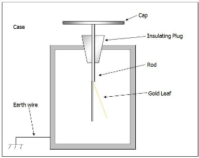
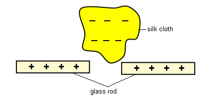
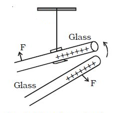
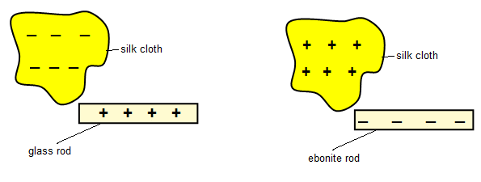
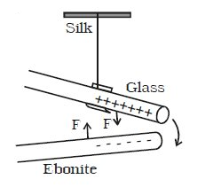
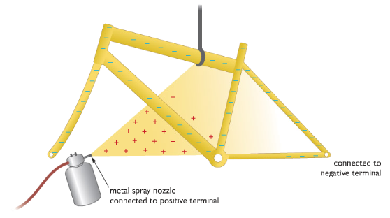
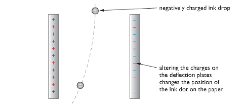

# (d) Electric charge

2.19 identify common materials which are electrical conductors or insulators, including metals and plastics

Conductors: Electrical conductors are materials that allow current to pass through them. Conductors have free electron diffusion to pass current. Metals like copper, silver, aluminium havefree electrons and can conduct electricity.

Insulators: Insulators do not conduct electricity because they don’t have free electrons. Examples of insulators are plastics, rubber, wood etc.

**2.20 describe experiments to investigate how insulating materials can be charged by friction**

### Experiment: To investigate how insulating materials can be charged by friction

Apparatus: Glass rod, silk cloth, electroscope

Procedure:

1. Take a glass rod and silk cloth.
1. Rub the rod with the cloth.
1. Now, take any of the two materials near the metal plate of an electroscope.

Observation

1. You will notice that the leaf below will deflect.
1. This will prove that charge can be produced by friction.

**2.21 explain that positive and negative electrostatic charges are produced on materials by the loss and gain of electrons**

If two materials are rubbed together electrons will be transferred. The one that gains electrons will be negatively charged and the one that losses electrons will be positively charged.

|                  Materials                  | Positive charge | Negative charge |
| :-----------------------------------------: | :-------------: | :-------------: |
|         Glass rod rubbed with silk          |      glass      |      Silk       |
|         Ebonite rod rubbed with fur         |       fur       |     ebonite     |
|      Perspex ruler rubbed with woolen       |     Perspex     |     Duster      |
|        Plastic comb rubbed with hair        |      hair       |  Plastic comb   |
|  Polythene strip rubbed with woolen duster  |     duster      |    Polythene    |
| Cellulose acetate rubbed with woolen duster |     acetate     |     duster      |

**2.22 understand that there are forces of attraction between unlike charges and forces of repulsion between like charges**

Similar charges repel each other and unlike charges attract each other. The attraction and repulsion occurs because of electrostatic force.

### Experiment: To investigate unlike charge attracts

Apparatus:

- Two pieces of glass rods.
- One piece of silk cloth
- Insulating thread.

Diagram:

Procedure:

1. Two glass rods are rubbed by silk cloth. The rods become positively charged and the cloth becomes negatively charged.
1. One positive charged glass rod is hung by an insulating thread.
1. Another positively charged glass rod is approached towards the hung rod.

Observation:

We will see that the hung rod move away.

Conclusion:

Like charges repels.

### Experiment: To investigate that like charge repels.

Apparatus:

- One piece of glass rod
- One piece of ebonite rod
- Two pieces of silk rod
- Insulating thread.

Diagram:

Procedure:

1. Two silk clothes are taken. When the glass rod is rubbed with the silk cloth, the glass rod becomes positively charged. Again, when with another silk cloth, the ebonite rod is rubbed, it becomes negatively charged.
1. The positively charged glass rod is hung by an insulating thread.
1. The negatively charged ebonite rod is approached towards the hung rod.

Observation:

We will see the hung rod moves towards the glass rod.

Conclusion:

Unlike charges attract.

### Experiment: Showing that a charged object can attract an uncharged object

If you charge a balloon by rubbing it against your jumper or your hair and then hold the balloon against a wall, you will find that the balloon sticks to the wall. There is an attraction between the charged balloon and the uncharged wall.

After the balloon has been charged with static electricity, but before it is brought close to the wall, the charges will be distributed. The balloon is negatively charged and the wall is uncharged – that is, the equal numbers of positive and negative charges.

As the negatively charged balloon is bought closer to the wall some of the negative electrons are repelled from the surface of the wall. This gives the surface of the wall a slight positive charge that attracts the negatively charged balloon.

**2.23 explain electrostatic phenomena in terms of the movement of electrons**

An electrostatic phenomenon is an event where electricity has a special effect, for example a static shock. Electrons move from one material to another. Materials with a negative charge will look for some way to earth like clouds through lightning.

**2.24 explain the potential dangers of electrostatic charges, eg when fuelling aircraft and tankers**

In some situations the presence of static electricity can be a disadvantage.

- As aircraft fly through the air, they can become charged with static electricity. As the charge on an aircraft increases so too does the potential difference between it and earth. With high potential differences her is the possibility of charges escaping to the earth as a spark during refueling, which could cause an explosion. The solution to this problem is to earth the plane with a conductor as soon as it lands and before refueling commences. Fuel tankers that transport fuel on roads must also be earthed before any fuels is transferred to prevent sparks causing a fire or explosion.
- Television screens and computer monitors become charged with static electricity as they are used. The charges attract light uncharged particles-that is dust.
- Our clothing can, under certain circumstances become charged with static electricity. When we remove the clothes there is the possibility of receiving a small electric shock as the charges escape to the earth.
- Workers handing electronic components must take care not to become charged by static as this can easily destroy expensive components. They wear earthing straps and work on earthed metal benches to prevent this.

**2.25 explain some uses of electrostatic charges, eg in photocopiers and inkjet printers.**

Electrostatic charges can be used in electrostatic paint spraying, inkjet printers, photocopiers, electrostatic precipitators etc.

**Electrostatic paint spraying**

Painting an awkwardly shaped object such as bicycle frame with a spray can be very time consuming and very wasteful of paint. Using Electrostatic spraying can be the process efficient.

Let the metal spray nozzle be connected to a positive terminal so the paint that emerges will be positive charged. The bicycle frame should be connected to a wire and it will become negatively charged. The positively charged paint will be attracted to the frame. There is the added benefit that paint is attracted into places, such as tight corners that might otherwise not receive good coating.

**Inject Printers**

Many modern printers use inkjets to direct a fine jet of ink drops onto paper. Each spot of ink is given a charge so that as it falls between a pair of deflecting plates, electrostatic forces direct it to the correct position. The charges on the plates change hundreds of times each second so that each drop falls in a different position, forming pictures and words on the paper as required.

**Photocopiers**

In photocopiers, the paper is shone in bright light which reflects to a rotating drum. The dark writings and pictures do not reflect. As a result the light removes the charges in the drum. Carbon powder attaches to the charges in the drum and the pictures and writings are pasted into a sheet of paper.

**Electrostatic precipitators**

Many heavy industrial plants, such as steel-making furnaces and coal fired power stations, produce large quantities of smoke. This smoke carries small particles of ash and dust into the environment, causing health problems and damage to buildings. One way of removing these pollutants from the smoke is to use electrostatic precipitators.

As the smoke initially rises up the chimney, it passes through a mesh of wires that are highly charged. As they pass through the mesh, the ash and dust particles become negatively charged. Higher up the chimney these charged particles are attracted by and stick to large metal earthed plates. The cleaner smoke is then released into the atmosphere. When the earthed plates are completely covered with dust and ash, they are given a sharp rap. The dust and ash fall into collection boxes, which are later emptied.
