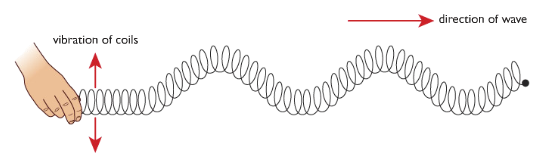
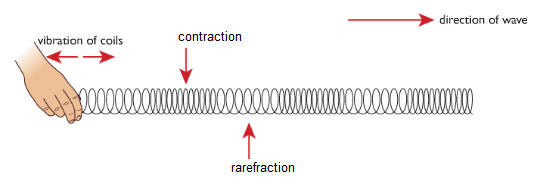
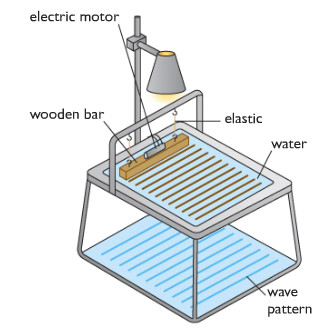
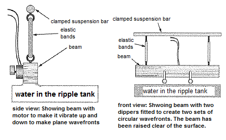

# (b) Properties of waves

## **3.2 understand the difference between longitudinal and transverse waves and describe experiments to show longitudinal and transverse waves in, for example, ropes, springs and water**

Waves can transfer energy and information from one place to another without transfer of matter. Waves can be divided into two types: mechanical waves and electromagnetic waves.

Mechanical waves can be of two types: transverse and longitudinal.

**Transverse waves:** A transverse wave is one that vibrates or oscillates, at right angles to the direction in which the energy or wave is moving. Example of transverse waves include light waves and waves travelling on the surface of water.

**Longitudinal waves:** A longitudinal wave is one in which the vibrations or oscillations are along the direction in which the energy or wave is moving. Examples of longitudinal waves include sound waves.

Transverse wave don’t need medium to move. Longitudinal wave needs medium to move.

### Experiment: To show different types of waves in spring.

Transverse –

If you waggle on end of a slinky spring from side to side you will see waves travelling through it. The energy carried by these waves moves along the slinky from one end to the other, but if you look closely you can see that the coils of the slinky are vibrating across the direction in which the energy is moving. This is an example of transverse wave.

Longitudinal –

If you push and pull the end of a slinky in a direction parallel to its axis, you can see energy travelling along it. This time however the coil of the slinky are vibrating in direction that are along its length. This is an example of longitudinal wave.

### Experiment: To create water waves using a ripple tank

When the motor is turned on the wooden bar vibrates creating a series of ripples on the surface of water. A light placed above the tank creates pattern of the water waves on the floor. A light placed above the tank creates patterns of the water waves on the floor. By observing the patterns we can see how the water waves are behaving.

## **3.3 define amplitude, frequency, wavelength and period of a wave**

Amplitude: Amplitude is the maximum displacement of a part of the medium from its rest position.

Wavelength: The distance between a particular point on a wave and the same point on the next wave (for example, from crest to crest) is called the wavelength (λ).

Frequency: The number of waves produced each second by a source, or the number passing a particular point each second is called frequency( *f*).

Period: The period of a wave is the time for one complete cycle of the waveform.

### Experiment: Adjusting ripple tank to investigate wavelength and frequency

The motor can be adjusted to produce a small number of waves each second. The frequency of the waves is small and the pattern shows that the waves have a long wavelength.

At higher frequencies, the water waves have shorter wavelengths. The speed of the waves does not change.

### Experiment: Demonstrating refraction using ripple tank

Refraction, the bending of light waves as they pass from one material to another, can be demonstrated by reducing the depth of water in the ripple tank (with a transparent glass or plastic sheet). Ripples travel more slowly if the depth of the water in the ripple tank is smaller. When setting up a ripple tank it is therefore important that the tank is level. Another problem with ripple tanks is unwanted reflection from the sides of the tank; these result in pretty patterns but make analysts of what you see very difficult. Most ripple tanks have sloping sides to reduce unwanted reflections.

### Experiment: To demonstrate diffraction using vibrating bar

To show the interesting effects of diffraction you need to set up continuous plane wavefronts and (circular wavefronts respectively). This is done with a vibrating bar placed wither directly in contact with the water or with two dippers just touched the water for circular wavefronts. The frequency of vibration is controlled frequency of the waves is controlled by varying the speed of electric motor attatched to the beam.

## **3.4 understand that waves transfer energy and information without transferring matter**

Waves are means of transferring energy and information from place to place. These transfers take place with no matter being transferred. Mobile phones, satellites etc. rely on waves.

Example: If you drop a large stone into a pond, waves will be produced. The waves spread out from the point of impact, carrying to all parts of the pond. But the water in the pond does not move from the centre to the edges.

## **3.5 know and use the relationship between the speed, frequency and wavelength of a wave:**

wave speed = frequency × wavelength

v = f× λ

## **3.6use the relationship between frequency and time period**

frequency,  f in hertz= 1time period, T (in seconds)

` `f= 1T

## **3.7 use the above relationships in different contexts including sound waves and electromagnetic waves**

As all wave share properties the above relations can be used for any type of wave.

P – 1: The period of a wave is 0.01 second. What is its frequency?

Ans: Frequency = 1/T
`                             `= 1/0.01s
`                             `= 100 Hz

P – 2: The frequency of a wave is 250 Hz and the wavelength is 0.02m. What is speed of the wave?

Ans: v=fλ
= 250 Hz x 0.02s
`              `= 5 m/s

## **3.8 understand that waves can be diffracted when they pass an edge**

Diffraction is the slight bending of waves as it passes around the edge of an object. The amount of bending depends on the relative size of the wavelength of light to the size of the opening. If the opening is much larger than the wave's wavelength, the bending will be almost unnoticeable. However, if the two are closer in size or equal, the amount of bending is considerable.

## **3.9 understand that waves can be diffracted through gaps, and that the extent of diffraction depends on the wavelength and the physical dimension of the gap.**

Diffraction involves a change in direction of waves as they pass through an opening or around a barrier in their path. Water waves have the ability to travel around corners, around obstacles and through openings. This ability is most obvious for water waves with longer wavelengths. Diffraction can be demonstrated by placing small barriers and obstacles in a ripple tank and observing the path of the water waves as they encounter the obstacles. The waves are seen to pass around the barrier into the regions behind it; subsequently the water behind the barrier is disturbed. The amount of diffraction (the sharpness of the bending) increases with increasing wavelength and decreases with decreasing wavelength. In fact, when the wavelength of the waves is smaller than the obstacle, no noticeable diffraction occurs.
