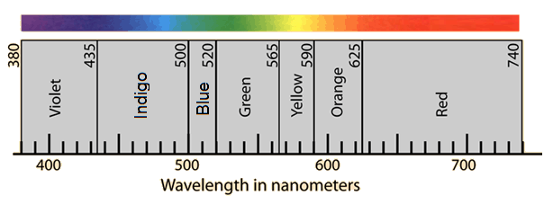

## (c) The electromagnetic spectrum

**3.10 understand that light is part of a continuous electromagnetic spectrum which includes radio, microwave, infrared, visible, ultraviolet, x-ray and gamma ray radiations and that all these waves travel at the same speed in free space**

The electromagnetic spectrum is a continuous spectrum of waves which includes the visible spectrum.

1. they all transfer energy
1. they are all transverse waves
1. they all travel at speed of light in vacuum (3x108 m/s)
1. they can all be reflected, refracted and diffracted

**3.11 identify the order of the electromagnetic spectrum in terms of decreasing wavelength and increasing frequency, including the colours of the visible spectrum**

Different frequencies and wavelength differ them into different groups and consequently have different properties. Radio waves have the lowest frequency and the longest wavelength. Gamma rays have the highest frequency and the shortest wavelength.

A mnemonic can help: **R**un **M**iles **I**n **V**ery **U**npleasant e**X**treme **G**ames.

**Colours of the visible spectrum**

There are seven colours in the visible spectrum: red, orange, yellow, green, blue, indigo and violet. Red has the longest wavelength and lowest frequency.

A mnemonic can help: **R**ichard **O**f **Y**ork **G**ave **B**attle **I**n **V**ain

The EM spectrum is continuous – it is only broken upto into distinct zones for convenience. For example, the visible light spectrum is made up of an indeterminate number of colours that blend smoothly from on shade to the next.

**3.12 explain some of the uses of electromagnetic radiations, including:**

**Radio waves**: It is used in communicating information. This can be speech, radio and television, music and encoded messages like computer data, navigation signals and telephone conversations. The properties that make radio waves suitable for communicating are:

- Radio waves can travel quickly.
- Can code information.
- Can travel long distance through buildings and walls.
- It is not harmful.

**Microwaves**: Microwaves are used in microwave oven which cooks food more quickly than in normal oven. Microwaves are also used in communications. The waves pass easily through the Earth’s atmosphere and so are used to carry signals to orbiting satellites. From here, the signals are passed on to their destination. Messages sent to and from mobile phones and radarare also carried by microwaves.

**Infrared**: Special cameras designed to detect infra-red waves can be used to create image even in the absence of visible light. The image can be created because of the different temperatures of objects. Wavelength of infrared from warm objects is shorter than the infrared from cool objects. Infra-red radiation is also used in remote controls for televisions, videos and stereo systems. Moreover it is used in heating materials like heater.

**Visible light**: The main use of visible light is to see. Visible light from lasers is used to read compact discs and barcodes. It can also be sent along optical fibres, so it can be used for communication or for looking into inaccessible places such as inside of the human body. Furthermore, it has uses in photography too.

**Ultraviolet**: Some chemicals glow when exposed to UV light. This property of UV light is used in security markers. The special ink is invisible in normal lights but becomes visible in UV light. UV light is also used in fluorescent lamps, to kill bacteria, to harden fillings and disco ‘black’ lights. Some insects can see into the ultraviolet part of spectrum and use this to navigate and to identify food sources.

**X-rays**: X-ray is used to take pictures of patient’s bone to determine any fracture. X-rays are also used in industry to check the internal structures of objects-for example: to look for cracks and faults in buildings or machinery- and at airport as part of the security checking procedure.The X-rays produced by collapsing stars are also used in radio astronomy.

**Gamma rays**: They are used to sterillise medical instruments, to kill micro-organisms so that food will keep for longer and to treat cancer using radiotherapy.

**3.13 understand the detrimental effects of excessive exposure of the human body to electromagnetic waves, including:**

and describe simple protective measures against the risks.

**Microwaves**: Micro waves might cause internal heating of body tissue. For this microwave ovens have metal screens that reflect microwaves and keep them inside the oven. It also has perceived risk of cancer.

It can be prevented by closing oven doors and using hands-free cell phones.

**Infrared**: The human body can be harmed by too much exposure to infra-red radiation, which can cause skin burning and cell damage.

It can be prevented by avoiding hot places, using reflective clothing and avoiding exposure to sun.

**Visible light:** Visible light can cause eye damage.

It can be prevented by sun glasses and avoiding exposure to the sun.

**Ultraviolet**: Overexposure of ultraviolet light will lead to sunburn and blistering. This can also cause skin cancer, blindness and damage to surface cells.

Protective goggles or glasses and skin creams can block the UV rays and will reduce the harmful effects of this radiation.

**X-rays:** X-ray has risk of cancer and cell damage.

Lead shielding, Monitor exposure (film badge), protective clothing can be used to prevent the risk.

**Gamma rays**: Gamma rays can damage to living cells. The damage can cause mutations in genes and can lead to cancer.

Lead shielding, Monitor exposure (film badge) can be used to prevent the risk.
