# (d) Light and sound

## **3.14 understand that light waves are transverse waves which can be reflected, refracted and diffracted**

Light waves are transverse wave that is emitted from luminous (objects that emit their own light such as sun, stars, fires, light bulbs etc.) or reflected from non-luminous objects (objects which do not emit their own light but are seen by their reflection of light). Light waves are transverse wave and like all waves, they can be reflected, refracted and diffracted.

## **3.15 use the law of reflection (the angle of incidence equals the angle of reflection)**

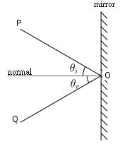

The law of reflection states that:

1. The incident ray, reflected ray and normal all lie in the same plane.
1. The angle of incidence (ϴi) is equal to the angle of reflection (ϴr).

### Experiment: To illustrate the laws of reflection.

**Apparatus:** Ray box, strip of plane mirror, protractor, piece of paper.

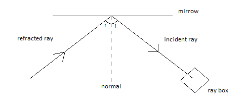

**Procedure:**

1. Set up the apparatus as shown in Figure.
1. Vary the angle of incidence _i_ and measure the angle of reflection _r._
1. Compare the values of _i_ and _r_.

## **3.16 construct ray diagrams to illustrate the formation of a virtual image in a plane mirror**

Types of images:

1. Virtual images: Image through which the rays of light don’t not actually pass is called virtual image. Example: Image formed in the mirror. Virtual images cannot be produced on a screen.
1. Real images: Images created with rays of light actually passing through them are called real images. Example: cinema screen.

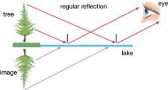

_Fig. Reflection of a tree. How the virtual image looks like below the lake._

Properties of an image in a plane mirror:

- The image is as far behind the mirror as the object is in front
- The is the same size as the object
- The image is virtualas it appears to be behind the mirror. The rays of light are not actually coming from the place where the image seems to be.
- The image is laterally inverted – that is, the left side and right side of the image appear to be interchanged.

How to construct ray diagrams?

Things we include in ray diagrams of a plain mirror:

i- Object    ii-Observer's eye or some indication   iii- Plane mirror   iv- Image.

1- Have object infront of the mirror.

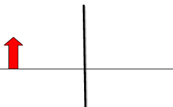

2- Draw atleast two rays emanating from the object (one from the top of the object and other at the bottom as shown below) and going towards mirror-- for some objects we need three or more.

3- Reflect ray from the mirror by using law of reflection towards observer.

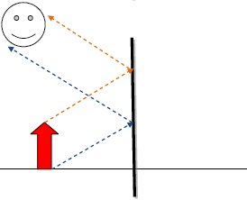

` `4- Extend the rays by dotted lines behind the mirror.

5- Construct the image according to the position of the ray ie if ray is coming from the bottom side of the object then it would show the bottom side and so and so as shown below.

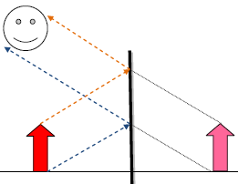

## **3.17 describe experiments to investigate the refraction of light, using rectangular blocks, semicircular blocks and triangular prisms**

As a light ray passes from one transparent medium to another, it bends. This bending of light is called refraction. Refraction occurs due to having different speed of light in different medium. For example, light travels slower in glass than in air. When ray of light travels from air to glass, it slows down as it crosses the boundary between two media. The change in speed causes the ray to change direction and therefore refraction occurs.

The light bends towards the normal as it passes from low-density to high-density (air to glass). The light is refracted and upon emerging from the glass the light bends away from the normal as it passes high density to low-density (glass to air).

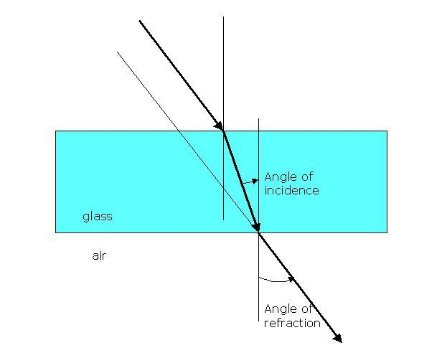

When the ray first entered the semi-circular glass, it was along the normal. As a result, it went straight. While escaping the glass, the light bend away from the normal.

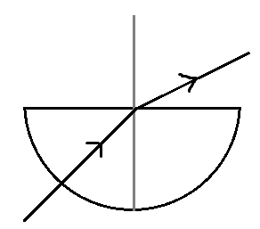

The incident ray entered the prism and is refracted. This ray travels along the prism in straight line, then again refraction after leaving the prism.

### Experiment: To demonstrate the refraction of light through a piece of glass block.

**Apparatus:** Rectangular glass block with one face frosted, two rays boxes, piece of paper, protractor.

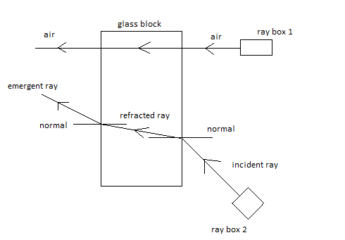

**Procedure:**

1. Place the glass block on a piece of paper with the frosted side down.
1. Send two narrow rays of light through the glass block as shown in Figure.
1. Observe the paths of the two rays of light.
1. Vary the angle of incidence _i_ and measure the angle of refraction _r_ using protractor*.*

## **3.18 know and use the relationship between refractive index, angle of incidence and angle of refraction:**

The ratio between sine of the angle of incidence and the sine of the angle of refraction is called refractive index. In a material, the refractive index is constant throughout the circuit.

n=sinsin i sinsin r

refractive index=sinsin (incident angle) sin⁡(refravted angle)

- Lighter mediums means that light can pass easily/ speed of light is more.
- Dense/light doesn’t mean physical density rather than optical condition.
- Refraction takes place in second medium.
- The ratio from a vacuum to a denser medium is called absolute refractive index.
- The ratio from a medium to another medium is called relative refractive index.
- It doesn’t have a unit because it is the ratio of same curve.
- Wavelength decreases in a denser medium, thus decreasing speed.
- The higher the wavelength, the more the light will bend.
- The higher the wavelength, the less the angle of refraction.

## **3.19 describe an experiment to determine the refractive index of glass, using a glass block**

### Experiment: To determine the refractive index of glass, using a glass block.

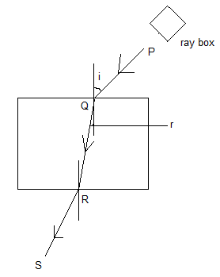

1. Put the glass block on an wooden table which is passed by a white sheet.
1. The border of the block is marked by a pencil.
1. At one border draw a normal and draw three lines to use as incident ray.
1. Set a ray box through anyone of the lines.
1. The ray travels and passes through the glass block and finally emerges from the glass block.
1. The passage of the ray is marked by putting some pins.
1. Now move the glass block and gain the footprints of the pins to show the passage of the ray.
1. Now using a protractor measure the ∠i and ∠r.
1. Now using, =sinsin i sinsin r ; calculate refractive index.

**Ways to improve result:**

1. Repeat the experiment, and find the average reading.
2. Plot a graph of sin I against sin r and find the gradient.
3. Vary the value of i and repeat.

## **3.20 describe the role of total internal reflection in transmitting information along optical fibres and in prisms**

Total internal reflection: When light falls on the surface of a lighter medium from denser medium at an angle of incidence greater than critical angle, then the light does not refracts. It rather reflects in the self-medium. This type of reflection is called total internal reflection.

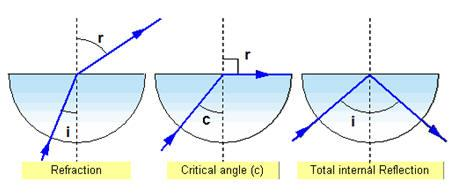

Condition of total internal reflection:

1. Light should fall in the surface of lighter medium from denser medium.
2. Angle of incidence must be greater than the critical angle.

Uses of total internal reflection:

i) The prismatic periscope

Light passes normally through the surface AB of the first prism (that is, it enters the prism at 90o) and so is undeviated. It then strikes the surface AC of the prism at angle of 45o. The critical angle for glass is 42o so the ray is totally internally reflected and is turned through 90o. On emerging from the first prism the light travels to a second prism which is positioned such that the ray is again totally internally reflected. The ray emerges parallel to the direction in which it was originally travelling.

The final image created by this type of periscope is likely to be sharper and brighter than that produced by a periscope that uses two mirrors. Because in mirrors, multiple images are formed due to several partial internal reflections at the non-silvered glass surface of the mirror.

ii) Reflectors

Reflector is a block of glass that changes the direction of rays into the required position.

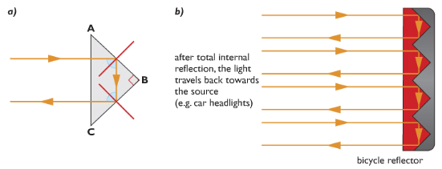

Light entering the prism undergoes total internal reflection twice. It emerges from prism travelling back in the direction from which it originally came. This arrangement is used in bicycle reflectors and binoculars.

iii) Optical fibres

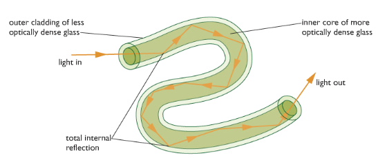

Optical fibre uses the property of total internal reflection. This is very thin strand composed of two different types of glass. The inner core is more optically dense than the outer one. As the fibres are narrow, light entering inner core always strike the boundary of the two glasses at an angle greater than critical angle. This technique is used to send information very fast at the speed of light.

Optical fibres are also used in endoscopes and telecommunications.

The endoscope is used by doctors to see inside human body. Light travels down one bundle of fibres and illuminates the object to be viewed. Light reflected by the object travels up a second bundle of fibres. An image of object is created by the eyepiece.

Modern telecommunication systems use optical fibres to transmit messages. Electrical signals from a telephone are converted into light energy by tiny lasers, which send pulses of light into the ends of optical fibres. A light-sensitive detector at the other end changes the pulses back into electrical signals, which then flow into a telephone receiver.

Optical fibres allow a much wider bandwidth. This means that many different digital signals can share the same optical fibre, so much more information can be transmitted along an optical fibre than by using an analogue signal.

Advantages of sending data using Optical Fibre:

- Optical fibre is less prone to noise.
- It is less prone to heating.
- It can send more information per second than copper wires.

## **3.21 explain the meaning of critical angle c**

Critical angle is an incident angle at which the incident ray is refracted and the refracted angle is equal to 90 degree in condition that the light falls on the surface of a lighter medium from denser medium.

## **3.22 know and use the relationship between critical angle and refractive index:**

sinsin c=1n

sinsin (critical angle) =1refractive index

## **3.23 understand the difference between analogue and digital signals**

To send a message using a digital signal, the information is converted into a sequence of numbers called a binary code. Digital electrical signals can either have of only two possible values (typically 0v and 5v). These represent the digits 0 and 1 used in the binary number system.

In the analogue method, the information is converted into electrical voltages and current that vary continuously.

## **3.24 describe the advantages of using digital signals rather than analogue signals**

1. Regenerating digital signal creates a clean accurate copy of the original signal but analogue signal are corrupted by other signals.
1. With digital signal, you can broadcast programs over the same frequency. It is possible because digital signals can carry more information per second than analogue signals. In analogue signal you need wider range of frequency to broadcast.
1. Digital systems are generally easier to design and build than analogue systems. That is the information can be stored and processed by computers.

## **3.25 describe how digital signals can carry more information**

Digital signals are capable of carrying more information than analogue signals because digital signals make use of the bandwidth more efficiently by closely approximating the original analogue signal. The parts of the signal that do not carry any information are thrown out thus saving the bandwidth from being used needlessly. Also, depending on the coding process, digital signals are much more efficient at filtering out noise than are analogue signals, which do not filter out noise at all thus saving even more bandwidth. The process of approximating the analogue signal in digital signal processing is called quantization.

## **3.26 understand that sound waves are longitudinal waves and how they can be reflected, refracted and diffracted**

Sound waves are longitudinal waves. They are produced by vibration of objects. Like other waves they can also be reflected refracted and diffracted.

Reflection:

Sound waves reflect when they bounce back from a surface so that the angle of incident is equal to the angle of reflection. A reflected sound wave is called an echo.

Example:

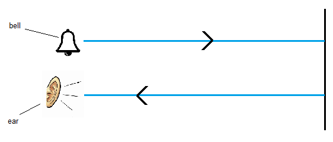

Sound is produced behind a nearby wall. After few seconds, a second sound is heard. Due to the reflection of sound wave echo is heard.

Refraction:

Sound waves refract when it changes direction while travelling across a high dense medium.

Example:

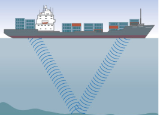

Sound wave is sent from the boat to determine the depth of the sea. If refracts when it enters into water. The return wave is received by a receiver. Measure the time required we can measure the depth of sea.

Diffraction:

` `Sound waves are diffracted when they spread while travelling through a narrow space such as doorway.

Example:

Sound is produced in the corridor. When it leaves the corridor, it diffracts. So a person standing at one side can hear the sound.

How sound wave travels?

When a vibration occurs, it pushes the air molecules around it closer together. This creates a compression. These particles then push against neighbouring particles so that the compression appears to be moving. Behind the compression is a region where the particles are spread out. This region is called rarefaction. In this way, they create compression and rarefaction and transfer energy.

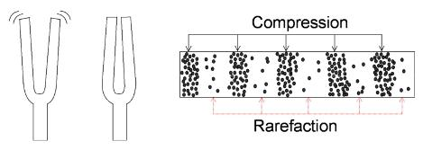

## **3.27 understand that the frequency range for human hearing is 20 Hz – 20,000 Hz**

An average person can only hear sound that have a frequency higher than 20Hz but lower than 20000 Hz. This spread of frequency is called audible range. Frequency higher than 20000 Hz which cannot be heard by humans are called ultrasounds.Frequency lower than 20 Hz that cannot be heard by humans are called infrasound.

## **3.28 describe an experiment to measure the speed of sound in air**

### Experiment: To measure the speed of sound by direct method

Apparatus: Starting pistol, stopwatch, measuring tape.

Procedure:

1. By means of measuring tape, observers are positioned at known distance apart in an open field.
1. First observer fires a starting pistol.
1. Second observer seeing the flash of the starting pistol, starts the stopwatch and then stops it when he hears the sound. The time interval is then recorded.

Ways to improve:

1. Repeat the experiment a few times and compute the values of the speed of sound for each experiment. Find the average value. This procedure minimizes random errors in finding the time interval between seeing the flash and hearing the sound.
1. Observers exchange positions and repeat experiment. This procedure will cancel the effect of wind on the speed of sound in air.

### Experiment: To measure the speed of sound using echoes

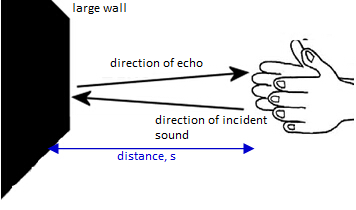

One boy claps, the sound travels and reflects from a nearby wall. After few seconds the echo is heard. Another boy starts the stopclock when the sound is produced and stopped the clock when the echo is heard. Now if the distance between the source of sound can reflector is d1 and the speed of sound will be v=2dt; where t = time from go and back.

Sources of error:

1. Reaction time, i.e when starting the clock by hearing the echo or stopping it when receiving the echo.

Ways to improve:

1. Repeat this 5 times.
1. Make sure there are no other large reflection surfaces nearby.

### Experiment: To measure the speed of sound using resonance tubes and tuning forks

A resonance tube is a Perspex tube with a water reservoir. The height of the water in the tube can be adjusted to change the length of the tube, as the sound waves will be reflected at the water surface. A sound of a known frequency is made by striking a tuning fork and holding it above the open end of the tube. The water column is adjusted until the loudest sound can be heard. As in the figure, the first resonance will be heard when the length of the air in the tube is equal to a quarter of the wavelength. You can check your result by lowering the water level to find the next resonance, at ¼ of the wavelength. The speed of sound I then calculated using

v=f×λ

### Experiment: To measure the speed of sound using oscilloscopes

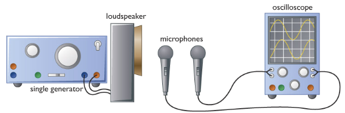

The apparatus is set up as in the figure. Set the signal generator to give a sound with frequency of about 1kHz. Start with the microphones close together, and observe how the two traces on the oscilloscope compare. Then move one microphone further away from the loudspeaker until it is one complete wavelength away from the first – you know you have arrived at this point when the traces one the oscilloscope screen are exactly above one another. Measure the distance between the microphone to get the wavelength of the sound, and use the oscillioscope screen to find an accurate value for the frequency. The speed of sound can then be worked out using the formula v=f×λ.

## **3.29 understand how an oscilloscope and microphone can be used to display a sound wave**

When sound waves enter the mircrophone, they make a crystal or a metal plate inside it vibrate. The vibrations are changed into electrical signals, and the oscilloscope uses these to make a spot which moves up and down on the screen. It moves the spot steadily sideways at the same time, producing a wave shape called waveform.

The waveform is really a graph showing how the air pressure at the microphone varies with time. It is not a picture of the sound waves themselves: Sound waves are not transverse (up and down).

Oscilloscopes are instruments used to show waveforms of electrical signals.

When we speak in microphone, sound waves are converted into electrical signals. When we connect the microphone to the oscilloscope then the oscilloscope would display waveforms onto the screen. The waveforms are a representation of sound waves.

.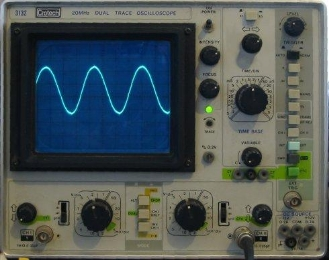

## **3.30 describe an experiment using an oscilloscope to determine the frequency of a sound wave**

### Experiment: To determine the frequency of a sound wave

1. Sound is produced by a loudspeaker.
2. The microphone catches the sound and transmits it into electrical signal.
3. The electrical signal is feed to the oscilloscope.
4. The oscilloscope displays the electrical signal as wave pattern.
5. The time base knob is adjusted for value 5 ms per division.
6. Now count the number of division occupied by one cycle of the wave.
7. Calculate the time for one cycle (T).
8. Now, frequency, f=1T

## **3.31 relate the pitch of a sound to the frequency of vibration of the source**

The sharpness or drollness of a sound is called its pitch.

The more something vibrates the higher frequency.
The higher frequency, the higher pitch.
So the more vibrations the higher pitch.

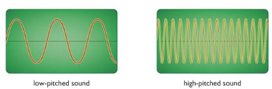

## **3.32 relate the loudness of a sound to the amplitude of vibration.**

The bigger the vibration the higher the amplitude.
The higher the amplitude the louder the sound.

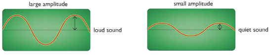
