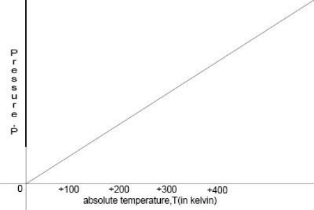

## (d) Ideal gas molecules

**5.9 understand the significance of Brownian motion, as supporting evidence for particle theory**

One piece of evidence for the continual motion of particles in a liquid or a gas is called Brownian motion. Particles of a liquid or gas are moving around continually and bump into each other and into tiny particles such as pollen grains. Sometimes there will be more collisions on one side of a pollen grain than on another, and this will make the pollen grain change its direction or speed of movement.

In short:

1. Gases are made up of molecules: We can treat molecules as point masses that are perfect spheres. Molecules in a gas are very far apart, so that the space between each individual molecule is many orders of magnitude greater than the diameter of the molecule.

2. Molecules are in constant random motion: There is no general pattern governing either the magnitude or direction of the velocity of the molecules in a gas. At any given time, molecules are moving in many different directions at many different speeds.

3. The movement of molecules is governed by Newton’s Laws: In accordance with Newton’s First Law, each molecule moves in a straight line at a steady velocity, not interacting with any of the other molecules except in a collision. In a collision, molecules exert equal and opposite forces on one another.

4. Molecular collisions are perfectly elastic: Molecules do not lose any kinetic energy when they collide with one another.

**5.10 understand that molecules in a gas have a random motion and that they exert a force and hence a pressure on the walls of the container**

Pressure comes into play whenever force is exerted on a certain area, but it plays a particularly important role with regard to gases. The kinetic theory tells us that gas molecules obey Newton’s Laws: they travel with a constant velocity until they collide, exerting a force on the object with which they collide. If we imagine gas molecules in a closed container, the molecules will collide with the walls of the container with some frequency, each time exerting a small force on the walls of the container. The more frequently these molecules collide with the walls of the container, the greater the net force and hence the greater the pressure they exert on the walls of the container.

Balloons provide an example of how pressure works. By forcing more and more air into an enclosed space, a great deal of pressure builds up inside the balloon. In the meantime, the rubber walls of the balloon stretch out more and more, becoming increasingly weak. The balloon will pop when the force of pressure exerted on the rubber walls is greater than the walls can withstand.

**5.11 understand why there is an absolute zero of temperature which is –273oC**

Temperature affect the pressure of particles of gases. The higher the temperature, the higher the energy in particles and more the pressure. If we decrease the temperature the result will be the exact opposite. As we cool the gas, the pressure keeps decreasing. The pressure of the gas cannot become less than zero. The temperature at which the pressure of the gas is decreased to 0, that temperature is called absolute zero. It is approximately –273oC.

**5.12 describe the Kelvin scale of temperature and be able to convert between the Kelvin and Celsius scales**

Temperature in K = temperature in oC + 273

Temperature in oC = temperature in K – 273

**5.13 understand that an increase in temperature results in an increase in the average speed of gas molecules**

The kinetic theory explains why temperature should be a measure of the average kinetic energy of molecules. According to the kinetic theory, any given molecule has a certain mass; a certain velocity; and a kinetic energy of ½ mv2. As we said, molecules in any system move at a wide variety of different velocities, but the average of these velocities reflects the total amount of energy in that system. If we increase the temperature, the kinetic energy will increase. This will result in increase of average velocity of the gas molecules.

**5.14 understand that the Kelvin temperature of the gas is proportional to the average kinetic energy of its molecules**

Temperature in Kelvin is directly proportional to the average kinetic energy of molecules. If we increase the temperature, kinetic energy as well as pressure will increase as well.

**5.15 describe the qualitative relationship between pressure and Kelvin temperature for a gas in a sealed container**

The number of gas particles and the space, or volume, they occupy remain constant. When we heat the gas the particles continue to move randomly, but with a higher average speed. This means that their collisions with the walls of the container are harder and happen more often. This results in the average pressure exerted by the particles increasing.

When we cool a gas the kinetic energy of its particles decreases. The lower the temperature of a gas the less kinetic energy its particles have – they move more slowly. At absolute zero the particles have no thermal or movement energy, so they cannot exert pressure.

**5.16 use the relationship between the pressure and Kelvin temperature of a fixed mass of gas at constant volume:**

p1T1=p2T2

**5.17 use the relationship between the pressure and volume of a fixed mass of gas at constant temperature:**

p1V1 = p2V2

Provided the temperature is constant, the average speed of the particles stays the same. If the same number of particles is squeezed into a smaller volume, they will hit the container walls more often. Each particle exerts a tiny force on the wall with which it collides. More collisions per second means a greater average force on the wall and, therefore, a greater pressure.
