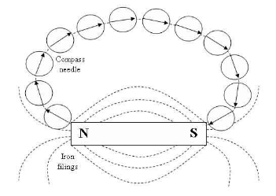
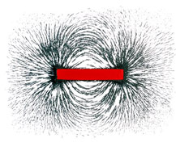

## (b) Magnetism

**6.2 understand that magnets repel and attract other magnets and attract magnetic substances**

Magnets are able to attract objects made from magnetic materials such as iron, steel, etc. Other objects like plastic, rubber are non-magnetic substance. They can’t attract magnet.

Magnets have two poles: North Pole and South Pole. North Pole and South Pole attract each other. Similar poles like North Pole and North Pole or South Pole and South Pole repel each other.

**6.3 describe the properties of magnetically hard and soft materials**

| Magnetically hard materials                                            | Magnetically soft materials                                            |
| :--------------------------------------------------------------------- | :--------------------------------------------------------------------- |
| Needs time to become magnetized                                        | Easily gets magnetized                                                 |
| Once magnetized, the magnetism remains permanently                     | 
Loses its magnetism easily

                               |
| Magnets withmagnetically hard materials are known as permanent magnets | Magnets withmagnetically soft materials are known as temporary magnets |
| Eg: Steel                                                              | Eg: Iron                                                               |

**6.4 understand the term ‘magnetic field line’**

Magnetic field is a volume of space where magnetism can be detected.

Magnetic fields are drawn using lines of force or flux lines. This lines are imaginary but they:

- show the shape of magnetic field.
- show the direction of the magnetic field – the field lines travel from north to south.
- show the strength of the magnetic field – the field lines are closest together where the magntic field is strongest.

  **6.5 understand that magnetism is induced in some materials when they are placed in a magnetic field**

If you keep a material in a magnetic field, eventually after a period of time, that material will be magnetized.

Example:

- Place a magnetically soft material close to a strong magnet. The soft iron bar becomes an induced magnet with the end nearer the magnet having opposite polarity to that of the magnet.
- A steel bar is placed inside a coil. After a while the bar becomes magnetized due to the magnetic induction from solenoid. The polarities of the magnet depend on the direction of current flow.

  **6.6 describe experiments to investigate the magnetic field pattern for a permanent bar magnet and that between two bar magnets**

### Experiment: To investigate the magnetic field pattern for a permanent bar magnet.

**Apparatus:** Bar magnet, plotting compass and a plain paper.

**Procedure:**

1. Place the bar magnet at the centre of the piece of paper so that its N-pole faces North and its S-pole faces South.

2. Starting near one pole of the magnet, the position ends, N and S, of the compass needle are marked by pencil dots X and Y. The compass is then moved until one end is exactly over Y and the new position of other end is marked with a third dot.

3. Repeat the process of marking the dots. Join the series of dots and this will give the plot of the field lines of the magnetic field.

**Precautions:**

1. Check that the plotting compass in good working order.

2. Ensure that there is no strong magnetic field around the plotting compass.

### Experiment: To plot magnetic field using iron fillings

**Apparatus:** Iron fillings, Bar magnet

**Procedure:**

Place a sheet of paper over a bar magnet. Sprinkle a thin layer of Iron filings over the paper and then tap the paper gently. The iron filings act like thousands of tiny compasses and point themselves along the lines of flux.

**6.7 describe how to use two permanent magnets to produce a uniform magnetic field pattern.**

**Apparatus:** Two bar magnets

**Procedure:**

By keeping the opposite poles face each other. The region between the poles would establish magnetic field that would be uniform.
