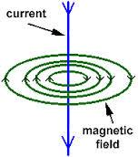
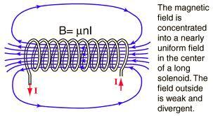
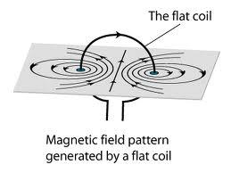
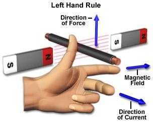

## (c) Electromagnetism

**6.8 understand that an electric current in a conductor produces a magnetic field round it**

When a current flows through a wire a magnetic field is created around the wire. This phenomenon is called electromagnetism. The field around the wire is quite weak and circular in shape. The direction of the magnetic field depends up the direction of the current and can be found using the right-hand grip rule.

**6.9 describe the construction of electromagnets**

If a temporary magnet is wrapped with a wire into a coil and pass current to it, the magnet will become magnetized. This way electromagnets can be constructed.

**6.10 sketch and recognize magnetic field patterns for a straight wire, a flat circular coil and a solenoid when each is carrying a current**

A field around a straight wire is simply a series of circles around the wire.

A field around a solenoid is similar to that of a bar magnet.

A field around a flat coil is basically like a single wire, but there are two.

**6.11 understand that there is a force on a charged particle when it moves in a magnetic field as long as its motion is not parallel to the field**

A charged particle has a magnetic field around it. When a charged particle moves through another magnetic field, it experiences a force. This is because of the overlapping of the two magnetic fields. However, if the charged particle is moved parallel to that field, no force will be exerted. As an electric current is a flow of electrons, we can see this effect when a wire carrying the current is put into a magnetic field too.

**6.12 understand that a force is exerted on a current-carrying wire in a magnetic field, and how this effect is applied in simple d.c. electric motors and loudspeakers**

If we pass a current through a piece of wire held at right angle to the magnetic field of a magnetic field of a magnet, the wire will move. The motion is the result of forces created by overlapping magnetic field around the wire and the magnet.

When a current flows along a wire a cylindrical magnetic field is created around the wire. If the wire is placed between the poles of a magnet, the two fields overlap. In certain places, the fields are in the same direction and so reinforce each other, producing a strong magnetic field. In other places, the fields are in opposite directions, producing a weaker field. The wire experiences a force, pushing it from the stronger part of the field to the weaker part. This is called the motor effect.

The moving – coil loudspeaker:

Signals from a source, such as an amplifier, are fed into the coil of the speaker as currents that are continually changing in size and direction. The overlapping fields of the coil and the magnet therefore create rapidly varying forces on the wires of the coil, which cause the speaker cone to vibrate. These vibrations create the sound waves we hear.

The electric motor:

As current passes around the loop of wire, one side of it will experience a force pushing it upwards. The other side will feel a force pushing it downwards, so the loop will rotate. Because of the split ring, when the loop is vertical, the connections to the supply through brushes swap over, so that the current flowing through each side of the loop changes direction. The wire at the bottom is now pushed upwards and the wire at the top is pushed downwards – so the loop carries on turning. The arrangement of brushes and split ring changes the direction of the current flowing through the loop every half turn, which means the rotation can be continuous.

**6.13 use the left hand rule to predict the direction of the resulting force when a wire carries a current perpendicular to a magnetic field**

The left hand rules shows the direction of force, magnetic field and current when a wire carries a current perpendicularly to a magnetic field.

The pointing finger points the magnetic field from North to South

The middle finger points the direction of current in wire.

The thumb shows the resulting force.

**6.14 describe how the force on a current-carrying conductor in a magnetic field increases with the strength of the field and with the current.**

Ways to increase the force produced in motors:

- Increase the number of turns or loops of wire (to make a coil)
- Increase the strength of magnetic field
- Increase the current flowing through the loop of wire
