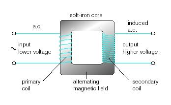

# (d) Electromagnetic induction

## **6.15 understand that a voltage is induced in a conductor or a coil when it moves through a magnetic field or when a magnetic field changes through it and describe the factors which affect the size of the induced voltage**

When a wire cuts the magnetic field of a magnet, a voltage is induced in the wire. This phenomenon is called electromagnetic induction.

If we move a wire across a magnetic field at right angles, a voltage is induced in the wire. The size of the induced voltage can be increased by:

1. moving the wire more quickly
1. using a stronger magnet
1. wrapping the wire into a coil so that more pieces of wire move through the magnetic field.

We can generate a voltage and current by pushing a magnet into a coil. The size of induced voltage can be increased by:

1. moving the magnet more quickly
1. using a stronger magnet
1. using a coil with a larger cross-sectional area.

Faraday’s Law of Electromagnetic Induction:

“The size of the induced voltage across the ends of a wire (coil) is directly proportional to the rate at which the magnetic lines of flux are being cut.”

This says that:

- a voltage and current are generated when a conductor such as wire cuts through the magnetic field lines.
- the faster the lines are cut the larger the induced voltage and current.

## **6.16 describe the generation of electricity by the rotation of a magnet within a coil of wire and of a coil of wire within a magnetic field and describe the factors which affect the size of the induced voltage**

In a generator, when the coil rotates, its wire cut through magnetic field lines and a current is induced in them. If we watch just one side of the coil, we see that the wire moves up through the field and then down for each turn of the coil. As a result, the current induced in the coil flows first in one direction and then in the opposite direction. This kind of current is called alternating current. A generator that produces alternating current is called an alternator. The size of the induced voltage can be increased by using much stronger magnets, many more turns of wire on the coil and spinning the coil much faster.

## **6.17 describe the structure of a transformer, and understand that a transformer changes the size of an alternating voltage by having different numbers of turns on the input and output sides**

A transformer is a device that helps to reduce or increase voltage in a wire or electric line. This is made of two soft iron core linking to the coils at the two end of the transformer. The first coil is called the primary coil and the second one is called the secondary coil. When alternating current is passed through a coil, the magnetic field around it is continuously changing. The changing magnetic field will cut the secondary coil and induce voltage in it, and that’s how current is passed. If the secondary coil has more turns than the primary coil, it is a step-up transformer where output the voltage will increase. If the secondary coil has less turns than the primary, it is a step-down transformer where theoutput voltage will decrease.

Why transformer doesn’t work with direct current?

Transformers only work if the magnetic field around the primary coil is changing. Transformers will therefore only work with ac currents and voltages. They will not work with dc current and voltages.

## **6.18 explain the use of step-up and step-down transformers in the large- scale generation and transmission of electrical energy**

After generating electricity, electric currents are passed to a step-up transformer which increase the voltage and decrease the current. This is because higher currents need wide and expensive wire to pass through. Or else, energy is lost in form of heat. Using transformers mean we can have a solution to this problem. Before the electricity reaches home, those are passed through step-down transformers to decrease the voltage and increase the current at the same time.

## **6.19 know and use the relationship between input (primary) and output (secondary) voltages and the turns ratio for a transformer:**

input voltageoutput voltage=number of turns on primary coilnumber of turns on secondary coil

VpVs=npns

## **6.20 know and use the relationship: for 100% efficiency**

If a transformer is 100% efficient, the electrical energy entering the primary coil is equal to the electrical energy leaving the secondary coil.

Input power = output power

VP IP= VS IS
