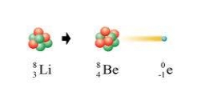
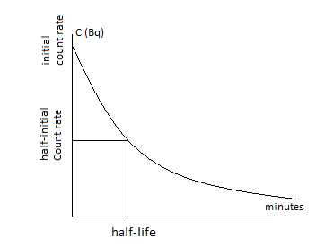

# (b) Radioactivity

## **7.2 describe the structure of an atom in terms of protons, neutrons and electrons and use symbols such as 146Cto describe particular nuclei**

An atom is a tiny particle with nucleus in the centre and electrons orbiting it. A nucleus is made up of proton and neutron.

An atom is presented in this way = XYZ

Z=Symbol of the atom

X=Mass Number

Y=Atomic Number

## **7.3 understand the terms atomic (proton) number, mass (nucleon) number and isotope**

Atomic Number: Atomic number is the number of protons in an atom

Mass number: Mass number is the addition number of protons and neutrons

Isotope: Isotope is an element which has the same atomic number as the original atom but different mass number.

## **7.4 understand that alpha and beta particles and gamma rays are ionising radiations emitted from unstable nuclei in a random process**

Stability of isotopes: The protons are held in a nucleus by nuclear force. Nuclear force is strong short ranged force. On the other hand, the protons try to repel away from each other due the electric force formed by the similar charges of protons. So the presence of neutrons help nucleus to stabilize. Too many or too few of neutrons can cause instability and may eventually decay, thus giving out ionising radiation along with energy.

Ionising radiation: Whenunstable nuclei decay they gives out ionising radiation. Ionising radiation causes atom to gain or lose electrons to form ions. Basically there are three types of ionizing radiation: alpha, beta and gamma.

Alpha radiation: Alpha radiation consists of fast-moving helium nucleus.

Beta radiation: Beta radiation consists of fast-moving electron.

Gamma rays: Gamma ray is an electromagnetic wave.

## **7.5 describe the nature of alpha and beta particles and gamma rays and recall that they may be distinguished in terms of penetrating power**

Nature of radiation

Alpha radiation has been identified as a stream of helium nuclei. In other words, an alpha particle is actually a positively-charged helium nucleus comprising two protons and two neutrons. It is a very stable particle.

Beta radiation has been identified as a stream of high-energy electrons. In other words, a beta particle is actually a negatively-charged electron. It is formed by a nucleus decay process.

Gamma radiation has been identified as high-frequency electromagnetic radiation. In other words, they are electromagnetic waves of very short wavelength.

Ionising power

When a fast-moving particle such as an alpha or beta particle collides with an atom, an electron may be ejected from the atom, resulting in a charged ion. Alpha particles have the greatest ionising power compared to beta and gamma radiation because it is heavier and large and is more likely to collide with atoms, resulting the greatest number of ions in their tracks. Compared with gamma rays, beta particles are more ionizing.

Penetrating power

The Figure shows the relative penetrating power of three kinds of radiation. The alpha particles can be stopped by a sheet of paper whereas beta particles and gamma rays penetrate it easily. This shows that alpha particles have the least penetrating power. Infact, it has a range of only few centimeters in air. Beta particles have a range of several metres in air but can be stopped by a 5mm tick aluminium sheet. Gamma rays are the most penetrating, having a range of a few hundred metres in air and can only be stopped by a 2 cm-thick lead shield.

| Radiation | Ionising power | Penetrating range in air | Example of range in air | Radiation stopped by |
| :-------- | :------------- | :----------------------- | :---------------------- | :------------------- |
| Alpha,α   | strong         | weak                     | 5-8cm                   | paper                |
| Beta, β   | medium         | medium                   | 500-1000 cm             | Thin aluminium       |
| Gamma, γ  | weak           | strong                   | Virtually infinite      | Thick lead sheet     |

## **7.6 describe the effects on the atomic and mass numbers of a nucleus of the emission of each of the three main types of radiation**

Alpha (α) decay:

In alpha decay,alpha particles takes away 4 nucleons with itself which reduce the mass number of the element by 4. Alpha particles have 2 protons with it, which reduce the atomic number of the element by 2.

Example:

Beta (β)decay:

Beta particle is formed when a neutron splits to form a proton and an electron. Beta particle practically has no mass, so it doesn’t affect the mass number of the element. As beta particles have a charge of -1, the elements atomic number is increased by +1.

Example:

Gamma (γ) decay:

After an unstable nucleus has emitted an alpha or beta particle it sometimes has surplus energy. It emits this energy as gamma radiation. Gamma ray is an electromagnetic wave and doesn’t affect the mass number or atomic number of the element.

## **7.7 understand how to complete balanced nuclear equations**

In a nuclear equation, in the left hand side the total mass number should be equal to the mass number in the right hand side. And the atomic number should be equal in both sides.

Here, Uranium experienced an alpha decay:

Here, Lithium faced beta decay:

## **7.8 understand that ionising radiations can be detected using a photographic film or a Geiger-Muller detector**

Photographic film: Photographic film is a traditional way to detect presence of ionising radiation nearby. Ionising radiations imprints photographic plates. That is the film becomes foggy when it is exposed to a certain amount of radiation.

Geiger Muller: Geiger Muller tube is used to measure the level of radiation. It is a glass tube with an electrically conducting coating on the inside surface. The tube has a thin window made of mica. The tube contains low pressured gases. In the middle of the tube, there is an electrode which is connected to a high voltage supply via a resistor. When ionising radiation enters the tube through the glass, it causes the low pressured gas to form ions. As ions are charged particle they allow to flow a pulse of current in the electrode which is detected by an electronic circuit.

Counting circuit is fitted with a GM tube so that it can measure how many ionising particles entered GM tube. Rate meters are fitted with GM tube to measure the number of ionising events per second, and so give a measure of the radioactivity in Becquerels. Rate meters have a loudspeaker output so the level of radioactivity is indicated by the rate of clicks produced.

## **7.9 explain the sources of background radiation**

Background radiation is low-level ionizing radiation that is produced all the time. The background radiation has many sources including natural and artificial ones.

Natural sources:

**Cosmic rays:** Violent nuclear reactions in stars and exploding stars called supernovae produce very energetic particles and cosmic rays that continuously bombard the Earth. Lower energy cosmic rays are given out by the Sun. Our atmosphere gives us fairly good protection from cosmic rays.

**Rocks and soil**: Some of the radiation comes from rocks in the Earth’s crust. When the Earth was formed, around 4.5 billion years ago, it contained many radioactive isotopes. Some decayed very quickly but others are still producing radiation. Some of the decay products of these long-lived radioactive materials are also radioactive, so there are radioactive isotopes with much shorter half-lives still present in the Earth’s crust.

**Living things**: Plants absorb radioactive materials from the soil and these pass up the food chain. Also we breathe small amount of radioactive isotopes of carbon, carbon – 14. We continuously renew the amount of radioactive isotopes in our bodies.

Artificial sources:

Human activity has added to background radiation by creating and using artificial sources of radiation. These include radioactive waste from nuclear power stations, radioactive fallout from nuclear weapons testing and medical x-rays.

Artificial sources account for about 15 percent of the average background radiation dose. Nearly all artificial background radiation comes from medical procedures such as receiving x-rays for x-ray photographs.

## **7.10 understand that the activity of a radioactive source decreases over a period of time and is measured in Becquerels**

Radioactive substance keeps decaying in a random process. As it decays, its activity is reduced over a period of time. The unit of Radioactivity is Becquerels.

If we plot a graph of activity of a radioactive isotope against time we will get something like the one above. The graph falls steeply at first and more slowly after time. This is because the activity gets smaller, and the smaller the activity the slower the activity will decrease. This kind of decrease proportional of activity to time is called exponential decay.

## **7.11 understand the term ‘half-life’ and understand that it is different for different radioactive isotopes**

“Half-Life” is the amount of time taken for the activity of any radioactive substance to reduce to half. Each radioactive isotope decays in different speeds. So half life is different for different types of isotopes.

## **7.12 use the concept of half-life to carry out simple calculations on activity**

To find half life, plot graph of the activity against time. Point out the half of the activity and draw line to match the time as done in the figure. The time is your half-life.

Half life calculation:

Example: The half life of an isotope is 3 hours. If the initial activity of the isotope is 544 Bq, what will be the count rate after 15 hours?

Ans:
15 hours = 3 x 5 hours
Therefore, the activity will be halved 5 times.
544×12×12×12×12×12=17
The activity will be 17 Bq after 15 hours.

### Experiment: How to find the Half-life of a radioactive isotope.

**Apparatus:** Geiger-Muller tube

**Procedure:** To measure the half-life of a radioactive material we must measure the activity of the sample at regular times. This is done using a Geiger – Muller tube linked to a rate meter. Before taking measurements from the sample, we must measure the local background radiation. We must subtract the background radiation from measurements taken from the sample so we know the radiation produced by the sample itself. We then measure the rate of decay of the sample at regular time intervals. The rate of decay is shown by the count rate on the rate meter. The results should be recorded in a table.

The rate of decay corrected from background radiation is proportional to the amount of radioactive isotope present. If we plot a graph of rate of decay against time, we can measure the half-life from the graph.

## **7.13 describe the uses of radioactivity in medical and non-medical tracers, in radiotherapy, and in the radioactive dating of archaeological specimens and rocks**

Radioactive materials are being used in many different ways in medicine, industry and agriculture. There are five main uses of radioactive materials. They are used in tracers, as penetrating radiation, as power sources, for medical treatment and for dating archaeological specimens.

1. _Tracers_
   The ability of detectors to measure small concentrations of a radioactive material is made use of in tracer applications. Tracers are used extensively in medicine. Iodine, for example accumulates readily in the thyroid gland. By using radioactive iodine – 131 and finding out the rate at which it accumulates in the thyroid, the thyroid functions may be monitored.

   In industry, a typical use of tracers is in the study of the wear and tear of the moving parts of machinery. This can be done by tagging a radioisotope onto the surfaces of the moving parts under investigation and then finding the amount rubbed off. Another major use in industry is in the detection of leaks in underground pipe.

   By introducing a suitable radioactive tracer into the pipe, the leak unusually high count rate at the area of the leak. This will save both time and money in locating and repairing the leak.

   In agriculture, radioactive phosphorus-32 is used as a tracer to find out how well the plants are absorbing phosphates which are crucial to their growth. The complicated mechanism of photosynthesis has also been studied using tracers.

1. _Penetrating radiation_
   Cobal-60 emits penetrating gamma rays which can be used to penetrate deep into welding to reveal faults. Normal X-rays are not able to perform this task. Gamma rays are also used to photograph the inside of an engine to reveal any cracks.

   In the area of manufacturing, suitable radioactive sources are used to check the thickness of rolled sheets of metal, paper or plastic. In other words, the gamma radiation source acts as a thickness gauge.

   A beta source cannot be used in this case because it is not penetrative enough when compared to the gamma source. However, a beta source can be used to check the thickness of rolled sheets of paper or plastic.

   In the food industry, the high penetration power of gamma rays is used to kill any bacteria in pre-packaged or frozen foods. This will sterilize the food and prevent food poisoning.

1. _Power sources_
   Uranium-235 is the most common fuel in nuclear power stations. Other radioactive materials can be used as portable sources. For example, some satellites use radioactive materials as their source of power, which comes from the energy released when these radioactive materials decay.

   Some fire alarms contain a small amount of alpha-emitting substance. The alpha particles emitted keep the air in the fire alarms slightly ionized and any changes in the level of ionization caused by smoke in a fire can be detected and the alarm is set off.

1. _Medical treatment_
   Radioactive cobalt, Co-60, decays with the emission of beta particles and high energy gamma rays. When properly shielded, the gamma rays can be brought to bear on deep cancerous growths in a cancer patient. The radiation kills the cell of the malignant tumour in the patient Machines built for this purposes, known as gammatrons are very useful in radiotherapy.
1. _Archaeological dating_
   Radioactive carbon-14 is present in small amounts in the atmosphere. Living plants absorb carbon dioxide and therefore become slightly radioactive. This enables the level of radioactivity of plants to be monitored.

   When a tree dies, the radioactive carbon present inside it will begin to decay. Since the half-life of carbon-14 is nearly 5500 years the age of a dead tree can be found by comparing the activity of the carbon-14 in the dead tree and a living tree.

   The activity of the carbon-14 of a living tree stays fairly constant as the carbon-14 is being replenished while the carbon-14 in the dead tree is not replenished. Therefore, by measuring the activity of carbon-14 in an ancient relic, scientists can calculate its age.

## **7.14 describe the dangers of ionising radiations, including:**

- Radiation can cause mutations in living organisms
- Radiation can damage cells and tissue
- The problems arising in the disposal of radioactive waste

and describe how the associated risks can be reduced.

_Hazard of radiation_
Overexposure to radioactive radiation may result in radiation burns. These will lead to sores and blisters which may take a long time to heal. Extreme overexposure can lead to radiation sickness, and ultimately death. Radioactive radiation can also lead to delayed conditions such as eye cataracts or leukemia, which may only appear many years later.

Ionizing radiation causes mutations in the genes which led to offspring bearing physiological and other abnormalities. They are health hazards to people, livestock and plants.

_Precautions against radiation hazards_
To prevent overexposure to radiation or any accidents, following precautions need to be taken:

1. Workers working with gamma radiation must wear film badges or pocket dosimeter in order to keep tract of the accumulated dosage they are exposed to over given period time.
1. Always keep radioactive sources in lead-lined boxes. The wall of the storage rooms of nuclear laboratories are to be built with lead bricks that are 1m thick. The outside of the room must be labeled “Radioactive Material”
1. The radiation symbol must be displayed whenever an experiment with a radioactive source is conducted.
1. If possible, persons doing radiation experiments should use special, protective clothing such as lead-lined suits as well as wear lead-lined gloves. Tweezers must be used to pick up strong sources. After completion of the day’s work, the contaminated clothing must be changed.
1. Food and drinks are strictly prohibited when a person is doing a radioactivity experiment. Otherwise, radioactive dust can be taken into the body together with food.
1. The nuclear process in a reactor produces a variety of different types of radioactive material. Some have relatively short half-lives and decay rapidly. These soon become safe to handle and do not present problems of long-term storage. Other materials have extremely long half – lives. These will continue to produce dangerous levels of ionising radiation for thousands of years. These waste products present a serious problem for long-term storage. They are usually sealed in containers that are then buried deep underground. The sites of underground storage have to be carefully selected. The rock must be impermeable to water and the geology of the site must be stable – storing waste in earthquake zones or area of volcanic activity would not be sensible.
